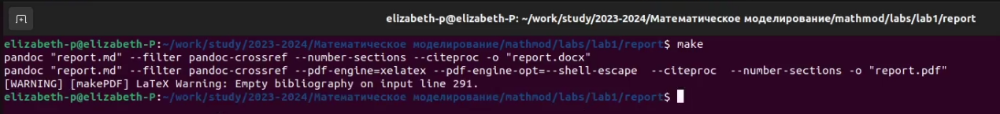

---
## Front matter
lang: ru-RU
title: Лабораторная работа №1
subtitle: Git и Markdown
author:
  - Парфенова Е. Е.
teacher:
  - Кулябов Д. С.
  - д.ф.-м.н., профессор
  - профессор кафедры прикладной информатики и теории вероятностей
institute:
  - Российский университет дружбы народов, Москва, Россия
date: 09 февраля 2024

## i18n babel
babel-lang: russian
babel-otherlangs: english

## Formatting pdf
toc: false
toc-title: Содержание
slide_level: 2
aspectratio: 169
section-titles: true
theme: metropolis
header-includes:
 - \metroset{progressbar=frametitle,sectionpage=progressbar,numbering=fraction}
 - '\makeatletter'
 - '\beamer@ignorenonframefalse'
 - '\makeatother'
---

# Информация

## Докладчик

:::::::::::::: {.columns align=center}
::: {.column width="70%"}

  * Парфенова Елизавета Евгеньвена
  * студент
  * Российский университет дружбы народов
  * [1032216437@pfur.ru](mailto:1032216437@pfur.ru)
  * <https://github.com/parfenovaee>

:::
::: {.column width="30%"}

:::
::::::::::::::

# Вводная часть

## Актуальность

- Важность подготовки системы к работе при дальнейших лабораторных
- Возможность быстро и правильно оформлять отчеты с использованием Markdown
- Эффективное использование Git

## Практическая значимость

- Подготовка системы для дальнейшей легкой и быстрой работы над лаборторными
- Использование полученных и возобновленных знаний в дальнейшей работе

## Цели и задачи

- Повторить основные команды git
- Вспомнить язык легковесной разметки Markdown
- Настроить git на персональном компьютере

## Материалы и методы

- Процессор `pandoc` для входного формата Markdown
- Результирующие форматы
	- `pdf`
	- `doc`
- Автоматизация процесса создания: `Makefile`

## Теоретическая база. Git

**Git** — распределённая система управления версиями. 

Наиболее часто используемые команды git:

– добавить все изменённые и/или созданные файлы и/или каталоги:

**git add .**

– сохранить все добавленные изменения и все изменённые файлы:

**git commit -am 'Описание коммита'**

– отправка изменений конкретной ветки в центральный репозиторий:

**git push origin имя_ветки**

## Теоретическая база. Markdowm

**Markdown** — облегчённый язык разметки, созданный с целью обозначения форматирования в простом тексте, с максимальным сохранением его читаемости человеком, и пригодный для машинного преобразования в языки для продвинутых публикаций (HTML, Rich Text и других).

# Основные этапы выполнения работы

## Создание каталогов для репозитория

Я начала выполнение Лабораторной работы с создания репозитория. Git  уже был установлен на мой компьютер. Вначале я создала катлоги с помощью команды **mkdir -p ~/work/study/2023-2024/"математическое моделирование"** и перешла в каталог командой **cd**

{#fig:001 width=40%}

## Генерация ключа SSH

Затем было необходимо создать репозиторий по учебному шаблону, это выполнялось с помощью первой команды, представленной на рисунке. Для успешного выполнения необходимо было сгенерировать SSH ключ и подключить устройство к серверу через него. Для этого я следовала инструкции на экране.

{#fig:002 width=30%}

## Ключ SSH

В ходе генерирования необходимо было ввести код из консоли в браузер и после проведения этого действия ключ был успешно сгенерирован и добавлен в мой профиль git 

{#fig:003 width=70%}

## Создание репозитория

Далее я заново ввела команду создания репозитория по шаблону. Как только репозиторий был солздан успешно, я клонировала его в mathmod с помощью **git clone**

{#fig:004 width=40%}

## Создание необходимых каталогов и загрузка их на сервер

Затем я перешла в каталог mathmod и применила команду **make prepare**. А затем загрузила все это с локального устройства на сервер с помощью кблока команд. Мой репозиторий был успешно создан и загружен на сервер

{#fig:005 width=70%}

## Создание необходимых каталогов и загрузка

Перейдем к документам Markdown. Для успешного конвертирования я перешла в папку, где находился нужный мне отчет. Затем я применила команду **make** для конвертирования

{#fig:006 width=70%}

## Создание необходимых каталогов и загрузка

Отчет в дополнительных форматах успешно был помещен в папку лабораторной работы

{#fig:007 width=40%}

## Вывод

Я настроила систему git для своего компьютера и вспомнила основные команды взаимодейтсвия с ней. Также я повторила правила письма в языке разметки Markdowm и подготовила с помощью этого языка отчет по Лабораторной работе №1.

