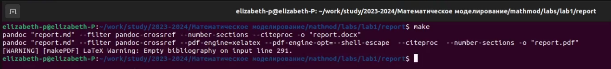

---
## Front matter
title: "Лабораторная работа 1"
subtitle: "Git и Markdown"
author: "Парфенова Елизавета Евгеньевна"

## Generic otions
lang: ru-RU
toc-title: "Содержание"

## Bibliography
bibliography: bib/cite.bib
csl: pandoc/csl/gost-r-7-0-5-2008-numeric.csl

## Pdf output format
toc: true # Table of contents
toc-depth: 2
lof: true # List of figures
lot: true # List of tables
fontsize: 12pt
linestretch: 1.5
papersize: a4
documentclass: scrreprt
## I18n polyglossia
polyglossia-lang:
  name: russian
  options:
	- spelling=modern
	- babelshorthands=true
polyglossia-otherlangs:
  name: english
## I18n babel
babel-lang: russian
babel-otherlangs: english
## Fonts
mainfont: PT Serif
romanfont: PT Serif
sansfont: PT Sans
monofont: PT Mono
mainfontoptions: Ligatures=TeX
romanfontoptions: Ligatures=TeX
sansfontoptions: Ligatures=TeX,Scale=MatchLowercase
monofontoptions: Scale=MatchLowercase,Scale=0.9
## Biblatex
biblatex: true
biblio-style: "gost-numeric"
biblatexoptions:
  - parentracker=true
  - backend=biber
  - hyperref=auto
  - language=auto
  - autolang=other*
  - citestyle=gost-numeric
## Pandoc-crossref LaTeX customization
figureTitle: "Рис."
tableTitle: "Таблица"
listingTitle: "Листинг"
lofTitle: "Список иллюстраций"
lotTitle: "Список таблиц"
lolTitle: "Листинги"
## Misc options
indent: true
header-includes:
  - \usepackage{indentfirst}
  - \usepackage{float} # keep figures where there are in the text
  - \floatplacement{figure}{H} # keep figures where there are in the text
---

# Цель работы

Повторить основные команды git и настроить его на своем устройстве. Повторить легковесный язык разметки Markdown.

# Задание

- Сделайте отчёт по лабораторной работе в формате
Markdown.
- В качестве отчёта просьба предоставить отчёты в 3 форматах:
pdf, docx и md (в архиве, поскольку он должен содержать скриншоты, Makefile и т.д.)

# Теоретическое введение

**Основные команды git**

Наиболее часто используемые команды git:

– создание основного дерева репозитория:

**git init**

– получение обновлений (изменений) текущего дерева из центрального репозитория:

**git pull**

– отправка всех произведённых изменений локального дерева в центральный репозиторий:

**git push**

– просмотр списка изменённых файлов в текущей директории:

**git status**

– просмотр текущих изменения:

**git diff**

– добавить все изменённые и/или созданные файлы и/или каталоги:

**git add .**

– добавить конкретные изменённые и/или созданные файлы и/или каталоги:

**git add имена_файлов**

– удалить файл и/или каталог из индекса репозитория (при этом файл и/или каталог остаётся в локальной директории):

**git rm имена_файлов**

– сохранить все добавленные изменения и все изменённые файлы:

**git commit -am 'Описание коммита'**

– сохранить добавленные изменения с внесением комментария через встроенный редактор:

**git commit**

– создание новой ветки, базирующейся на текущей:

**git checkout -b имя_ветки**

– переключение на некоторую ветку(при переключении на ветку, которой ещё нет в локальном репозитории, она будет создана и связана с удалённой):

**git checkout имя_ветки**

– отправка изменений конкретной ветки в центральный репозиторий:

**git push origin имя_ветки**

– слияние ветки с текущим деревом:

**git merge --no-ff имя_ветки**

– удаление локальной уже слитой с основным деревом ветки:

**git branch -d имя_ветки**

– принудительное удаление локальной ветки:

**git push origin :имя_ветки**

**Базовые сведения Markdown**

Чтобы создать заголовок, используйте знак ( # ), например:

'# This is heading 1'

'## This is heading 2'

'### This is heading 3'

'#### This is heading 4'

Чтобы задать для текста полужирное начертание, заключите его в двойные звездочки:

**This text is bold**

Чтобы задать для текста курсивное начертание, заключите его в одинарные звездочки:

*This text is italic*

Чтобы задать для текста полужирное и курсивное начертание, заключите его в тройные звездочки:

***This is text is both bold and italic***

Блоки цитирования создаются с помощью символа >:

>The drought had lasted now for ten million years, and the reign of the terrible lizards had long since ended. Here on the Equator, in the continent which would one day be known as Africa, the battle for existence had reached a new climax of ferocity, and the victor was not yet in sight. In this barren and desiccated land, only the small or the swift or the fierce could flourish, or even hope to survive.

Неупорядоченный (маркированный) список можно отформатировать с помощью звездочек или тире:

- List item 1

- List item 2

- List item 3

Чтобы вложить один список в другой, добавьте отступ для элементов дочернего списка:

- List item 1

  - List item A

  - List item B

- List item 2

Упорядоченный список можно отформатировать с помощью соответствующих цифр:

1. First instruction

2. Second instruction

3. Third instruction

Чтобы вложить один список в другой, добавьте отступ для элементов дочернего списка:

First instruction

    Sub-instruction
    Sub-instruction

Second instruction

Синтаксис Markdown для встроенной ссылки состоит из части [link text] , представляющей текст гиперссылки, и части (file-name.md) – URL-адреса или имени файла, на который дается ссылка:

[link text] (file-name.md)

Верхние индексы записывается как:

H2O

Нижние индексы записывается как:

2^10^

Внутритекстовые формулы делаются аналогично формулам LaTeX. Например, формула sin2(x)+cos 2 (x) = 1 запишется как

$\sin^2 (x) + \cos^2 (x) = 1$

# Выполнение лабораторной работы

Я начала выполнение Лабораторной работы с создания репозитория. Git  уже был установлен на мой компьютер. Вначале я создала катлоги с помощью команды **mkdir -p ~/work/study/2023-2024/"математическое моделирование"** и перешла в каталог с помощью **cd** (рис. [-@fig:001]).

{#fig:001 width=70%}

Затем было необходимо создать репозиторий по учебному шаблону, это я выполнила с помощью первой команды, представленной на рисунке. Для успешного выполнения необходимо было сгенерировать SSH ключ и подключить устройство к серверу через него. Для этого я следовала инструкции на экране. (рис. [-@fig:002]).

{#fig:002 width=70%}

 После ответов на все вопросы необходимо было залогиниться через браузер, введя код доступа, показанный в консоли. (рис. [-@fig:003]).

{#fig:003 width=70%}

После проведения всех операций ключ был успешно сгенерирован и добавлен в мой профиль git (рис. [-@fig:004]).

{#fig:004 width=70%}

Далее я заново ввела команду создания репозитория по шаблону. Как только репозиторий был солздан успешно, я клонировала его в mathmod с помощью **git clone**(рис. [-@fig:005])

{#fig:005 width=70%}

Затем я перешла в каталог mathmod и применила команду **make prepare**. А затем загрузила все это с локального устройства на сервер с помощью команд **git add .**, **git commit**, **git push**.(рис. [-@fig:006]).

{#fig:006 width=70%}

Мой репозиторий полностью готов. (рис. [-@fig:007])

{#fig:007 width=70%}

Pandoc и LaTex были установлены у меня на компьютере, правда в процессе работы мне пришлось доустанавливать некоторые части этих пакетов, чтобы все работало корректно. Чтобы конвертировать файл md в другие форматы, я вначале перешла в папку reports, которая находилась в каталоге первлой лабораторной. Там как раз был шаблон, который можно было конвертировать (рис. [-@fig:008]).

{#fig:008 width=70%}

Затем я применила команду **make** для конвертирования.(рис. [-@fig:009]).

{#fig:009 width=70%}

Новые документы появились в папке отчета первой лабораторной работы (рис. [-@fig:010])

{#fig:010 width=70%}

На этом выполнение Лабораторной работы было окончено.

# Выводы

Мы вспомнили, как работать с git, создали новый репозиторий и установили связь между локальным и глобальным серверами. Также мы смогли настроить ковертирование файлов в разные форматы и вспомнили язык легковесной разметки Markdown.
