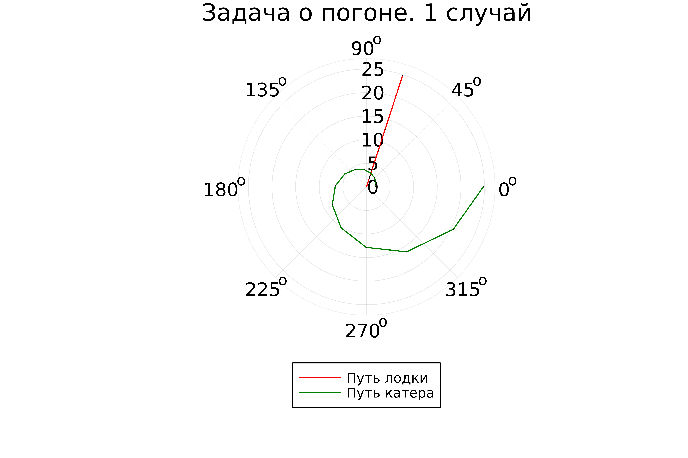
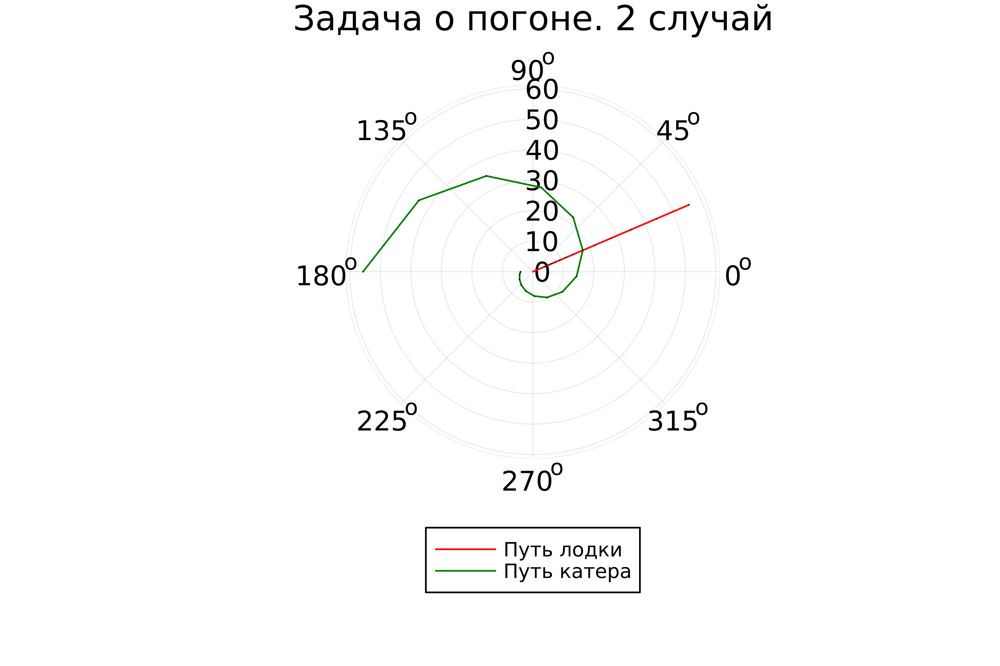

---
## Front matter
lang: ru-RU
title: Лабораторная работа №2
subtitle: Задача о погоне
author:
  - Парфенова Е. Е.
teacher:
  - Кулябов Д. С.
  - д.ф.-м.н., профессор
  - профессор кафедры прикладной информатики и теории вероятностей
institute:
  - Российский университет дружбы народов, Москва, Россия
date: 15 февраля 2024

## i18n babel
babel-lang: russian
babel-otherlangs: english

## Formatting pdf
toc: false
toc-title: Содержание
slide_level: 2
aspectratio: 169
section-titles: true
theme: metropolis
header-includes:
 - \metroset{progressbar=frametitle,sectionpage=progressbar,numbering=fraction}
 - '\makeatletter'
 - '\beamer@ignorenonframefalse'
 - '\makeatother'
---

# Информация

## Докладчик

:::::::::::::: {.columns align=center}
::: {.column width="70%"}

  * Парфенова Елизавета Евгеньвена
  * студент
  * Российский университет дружбы народов
  * [1032216437@pfur.ru](mailto:1032216437@pfur.ru)
  * <https://github.com/parfenovaee>

:::
::: {.column width="30%"}


:::
::::::::::::::


# Вводная часть

## Актуальность

- Важность изучения языка программирования Julia 
- Необходимость умения строить математические модели к разным задачам

## Цели и задачи работы

- Составить математическую модель для задачи о погоне 
- Решить задачу о погоне
- Изучить основы языка программирования Julia.

# Теоретическое введение 

## Язык программирование Julia

*Julia* — высокоуровневый свободный язык программирования с динамической типизацией, созданный для математических вычислений. Эффективен также и для написания программ общего назначения.Синтаксис языка схож с синтаксисом других математических языков (например, MATLAB и Octave), однако имеет некоторые существенные отличия. Julia написан на Си, C++ и Scheme. Имеет встроенную поддержку многопоточности и распределённых вычислений, реализованные в том числе в стандартных конструкциях. Язык возник 23 августа 2009 года.

Основной задачей при создании была разработка универсального языка, способного работать с большим объёмом вычислений и при этом гарантировать максимальную производительность.

## Установка Julia для систем Unix 

На официальном сайте представлен алгоритм установки Julia для разных систем. Установка и настройка версии 1.10.0 заключаются в следующем наборе команд, который загружает последнюю версию Julia в каталог с именем julia-1.10.1:

```
wget https://julialang-s3.julialang.org/bin/linux/x64/1.10/julia-1.10.1-linux-x86_64.tar.gz
tar zxvf julia-1.10.1-linux-x86_64.tar.gz
```

## Задача о погоне

*Кривая погони* — кривая, представляющая собой решение задачи о «погоне», которая ставится следующим образом. Пусть точка *A* равномерно движется по некоторой заданной кривой. Требуется найти траекторию равномерного движения точки 
*P* такую, что касательная, проведённая к траектории в любой момент движения, проходила бы через соответствующее этому моменту положение точки *A*

## Необходимые термины 

*Дифференциальное уравнение* — уравнение, которое помимо функции содержит её производные.

*Полярная система координат* - двумерная система координат, в которой каждая точка на плоскости определяется двумя числами — полярным углом и полярным радиусом. 

*Тангенциальная скорость* - это скорость объекта, совершающего круговое движение, то есть движущегося по круговой траектории.

*Радиальная скорость* - это скорость изменения вектора смещения между двумя точками.

# Задание лабораторной работы

## Определение варианта

Вариант определялся по формуле из ТУИСа: $(S_{n} mod N)+1$, где Sn — номер студбилета, N — количество заданий. 

Мой вариант - 8. 

## Задача

*Задача о погоне. Вариант 8*

На море в тумане катер береговой охраны преследует лодку браконьеров.
Через определенный промежуток времени туман рассеивается, и лодка
обнаруживается на расстоянии 6,5 км от катера. Затем лодка снова скрывается в
тумане и уходит прямолинейно в неизвестном направлении. Известно, что скорость
катера в 2,6 раза больше скорости браконьерской лодки.

## Задание

1. Запишите уравнение, описывающее движение катера, с начальными
условиями для двух случаев (в зависимости от расположения катера
относительно лодки в начальный момент времени).
2. Постройте траекторию движения катера и лодки для двух случаев.
3. Найдите точку пересечения траектории катера и лодки 

# Выполнение лабораторной работы

## Построение математичсекой модели

1. Примем за начальный момент времени момент обнаружения лодки браконьеров, то есть момент, когда туман рассеялся. 

2. Введем полярные координаты, считая, что точка обнаружения лодки браконьеров - это полюс, а полярная ось проходит через точку нахождения береговой охраны. Тогда координаты катера (6,5; 0)

## Построение математичсекой модели

3. Далее необходимо найти расстояние после которого катер начнет двигаться вокруг полюса. Так как траектория катера пересечется с траекторией лодки только в случае того, если судна будут двигаться на одном растоянии от полюса. Поэтому некоторое время катер береговой охраны должен двигаться прямолинейно, а затем, когда окажется на том же расстоянии от полюса, что и лодка, начать двигаться вокрук полюса.

## Построение математичсекой модели

4. Составим систему простых уравнений. За время $t$ лодка пройдет $x$, а катер береговой охраны $6.5-x$. Примем скорость лодки браконеров за $v$. Следовательно время будет равно $x\over v$ для лодки и $6.5-x\over 2.6 v$ или $6.5+x\over 2.6 v$ для катера. Учитывая, что время должно быть равно, получается:

$$
\left\{
\begin{array}{cc}
\dfrac{x}{v} = \dfrac{6.5 - x}{2.6v} \\\\
\dfrac{x}{v} = \dfrac{6.5 + x}{2.6v}
\end{array}
\right.
$$

Решив систему, мы получили два значени $x$: $x_{1} = {65\over36}$, а $x_{2} = {65\over16}$

## Построение математичсекой модели

5. Как только катер береговой охраны окажется на том же расстоянии от полюса, что и лодка, он начнет двигаться вокруг полюса удаляясь от не со скоростью лодки браконьеров $v$. Скорость $v$ раскладывается на 2 значения: $v_{r} = {dr\over dt}$ - радиальная скорость и $v_{\tau} = {r*{d{\theta}\over dt }}$ - тангенциальная скорость. 

6. Нам необходимо составить систему дифференциальных уравнений. Первое уравнение у нас уже есть: $v_{r} = {dr\over dt}$. Второе уравнение мы найдем из разложения скорости на две составляющие с помощью теоремы Пифагора:

$v_{\tau} = {\sqrt{(2.6v)^2 - v_{_r}^2}} = {\sqrt{6.76v - v^2}} = 2.4v$

## Построение математичсекой модели

Следовательно второе уравнение выглядит так: ${r*{d{\theta}\over dt }} = 2.4v$

Тогда система уравнений получается: 

$$
\left\{
\begin{array}{cc}
\dfrac{dr}{dt} = {v} \\\\
\dfrac{r*{d{\theta}}}{dt} = 2.4v
\end{array}
\right.
$$

## Построение математичсекой модели

С начальными условиями: 

(для первого случая)
$$
\left\{
\begin{array}{cc}
{\theta = 0} \\\\
{r_{0}} = {65\over 36}
\end{array}
\right.
$$

(для второго случая)
$$
\left\{
\begin{array}{cc}
{\theta = -\pi} \\\\
{r_{0}} = {65\over 16}
\end{array}
\right.
$$

## Построение математичсекой модели

Путем математичсеких манипуляций приводим систему к такому виду: 

${dr\over d\theta} = {r\over 2.4}$

Математическая модель готова. 

## Установка Julia

Julia на системы Unix устанавливается в соотвествии с алгоритмом в теоретическом введении. Настройка языка программирования для дальнейшей работы включает в себя:

- добавление папки bin наше Julia в системную PATH переменную окружения
- загрузка всех необходимых библиотек

При правильной установке и настройке Julia открывается командой **julia** из консоли

{#fig:001 width=15%}

## Процесс решения задачи

Для решения задачи необходимо вставить сделанный код в открытую Julia и дождаться пока сгенерируются два изображения (решения задачи для двух случаев)

{#fig:002 width=40%}

## Решение задачи для 1 случая

На рисункке изображены траектории движения лодки и катера для первого случая и наглядно видна точка их пересечения

Точка пересечния: 2,5 по полярному радиусу и 72 градуса по полярному углу

{#fig:002 width=40%}

## Решение задачи для 2 случая

На рисункке изображены траектории движения лодки и катера для второго случая и наглядно видна точка их пересечения

Точка пересечния: 8 по полярному радиусу и 23 градуса по полярному углу

{#fig:002 width=40%}

# Вывод 

## Вывод 

Мы успешно решили задачу о погоне для двух случаев, составив математическую модель для нашего варианта задачи. Построили два изображения и наглядно нашли точки пересечния траекторий. Также изучили основы программирования на языке Julia

