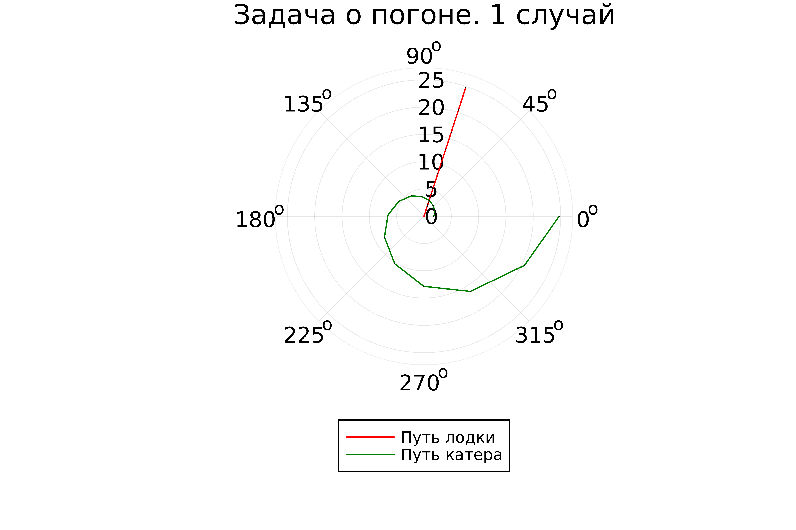
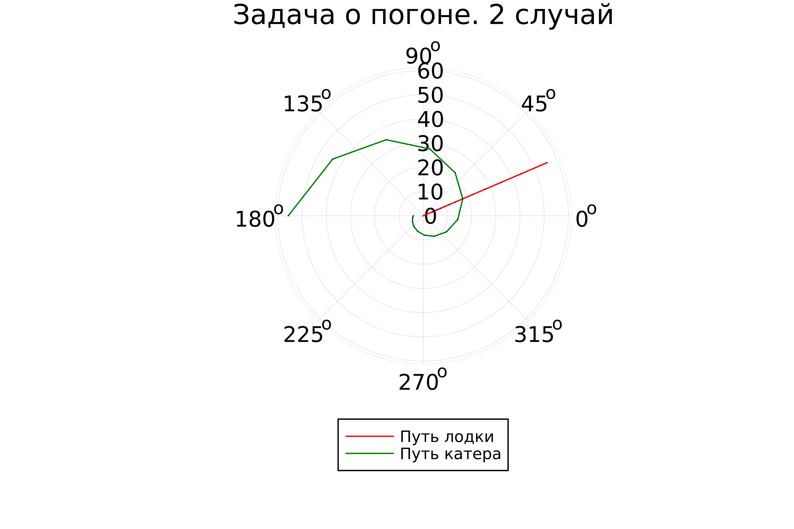

---
## Front matter
title: "Лабораторная работа №2"
subtitle: "Задача о погоне"
author: "Парфенова Елизавета Евгеньевна"

## Generic otions
lang: ru-RU
toc-title: "Содержание"

## Bibliography
bibliography: bib/cite.bib
csl: pandoc/csl/gost-r-7-0-5-2008-numeric.csl

## Pdf output format
toc: true # Table of contents
toc-depth: 2
lof: true # List of figures
lot: true # List of tables
fontsize: 12pt
linestretch: 1.5
papersize: a4
documentclass: scrreprt
## I18n polyglossia
polyglossia-lang:
  name: russian
  options:
	- spelling=modern
	- babelshorthands=true
polyglossia-otherlangs:
  name: english
## I18n babel
babel-lang: russian
babel-otherlangs: english
## Fonts
mainfont: PT Serif
romanfont: PT Serif
sansfont: PT Sans
monofont: PT Mono
mainfontoptions: Ligatures=TeX
romanfontoptions: Ligatures=TeX
sansfontoptions: Ligatures=TeX,Scale=MatchLowercase
monofontoptions: Scale=MatchLowercase,Scale=0.9
## Biblatex
biblatex: true
biblio-style: "gost-numeric"
biblatexoptions:
  - parentracker=true
  - backend=biber
  - hyperref=auto
  - language=auto
  - autolang=other*
  - citestyle=gost-numeric
## Pandoc-crossref LaTeX customization
figureTitle: "Рис."
tableTitle: "Таблица"
listingTitle: "Листинг"
lofTitle: "Список иллюстраций"
lotTitle: "Список таблиц"
lolTitle: "Листинги"
## Misc options
indent: true
header-includes:
  - \usepackage{indentfirst}
  - \usepackage{float} # keep figures where there are in the text
  - \floatplacement{figure}{H} # keep figures where there are in the text
---

# Цель работы

Составить математическую модель для задачи о погоне и решить эту задачу. Изучить основы языка программирования Julia.

# Задание

*Определение варианта*

Вариант определялся по формуле из ТУИСа: $(S_{n} mod N)+1$, где Sn — номер студбилета, N — количество заданий. 

Мой вариант - 8. 

*Задача о погоне. Вариант 8*

На море в тумане катер береговой охраны преследует лодку браконьеров.
Через определенный промежуток времени туман рассеивается, и лодка
обнаруживается на расстоянии 6,5 км от катера. Затем лодка снова скрывается в
тумане и уходит прямолинейно в неизвестном направлении. Известно, что скорость
катера в 2,6 раза больше скорости браконьерской лодки.

1. Запишите уравнение, описывающее движение катера, с начальными
условиями для двух случаев (в зависимости от расположения катера
относительно лодки в начальный момент времени).
2. Постройте траекторию движения катера и лодки для двух случаев.
3. Найдите точку пересечения траектории катера и лодки 

# Теоретическое введение

**Справка о языке Julia** 

*Julia* — высокоуровневый свободный язык программирования с динамической типизацией, созданный для математических вычислений. Эффективен также и для написания программ общего назначения.Синтаксис языка схож с синтаксисом других математических языков (например, MATLAB и Octave), однако имеет некоторые существенные отличия. Julia написан на Си, C++ и Scheme. Имеет встроенную поддержку многопоточности и распределённых вычислений, реализованные в том числе в стандартных конструкциях. Язык возник 23 августа 2009 года.

Основной задачей при создании была разработка универсального языка, способного работать с большим объёмом вычислений и при этом гарантировать максимальную производительность [@wiki:bash]. 

*Установка Julia для систем Unix*

На официальном сайте представлен алгоритм установки Julia для разных систем. Установка и настройка версии 1.10.0 заключаются в следующем:

1. Настоятельно рекомендуется использовать официальные общие двоичные файлы со страницы загрузок для установки Julia в Linux и FreeBSD. Следующий набор команд загружает последнюю версию Julia в каталог с именем julia-1.10.1:
```
wget https://julialang-s3.julialang.org/bin/linux/x64/1.10/julia-1.10.1-linux-x86_64.tar.gz
tar zxvf julia-1.10.1-linux-x86_64.tar.gz
```

2. Чтобы запустить Julia, вы можете выполнить любое из следующих действий:

- Вызовите julia исполняемый файл, используя его полный путь: <Julia directory>/bin/julia

- Создайте символическую ссылку на julia внутри папки, которая находится в вашей системе PATH

- Добавьте bin папку Julia (с полным путем) в вашу системную PATH переменную окружения с помощью строки *export PATH="$PATH:/path/to/<Julia directory>/bin"* в файле ~/.bashrc, где Julia directory - путь к вашему языку программирования [@julia_install:bash].

**Задача о погоне**

*Кривая погони* — кривая, представляющая собой решение задачи о «погоне», которая ставится следующим образом. Пусть точка *A* равномерно движется по некоторой заданной кривой. Требуется найти траекторию равномерного движения точки 
*P* такую, что касательная, проведённая к траектории в любой момент движения, проходила бы через соответствующее этому моменту положение точки *A*[@wiki_2:bash].

**Термины**

*Дифференциальное уравнение* — уравнение, которое помимо функции содержит её производные.

*Полярная система координат* - двумерная система координат, в которой каждая точка на плоскости определяется двумя числами — полярным углом и полярным радиусом. 

*Тангенциальная скорость* - это скорость объекта, совершающего круговое движение, то есть движущегося по круговой траектории.

*Радиальная скорость* - это скорость изменения вектора смещения между двумя точками.Он сформулирован как проекции вектора цели-наблюдателя относительно скорости на относительно направления или линии визирования, соединяющей две точки.

# Выполнение лабораторной работы

**Построение математической модели**

1. Примем за начальный момент времени момент обнаружения лодки браконьеров, то есть момент, когда туман рассеялся. 

2. Введем полярные координаты, считая, что точка обнаружения лодки браконьеров - это полюс, а полярная ось проходит через точку нахождения береговой охраны. Тогда координаты катера (6,5; 0)

3. Далее необходимо найти расстояние после которого катер начнет двигаться вокруг полюса. Так как траектория катера пересечется с траекторией лодки только в случае того, если судна будут двигаться на одном растоянии от полюса. Поэтому некоторое время катер береговой охраны должен двигаться прямолинейно, а затем, когда окажется на том же расстоянии от полюса, что и лодка, начать двигаться вокрук полюса.

4. Составим систему простых уравнений. За время $t$ лодка пройдет $x$, а катер береговой охраны $6.5-x$. Примем скорость лодки браконеров за $v$. Следовательно время будет равно $x\over v$ для лодки и $6.5-x\over 2.6 v$ или $6.5+x\over 2.6 v$ для катера. Учитывая, что время должно быть равно, получается:

$$
\left\{
\begin{array}{cc}
\dfrac{x}{v} = \dfrac{6.5 - x}{2.6v} \\\\
\dfrac{x}{v} = \dfrac{6.5 + x}{2.6v}
\end{array}
\right.
$$

Решив систему, мы получили два значени $x$: $x_{1} = {65\over36}$, а $x_{2} = {65\over16}$

5. Как только катер береговой охраны окажется на том же расстоянии от полюса, что и лодка, он начнет двигаться вокруг полюса удаляясь от не со скоростью лодки браконьеров $v$. Скорость $v$ раскладывается на 2 значения: $v_{r} = {dr\over dt}$ - радиальная скорость и $v_{\tau} = {r*{d{\theta}\over dt }}$ - тангенциальная скорость. 

6. Нам необходимо составить систему дифференциальных уравнений. Первое уравнение у нас уже есть: $v_{r} = {dr\over dt}$. Второе уравнение мы найдем из разложения скорости на две составляющие с помощью теоремы Пифагора:

$v_{\tau} = {\sqrt{(2.6v)^2 - v_{_r}^2}} = {\sqrt{6.76v - v^2}} = 2.4v$

Следовательно второе уравнение выглядит так: ${r*{d{\theta}\over dt }} = 2.4v$

Тогда система уравнений получается: 

$$
\left\{
\begin{array}{cc}
\dfrac{dr}{dt} = {v} \\\\
\dfrac{r*{d{\theta}}}{dt} = 2.4v
\end{array}
\right.
$$

С начальными условиями: 

(для первого случая)
$$
\left\{
\begin{array}{cc}
{\theta = 0} \\\\
{r_{0}} = {65\over 36}
\end{array}
\right.
$$

(для второго случая)
$$
\left\{
\begin{array}{cc}
{\theta = -\pi} \\\\
{r_{0}} = {65\over 16}
\end{array}
\right.
$$

Путем математичсеких манипуляций приводим систему к такому виду: 

${dr\over d\theta} = {r\over 2.4}$

Математическая модель готова.

**Траектория движения** 

Julia была установлена на мой компьютер и настроена на нем заранее по инстукции в теоретическом введении. Для начала работы в ней прописываем в терминале команду **julia** (рис. [-@fig:001]).

{#fig:001 width=70%}

Далее необходимо написать код программы для решения дифференциального уравнения и наглядного построения траектории движения лодки браконьеров и катера береговой охраны.

*Код программы*

```
using Plots
using DifferentialEquations

# Константы из задачи
const k = 6.5
const v = 2.6
#Константа для уранвения
const ur = 2.4

# Начальное условие
const r0_1= k/(v + 1)
const r0_2 = k/(v - 1)

# Интервал
const T_1 = (0, 2*pi)
const T_2 = (-pi, pi)

#Функция для диф.уранвения
function F(u, p, t)
    return u / ur
end

# 1 случай
#Решение диф.уранвения
problem = ODEProblem(F, r0_1, T_1)
result = solve(problem, abstol=1e-8, reltol=1e-8)

dxR = rand(1:size(result.t)[1])
rAngles = [result.t[dxR] for i in 1:size(result.t)[1]]

#Параметры для изображения
plt = plot(proj=:polar, aspect_ratio=:equal, dpi = 1000, legend=true, bg=:white)

plot!(plt, xlabel="theta", ylabel="r(t)", title="Задача о погоне. 1 случай", legend=:outerbottom)
plot!(plt, [rAngles[1], rAngles[2]], [0.0, result.u[size(result.u)[1]]], label="Путь лодки", color=:red, lw=1)
scatter!(plt, rAngles, result.u, label="", mc=:red, ms=0.0005)
plot!(plt, result.t, result.u, xlabel="theta", ylabel="r(t)", label="Путь катера", color=:green, lw=1)
scatter!(plt, result.t, result.u, label="", mc=:green, ms=0.0005)

#Сохранение изображения
savefig(plt, "lab02_01.png")

# 2 случай
#Решение диф.уранвения
problem = ODEProblem(F, r0_2 , T_2)
result = solve(problem, abstol=1e-8, reltol=1e-8)

dxR = rand(1:size(result.t)[1])
rAngles = [result.t[dxR] for i in 1:size(result.t)[1]]

#Параметры для изображения
plt1 = plot(proj=:polar, aspect_ratio=:equal, dpi = 1000, legend=true, bg=:white)

plot!(plt1, xlabel="theta", ylabel="r(t)", title="Задача о погоне. 2 случай", legend=:outerbottom)
plot!(plt1, [rAngles[1], rAngles[2]], [0.0, result.u[size(result.u)[1]]], label="Путь лодки", color=:red, lw=1)
scatter!(plt1, rAngles, result.u, label="", mc=:red, ms=0.0005)
plot!(plt1, result.t, result.u, xlabel="theta", ylabel="r(t)", label="Путь катера", color=:green, lw=1)
scatter!(plt1, result.t, result.u, label="", mc=:green, ms=0.0005)

#Сохранение изображения
savefig(plt1, "lab02_02.png")
```
Далее необходимо вставить получившийся код в терминал с открытой Julia и подождать пока сгенерируются фотографии траекторий в двух случаях. Они создаются достаточно быстро(рис. [-@fig:002]).

{#fig:002 width=70%}

**Анализ результатов** 

Рассмотрим полученные изображения и найдем точку пересечения для каждого из случаев наглядно.

Первый случай (рис. [-@fig:003]).

{#fig:003 width=70%}

Точка пересения на данном изображении, судя по рисунку, это: 2,5 по полярному радиусу и 72 градуса по полярному углу

Второй случай (рис. [-@fig:004]).

{#fig:004 width=70%}

Точка пересения на данном изображении, судя по рисунку, это: 8 по полярному радиусу и 23 градуса по полярному углу

Данная задача сложно выполнима в OpenModelica, так как она не работает с полярными координатами.

# Выводы

Мы успешно решили задачу о погоне для двух случаев, составив математическую модель для нашего варианта задачи. Построили два изображения и наглядно нашли точки пересечния траекторий. Также изучили основы программирования на языке Julia

# Список литературы{.unnumbered}

::: {#refs}
:::
