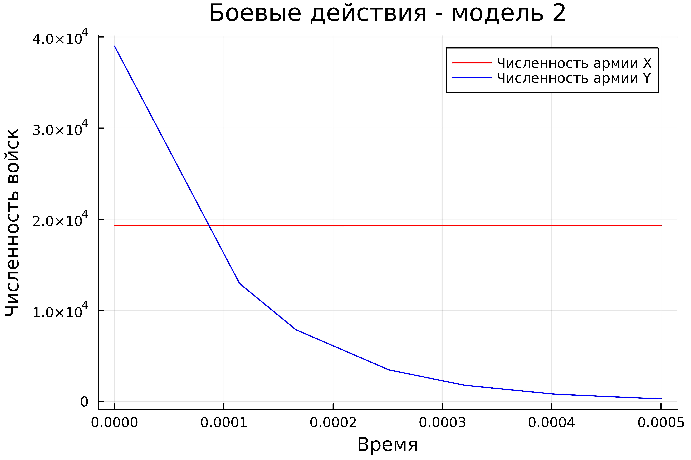

---
## Front matter
lang: ru-RU
title: Лабораторная работа №3
subtitle: Модель боевых действий
author:
  - Парфенова Е. Е.
teacher:
  - Кулябов Д. С.
  - д.ф.-м.н., профессор
  - профессор кафедры прикладной информатики и теории вероятностей
institute:
  - Российский университет дружбы народов, Москва, Россия
date: 21 февраля 2024

## i18n babel
babel-lang: russian
babel-otherlangs: english

## Formatting pdf
toc: false
toc-title: Содержание
slide_level: 2
aspectratio: 169
section-titles: true
theme: metropolis
header-includes:
 - \metroset{progressbar=frametitle,sectionpage=progressbar,numbering=fraction}
 - '\makeatletter'
 - '\beamer@ignorenonframefalse'
 - '\makeatother'
---

# Информация

## Докладчик

:::::::::::::: {.columns align=center}
::: {.column width="70%"}

  * Парфенова Елизавета Евгеньвена
  * студент
  * Российский университет дружбы народов
  * [1032216437@pfur.ru](mailto:1032216437@pfur.ru)
  * <https://github.com/parfenovaee>

:::
::: {.column width="30%"}

:::
::::::::::::::

# Вводная часть

## Актуальность

- Необходимость умения строить различные математичсекие модели и их визуальное представление
- Важность изучения инструмента математичсекого моделирования - OpenModelica

## Цели и задачи работы

- Изучить модель боевых действий Ланчестера и применить знания о ней на практике 
- Изучить основы работы с OpenModelica

# Теоретическое введение 

## OpenModelica

*OpenModelica* — свободное открытое программное обеспечение для моделирования, симуляции, оптимизации и анализа сложных динамических систем. Основано на языке Modelica. OpenModelica используется в академической среде и на производстве. В промышленности используется в области оптимизации энергоснабжения, автомобилестроении и водоочистке. 

Включает блоки механики, электрики, электроники, электродвигатели, гидравлики, термодинамики, элементы управления и т. д. OpenModelica имеет значительно более удобное представление системы уравнений исследуемого блока в сравнении с другими вычислительными средами.

## Модель боевых действий - модель Ланчестера

*Законы Ланчестера* представляют собой математические формулы для расчета относительной численности вооруженных сил. Уравнения Ланчестера - это дифференциальные уравнения, описывающие зависимость численности двух армий A и B от времени, причем функция зависит только от A и B.

В наиболее общем виде ланчестерские модели можно описать уравнением:

$$
\left\{
\begin{array}{cc}
\dfrac{dR_1}{dt} = -a_1R_1 - {\gamma}_1R_1R_2 + d_1  \\\\
\dfrac{dR_2}{dt} = -a_2R_2 - {\gamma}_2R_1R_2 + d_2 
\end{array}
\right.
$$

# Задание лабораторной работы

## Задача

Мой вариант - Вариант №8. 

*Модель боевых действий - вариант №8*

Между страной $X$ и страной $Y$ идет война. Численность состава войск
исчисляется от начала войны, и являются временными функциями
$x(t)$ и $y(t)$. В начальный момент времени страна $X$ имеет армию численностью 19 300 человек, а в распоряжении страны $Y$ армия численностью в 39 000 человек. Для упрощения модели считаем, что коэффициенты
$a, b, c, h$ постоянны. Также считаем $P(t)$ и $Q(t)$ непрерывные функции.

## Задание

Постройте графики изменения численности войск армии $X$ и армии $Y$ для
следующих случаев:

1. Модель боевых действий между регулярными войсками
$$
\left\{
\begin{array}{cc}
\dfrac{dx}{dt} = -0,46x(t) - 0,7y(t) + sin(0,5t)  \\\\
\dfrac{dy}{dt} = -0,82x(t) - 0,5y(t) + cos(1,5t) 
\end{array}
\right.
$$

## Задание

2. Модель ведение боевых действий с участием регулярных войск и
партизанских отрядов:

$$
\left\{
\begin{array}{cc}
\dfrac{dx}{dt} = -0,38x(t) - 0,73y(t) + sin(2t) + 1  \\\\
\dfrac{dy}{dt} = -0,5x(t)y(t) - 0,28y(t) + cos(2t) 
\end{array}
\right.
$$

Граифики необходимо построить как в Julia, так и в OpenModelica.

# Выполнение лабораторной работы

## Построение метематической модели

Мы будем рассматривать два случая ведения боевых действий в модели Ланчестера: модель боевых действий между регулярными войсками и модель боевых действий между регулярными войсками и партизанскими отрядами.

В первом случае математичсекая модель представляет собой вот такую систему дифференциальных уравнений:

$$
\left\{
\begin{array}{cc}
\dfrac{dx}{dt} = -a(t)x(t) - b(t)y(t) + P(t)  \\\\
\dfrac{dy}{dt} = -c(t)x(t) - h(t)y(t) + Q(t) 
\end{array}
\right.
$$ 

## Построение метематической модели

В данной системе элементы $-a(t)x(t)$ и $- h(t)y(t)$ описывают потери, не связанные с боевыми действиями, а элементы $- b(t)y(t)$ и $-c(t)x(t)$ описывают потери на поле боя. Коэффициенты $b(t)$ и $c(t)$ определят эффективность боевых действий со стороны двух армий, а $a(t)$ и $h(t)$ - степень влияния фаткоров на потери на поле боя. Функции $P(t), Q(t)$ учитывают возможность подхода подкрепления к армиям. 

## Построение метематической модели

Во втором случае в сражение вступают более скрытыне партизанские отряды, поэтому численность войск будет пропорцианальна не только численности армейских соединений, но и численности самих партизан. Система принимает такой вид: 

$$
\left\{
\begin{array}{cc}
\dfrac{dx}{dt} = -a(t)x(t) - b(t)y(t) + P(t)  \\\\
\dfrac{dy}{dt} = -c(t)x(t)y(t) - h(t)y(t) + Q(t) 
\end{array}
\right.
$$ 

При этом все коэффициенты сохраняют свои значения для модели.

## Пострение графиков. Julia

В результате исполнения кода на Julia, в ходе которого строились графики для двух случаев, сгенерировались два изображения:

1. График модели боевых действий между регулярными войсками.

{#fig:001 width=48%}

## Пострение графиков. Julia

2. График модели боевых действий между регулярными войсками и партизанскими отрядами.

{#fig:002 width=50%}

## Пострение графиков. OpenModelica

После установки OpenModelica на свой компьютер я открыла приложение "OMEdit" и работала в нем. 

{#fig:003 width=40%}

## Пострение графиков. OpenModelica

Для построения графиков были созданы две модели. В результате моедлирвоания построились два графика:

1. График модели боевых действий между регулярными войсками. Красный график - численность армии $X$, а синий график - численность армии $Y$

{#fig:004 width=40%}

## Пострение графиков. OpenModelica

2. График модели боевых действий между регулярными войсками и партизанскими отрядами. Цвета графиков совпадают с обозначениями в предыдущем случае.

{#fig:005 width=50%}

## Анализ результатов

Сравнив графики соотвествующих друг другу моделей боевых действий, созданных в Julia и OpenModelica, можно наглядно увидеть, что графики практически идентичны. Их разница заключается лишь в масштабе. 

# Вывод

Мы изучили модель боевых действий Ланчестера и выполнили задание лабораторной работы, построив графики для требуебых случаев в Julia и OpenModelica. При этом мы изучили основы моделировани в OpenModelica и, нужно сказать, построение модели в OpenModelica мне показалось значительно проще и понятнее.