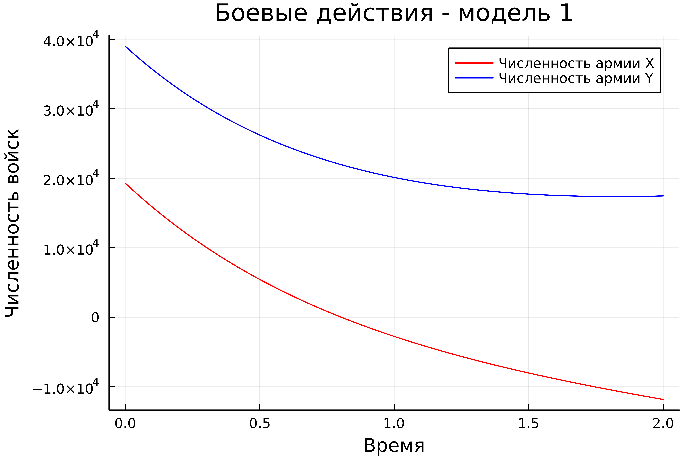
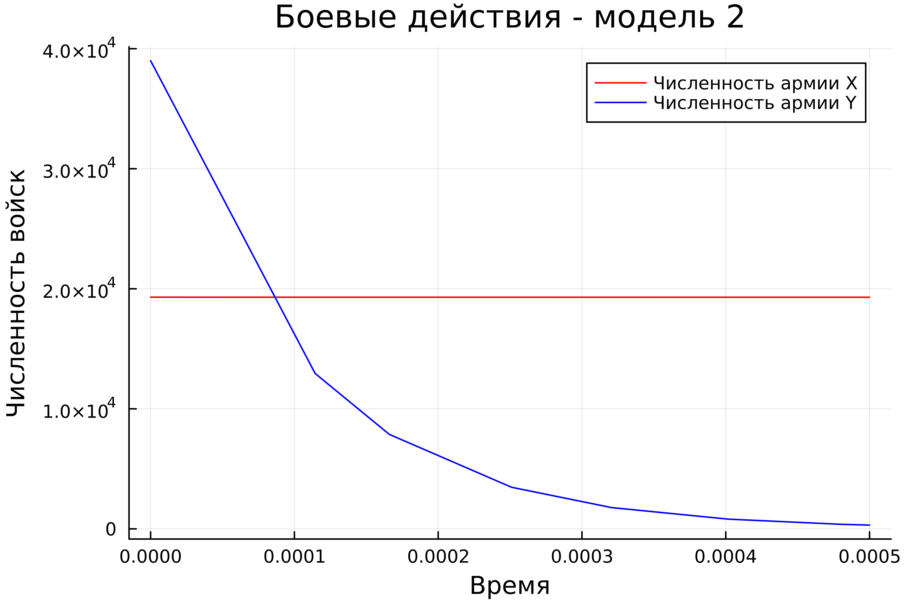
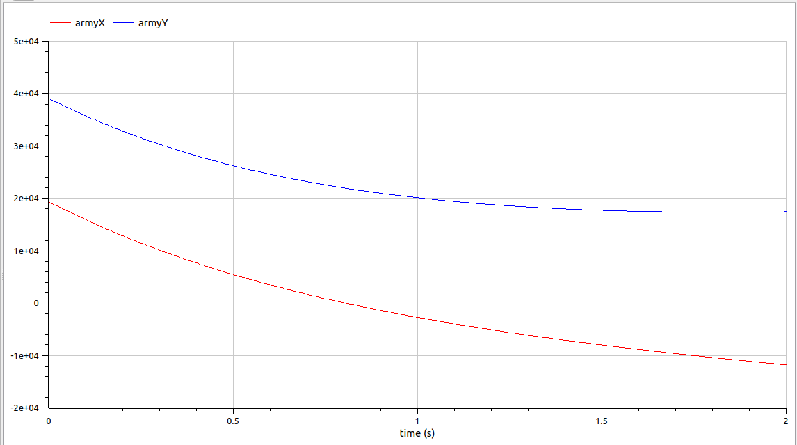
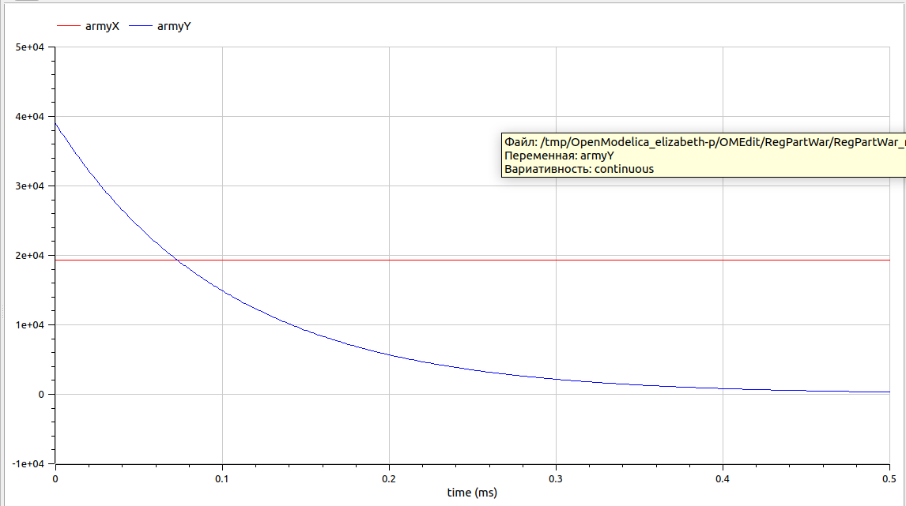

---
## Front matter
title: "Лабораторная работа №3"
subtitle: "Модель боевых действий"
author: "Парфенова Елизавета Евгеньевна"

## Generic otions
lang: ru-RU
toc-title: "Содержание"

## Bibliography
bibliography: bib/cite.bib
csl: pandoc/csl/gost-r-7-0-5-2008-numeric.csl

## Pdf output format
toc: true # Table of contents
toc-depth: 2
lof: true # List of figures
lot: true # List of tables
fontsize: 12pt
linestretch: 1.5
papersize: a4
documentclass: scrreprt
## I18n polyglossia
polyglossia-lang:
  name: russian
  options:
	- spelling=modern
	- babelshorthands=true
polyglossia-otherlangs:
  name: english
## I18n babel
babel-lang: russian
babel-otherlangs: english
## Fonts
mainfont: PT Serif
romanfont: PT Serif
sansfont: PT Sans
monofont: PT Mono
mainfontoptions: Ligatures=TeX
romanfontoptions: Ligatures=TeX
sansfontoptions: Ligatures=TeX,Scale=MatchLowercase
monofontoptions: Scale=MatchLowercase,Scale=0.9
## Biblatex
biblatex: true
biblio-style: "gost-numeric"
biblatexoptions:
  - parentracker=true
  - backend=biber
  - hyperref=auto
  - language=auto
  - autolang=other*
  - citestyle=gost-numeric
## Pandoc-crossref LaTeX customization
figureTitle: "Рис."
tableTitle: "Таблица"
listingTitle: "Листинг"
lofTitle: "Список иллюстраций"
lotTitle: "Список таблиц"
lolTitle: "Листинги"
## Misc options
indent: true
header-includes:
  - \usepackage{indentfirst}
  - \usepackage{float} # keep figures where there are in the text
  - \floatplacement{figure}{H} # keep figures where there are in the text
---

# Цель работы

Изучить модель боевых действий Ланчестера и применить эти знания при построении графиков в лабораторной работе. Изучить основы работы с OpenModelica.

# Задание

Мой вариант - Вариант №8. 

*Модель боевых действий - вариант №8*

Между страной $X$ и страной $Y$ идет война. Численность состава войск
исчисляется от начала войны, и являются временными функциями
$x(t)$ и $y(t)$. В начальный момент времени страна $X$ имеет армию численностью 19 300 человек, а в распоряжении страны $Y$ армия численностью в 39 000 человек. Для упрощения модели считаем, что коэффициенты
$a, b, c, h$ постоянны. Также считаем $P(t)$ и $Q(t)$
непрерывные функции. 
Постройте графики изменения численности войск армии $X$ и армии $Y$ для
следующих случаев:

1. Модель боевых действий между регулярными войсками
$$
\left\{
\begin{array}{cc}
\dfrac{dx}{dt} = -0,46x(t) - 0,7y(t) + sin(0,5t)  \\\\
\dfrac{dy}{dt} = -0,82x(t) - 0,5y(t) + cos(1,5t) 
\end{array}
\right.
$$

2. Модель ведение боевых действий с участием регулярных войск и
партизанских отрядов:

$$
\left\{
\begin{array}{cc}
\dfrac{dx}{dt} = -0,38x(t) - 0,73y(t) + sin(2t) + 1  \\\\
\dfrac{dy}{dt} = -0,5x(t)y(t) - 0,28y(t) + cos(2t) 
\end{array}
\right.
$$

Граифики необходимо построить как в Julia, так и в OpenModelica.

# Теоретичеcкое введение

**OpenModelica**

*OpenModelica* — свободное открытое программное обеспечение для моделирования, симуляции, оптимизации и анализа сложных динамических систем. Основано на языке Modelica. OpenModelica используется в академической среде и на производстве. В промышленности используется в области оптимизации энергоснабжения, автомобилестроении и водоочистке. 

Включает блоки механики, электрики, электроники, электродвигатели, гидравлики, термодинамики, элементы управления и т. д.
OpenModelica имеет значительно более удобное представление системы уравнений исследуемого блока в сравнении с другими вычислительными средами (фактически без существенного преобразования и без сведения к форме Коши, остаётся лишь задать начальные условия и записать уравнения в скоростях)[@wiki:bash].

**Установка OpenModelica в системе Linux**

Необходимо использовать следующие строки в командной строке для обновления ваших пакетов и установки сертификата, подписывающего пакеты OpenModelica:

``` 
sudo apt-get update
sudo apt-get install ca-certificates curl gnupg
sudo curl -fsSL http://build.openmodelica.org/apt/openmodelica.asc | \
  sudo gpg --dearmor -o /usr/share/keyrings/openmodelica-keyring.gpg
```
Затем необходимо обновить исходные тексты, используя строки ниже. (Параметры установки на ресурче выбраны общие: Архитектура процессора: amd64, операционная система: auto, Выпускная ветвь: stable): 

```
echo "deb [arch=amd64 signed-by=/usr/share/keyrings/openmodelica-keyring.gpg] \
  https://build.openmodelica.org/apt \
  $(cat /etc/os-release | grep "\(UBUNTU\\|DEBIAN\\|VERSION\)_CODENAME" | sort | cut -d= -f 2 | head -1) \
  stable" | sudo tee /etc/apt/sources.list.d/openmodelica.list
```
После этого нужно обновить и устанвоить OpenModelica [@om:bash]:

```
sudo apt update
sudo apt install openmodelica
```
**Модель боевых действий - модель Ланчестера**

*Законы Ланчестера* представляют собой математические формулы для расчета относительной численности вооруженных сил. Уравнения Ланчестера - это дифференциальные уравнения, описывающие зависимость численности двух армий A и B от времени, причем функция зависит только от A и B. [@wiki_2:bash]

В наиболее общем виде ланчестерские модели можно описать уравнением:

$$
\left\{
\begin{array}{cc}
\dfrac{dR_1}{dt} = -a_1R_1 - {\gamma}_1R_1R_2 + d_1  \\\\
\dfrac{dR_2}{dt} = -a_2R_2 - {\gamma}_2R_1R_2 + d_2 
\end{array}
\right.
$$

где $R1$ и $R2$ – ресурсы (численности) соответственно 1-й и 2-й конфликтующих сторон; $a1$  и  $a2$  –  интенсивность  небоевых  потерь  соот-ветственно 1-й и 2-й  конфликтующих  сторон; ${\gamma}_1$  и  ${\gamma}_2$ –  интенсивность  боевых потерь,  вследствие воздействия противоположной  стороны, соответствен-но 1-й и 2-й стороны; $d_1$ и  $d_2$ – интенсивность вступления в  конфликт  резервов соответственно 1-й и 2-й конфликтующих сторон: $d_i$ > 0 – если резервы подходят и вступают в конфликт, $d_i$ < 0 – если резервы отходят и покидают конфликт. [@lan:bash]

# Выполнение лабораторной работы

**Построение математичсекой модели**

Мы будем рассматривать два случая ведения боевых действий в модели Ланчестера. 

**Боевые действия между регулярными войсками**

В этом случае численность регулярных войск определяется тремя
факторами:
- скорость уменьшения численности войск из-за причин, не связанных с
боевыми действиями (болезни, травмы, дезертирство);
- скорость потерь, обусловленных боевыми действиями
противоборствующих сторон (что связанно с качеством стратегии,
уровнем вооружения, профессионализмом солдат и т.п.);
- скорость поступления подкрепления (задаётся некоторой функцией от
времени).

При таком случае модель боевых действий описывается следующими дифференциальными уравнениями: 

$$
\left\{
\begin{array}{cc}
\dfrac{dx}{dt} = -a(t)x(t) - b(t)y(t) + P(t)  \\\\
\dfrac{dy}{dt} = -c(t)x(t) - h(t)y(t) + Q(t) 
\end{array}
\right.
$$ 

В данной системе элементы $-a(t)x(t)$ и $- h(t)y(t)$ описывают потери, не связанные с боевыми действиями, а элементы $- b(t)y(t)$ и $-c(t)x(t)$ описывают потери на поле боя. Коэффициенты $b(t)$ и $c(t)$ определят эффективность боевых действий со стороны двух армий, а $a(t)$ и $h(t)$ - степень влияния фаткоров на потери на поле боя. Функции $P(t), Q(t)$ учитывают возможность подхода подкрепления к армиям.  

**Боевые действия между регулярными войсками и партизанскими отрядами**

Нерегулярные войска, которыми являются партизанские отряды, в отличии от постоянной армии, менее уязвимы, так как действуют скрытно, в этом случае сопернику приходится действовать неизбирательно, по площадям, занимаемым партизанами. Поэтому считается, что темп потерь партизан пропорционален как численности армейскийх соединений, так и численности самих партизан. Тогда модель боевых действий примет вот такой вид: 

$$
\left\{
\begin{array}{cc}
\dfrac{dx}{dt} = -a(t)x(t) - b(t)y(t) + P(t)  \\\\
\dfrac{dy}{dt} = -c(t)x(t)y(t) - h(t)y(t) + Q(t) 
\end{array}
\right.
$$ 

При этом значения всех коэффициентов остаются такими же, как и в модели боевых действий для регулярных войск.

Дифференциальные уравнения в задаче соотвествуют построенным для обоих случаев моделям. 

**Построение графиков. Julia** 

В ходе построения графиков было решено использовать разные временные промежутки для более корректного и гладкого грфаика, особенно во второй модели. Код на Julia для построения обоих грфаиков по предложенной математической модели:

```
using Plots
using DifferentialEquations

const army = Float64[19300, 39000]  
#Временные промежутки для первой и второй модели соотвественно
const t1 = [0.0, 2.0]  
const t2 = [0.0, 0.0005]  

#Функция для регулярных войск
function regular_war(du, u, p, t)
    du[1] = -0.46*u[1] - 0.7*u[2] + sin(t*0.5)   
    du[2] = -0.82*u[1] - 0.5*u[2] + cos(t*1.5)  
end
#Функция для регулярных войск и партизанских отрядов
function regular_part(du, u, p, t)
    du[1] = -0.38*u[1] - 0.73*u[2] + sin(t*2) + 1  
    du[2] = -0.5*u[1]*u[2] - 0.28*u[2] + cos(t*2)  
end

#Решение дифференциальных уравнений для первого случая
equat1 = ODEProblem(regular_war, army, t1)
solv1 = solve(equat1, dtmax=0.01)  

#Решение дифференциальных уравнений для второго случая
equat2 = ODEProblem(regular_part, army, t2)  
solv2 = solve(equat2, dtmax=0.01) 

#Массивы решений для каждого уравнения каждой модели
U1_1 = [u[1] for u in solv1.u]
U1_2 = [u[2] for u in solv1.u]
U2_1 = [u[1] for u in solv2.u]
U2_2 = [u[2] for u in solv2.u]

##Отрисовка графиков для обоих моделей и сохранение изображений
plot1 = plot(dpi = 1200, legend= true, bg =:white, xlabel="Время", ylabel="Численность войск", title="Боевые действия - модель 1")
plot!(plot1, solv1.t, U1_1, label="Численность армии X", color =:red)
plot!(plot1, solv1.t, U1_2, label="Численность армии Y", color =:blue)
savefig(plot1, "lab03_1.png")

plot2 = plot(dpi = 1200, legend= true, bg =:white, xlabel="Время", ylabel="Численность войск", title="Боевые действия - модель 2")
plot!(plot2, solv2.t, U2_1, label="Численность армии X", color =:red)
plot!(plot2, solv2.t, U2_2, label="Численность армии Y", color =:blue)
savefig(plot2, "lab03_2.png")
```
В результате исполнения кода в консоли после открытия Julia одноименной командой сгенерировались два изображения:

1. График модели боевых действий между регулярными войсками (рис. [-@fig:001]).

{#fig:001 width=70%}

2. График модели боевых действий между регулярными войсками и партизанскими отрядами (рис. [-@fig:002]).

{#fig:002 width=70%}

**Построение графиков. OpenModelica** 

OpenModelica бфла установлена согласно инструкции в теоретичсеком введении. После я открыла рабочее пространство, которое установился отдельным приложением (рис. [-@fig:003]). 

{#fig:003 width=70%}

Далее я написала две модели для 1 и 2 случая ведения боевых действий. 

Модель боевых действий между регулярными войсками: 

```
model RegularWar

Real t = time;
Real armyX(start=19300);
Real armyY(start=39000);
 
equation
der(armyX) = -0.46*armyX - 0.7*armyY+ sin(t*0.5);   
der(armyY) = -0.82*armyX - 0.5*armyY + cos(t*1.5);  

end RegularWar;
```

Модель боевых действий между регулярными войсками и партизанскими отрядами:

```
model RegPartWar

Real t = time;
Real armyX(start=19300);
Real armyY(start=39000);

equation
der(armyX) = -0.38*armyX - 0.73*armyY + sin(t*2) + 1;   
der(armyY) = -0.5*armyX*armyY - 0.28*armyY + cos(t*2); 
 
end RegPartWar;
```

В результате были построены два графика:

1. График модели боевых действий между регулярными войсками (рис. [-@fig:004]). Красный график - численность армии $X$, а синий график - численность армии $Y$

{#fig:004 width=70%}

2. График модели боевых действий между регулярными войсками и партизанскими отрядами (рис. [-@fig:005]). Цвета графиков совпадают с обозначениями в предыдущем случае.

{#fig:005 width=70%}

**Анализ получившихся графиков**

Сравнив графики соотвествующих друг другу моделей боевых действий, созданных в Julia и OpenModelica, можно наглядно увидеть, что графики практически идентичны. Их разница заключается лишь в масштабе. 

# Выводы

Мы изучили модель боевых действий Ланчестера и выполнили задание лаюораторной работы, построив графики для требуебых случаев в Julia и OpenModelica. При этом мы изучили основы моделировани в OpenModelica и, нужно сказать, построение модели в OpenModelica мне показалось значительно проще и понятнее.

# Список литературы{.unnumbered}

::: {#refs}
:::
