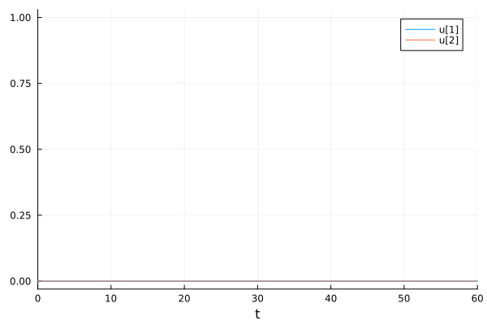
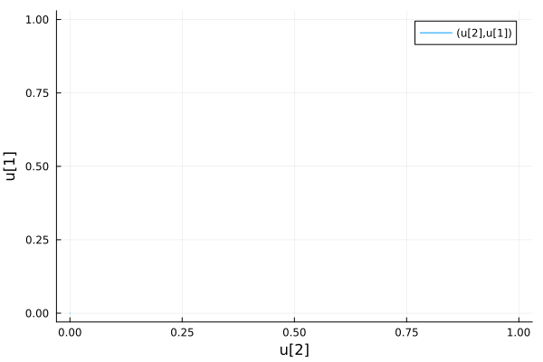
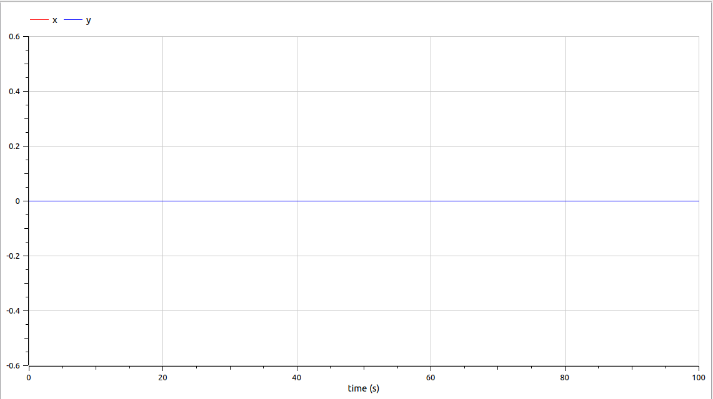
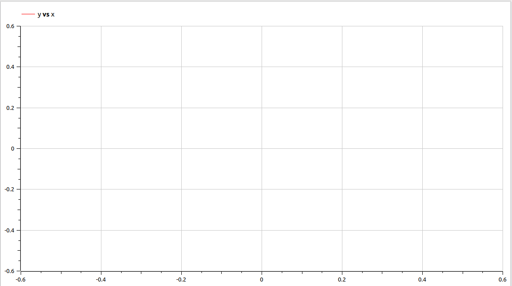
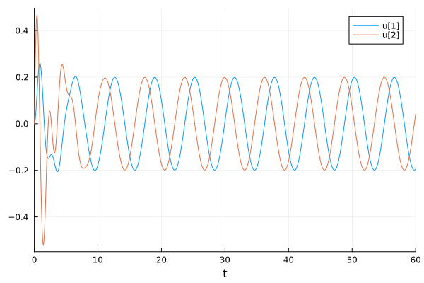
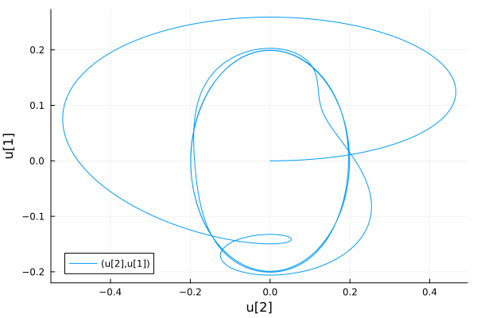
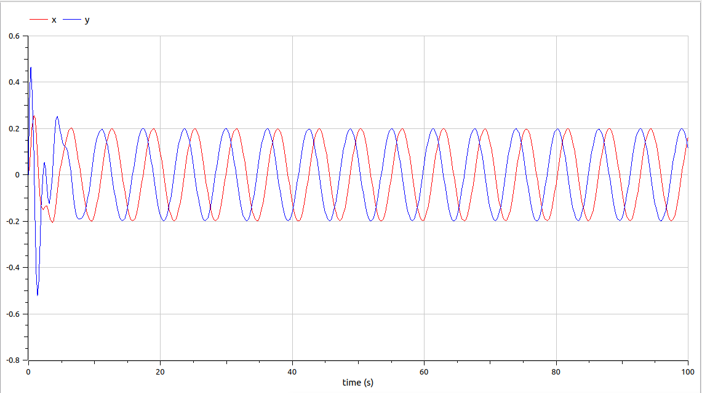
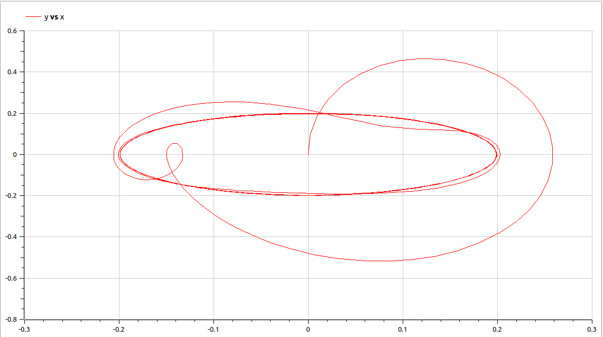

---
## Front matter
lang: ru-RU
title: Лабораторная работа №4
subtitle: Модель гармонических колебаний
author:
  - Парфенова Е. Е.
teacher:
  - Кулябов Д. С.
  - д.ф.-м.н., профессор
  - профессор кафедры прикладной информатики и теории вероятностей
institute:
  - Российский университет дружбы народов, Москва, Россия
date: 29 февраля 2024

## i18n babel
babel-lang: russian
babel-otherlangs: english

## Formatting pdf
toc: false
toc-title: Содержание
slide_level: 2
aspectratio: 169
section-titles: true
theme: metropolis
header-includes:
 - \metroset{progressbar=frametitle,sectionpage=progressbar,numbering=fraction}
 - '\makeatletter'
 - '\beamer@ignorenonframefalse'
 - '\makeatother'
---

# Информация

## Докладчик

:::::::::::::: {.columns align=center}
::: {.column width="70%"}

  * Парфенова Елизавета Евгеньвена
  * студент
  * Российский университет дружбы народов
  * [1032216437@pfur.ru](mailto:1032216437@pfur.ru)
  * <https://github.com/parfenovaee>

:::
::: {.column width="30%"}

:::
::::::::::::::

# Вводная часть

## Актуальность

- Важность умения строить визуальное представление (графики решений, фазовые портреты и т.д) для различных математических моделей, представленных дифференциальными уранвениями
- Более глубокое понимание поведения физических систем, которые подобны той, что описана в лабораторной работе, в различных случаях

## Цели и задачи

- Изучить понятие гармонических колебаний и гармонического осциллятора
- Изучить математичсекую модель колебаний гармонического осциллятора 
- Найти решение уравнений и построить фазовый портерт для различных случаев в Julia и OpenModelica

# Теоретическое введение 

## Теоретичсекое введение(1)

*Гармонические колебания* — колебания, при которых физическая величина изменяется с течением времени по гармоническому (синусоидальному, косинусоидальному) закону. 

*Гармониический осциллятор* (в классической механике) — система, которая при выведении её из положения равновесия испытывает действие возвращающей силы $F$, пропорциональной смещению $x$: 

$F = kx$, где $k$ - постоянный коэффициент.

## Теоретичсекое введение(2)

Если $F$ — единственная сила, действующая на систему, то систему называют простым или консервативным гармоническим осциллятором. 

Если имеется ещё и сила трения (затухание), пропорциональная скорости движения, то такую систему называют затухающим или диссипативным осциллятором.

## Теоретичсекое введение(3)

По второму закону Ньютона дифференциальное уравнение, описывающее затухающий осциллятор выглядит так:

$$\ddot{x}+2\gamma\dot{x}+\omega_0^2=0$$ 

где $x$ – переменная, описывающая состояние системы, $\gamma$ – параметр, характеризующий потери энергии, $\omega_0$
– собственная частота колебаний, $t$ – время.

*Фазовый портрет* - это геометрическое представление орбит динамической системы в фазовой плоскости. Каждый набор начальных условий представлен отдельной точкой или кривой.

# Задание лабораторной работы

## Задача

Мой вариант - вариант №8 

Постройте фазовый портрет гармонического осциллятора и решение уравнения
гармонического осциллятора для следующих случаев: 

1. Колебания гармонического осциллятора без затуханий и без действий внешней
силы $\ddot{x}+1.5x=0$

2. Колебания гармонического осциллятора c затуханием и без действий внешней
силы $\ddot{x}+\dot{x}+10x=0$

3. Колебания гармонического осциллятора c затуханием и под действием внешней
силы $\ddot{x}+\dot{x}+11x=2\cos(t)$

На интервале $t\in [0;60]$ (шаг 0.05) с начальными условиями $x_0 = 0, y_0 = 0$

# Выполнение лабораторной работы

## Математчисекая модель (1)

Как уже было обозначено в теоретическом введении, уравнение свободных колебаний гармонического осциллятора имеет следующий вид:

$$\ddot{x}+2\gamma\dot{x}+\omega_0^2=0$$ 

## Математчисекая модель (2)

Уравнение, написанное выше, - это линейное однородное дифференциальное уравнение
второго порядка и оно является примером линейной динамической системы.
При отсутствии потерь в системе ( $\gamma = 0$) получаем
уравнение консервативного осциллятора энергия колебания которого сохраняется
во времени:

$$\ddot{x}+\omega_0^2=0$$ 

## Математчисекая модель (3)

анное уранение второго порядка можно представить в виде системы дифференциальных уравнений первого порядка: 

$$
 \begin{cases}
	\dot{x}=y
	\\   
	\dot{y}=-\omega_0^2 x
 \end{cases}
$$

с начальными условиями: 

$$
 \begin{cases}
	x(t_0)=x_0
	\\   
	y(t_0)=y_0
 \end{cases}
$$

## Математчисекая модель (4)

Независимые переменные $x$, $y$ определяют пространство, в котором
«движется» решение. Это фазовое пространство системы, поскольку оно двумерно
будем называть его **фазовой плоскостью**. 

Решению уравнения движения как функции времени отвечает гладкая кривая в фазовой плоскости. Она называется **фазовой траекторией**. 

Если множество различных решений (соответствующих различным 
начальным условиям) изобразить на одной фазовой плоскости, возникает общая
картина поведения системы. Такую картину, образованную набором фазовых
траекторий, называют **фазовым портретом**.

## Колебания гармонического осциллятора без затуханий и без действий внешней силы. Julia

Уравнение для этого случая представлено в таком виде: $\ddot{x}+1.5x=0$. Здесь $\omega^2 = 1.5$.

В результате моделирования были сгенерированы два изображения

1. Решение уравнения колебаний гармонического осциллятора для случая без затуханий и без воздествия внешей силы.

{#fig:001 width=20%}

## Колебания гармонического осциллятора без затуханий и без действий внешней силы. Julia

2. Фазовый портрет колебаний гармонического осциилятора для случая без затуханий и без воздествия внешей силы.

{#fig:002 width=40%}

## Колебания гармонического осциллятора без затуханий и без действий внешней силы. OpenModelica

В результате моделирования получились такие же график решения и фазовый портрет, как и для Julia: 

1. Решение уравнения колебаний гармонического осциллятора для случая без затуханий и без воздествия внешей силы.

{#fig:003 width=30%}

## Колебания гармонического осциллятора без затуханий и без действий внешней силы. OpenModelica

2. Фазовый портрет колебаний гармонического осциилятора для случая без затуханий и без воздествия внешей силы.

{#fig:004 width=50%}

## Колебания гармонического осциллятора без затуханий и без действий внешней силы. OpenModelica

Так как начальные условия равны нулю ($x_0 = 0, y_0 = 0$), то в итоге без затуханий и воздествия каких-либо внещних сил решением уранвения колебаний становятся две совпадающие друг с другом прямые, проходящие через центр координат. А фазовый портрет приобретает вид точки, которая находится в центре координат. Что мы, собственно, и видим на представленных графиках. 

## Колебания гармонического осциллятора с затуханиями и без действий внешней силы. Julia

Уравнение для этого случая представлено в таком виде: $\ddot{x}+\dot{x}+10x=0$. Здесь $\omega^2 = 10$, a $g = 1$. 

В результате работы кода сгенерировались такие изображения: 

1. Решение уравнения колебаний гармонического осциллятора для случая с затуханиями и воздествия внешей силы.

{#fig:005 width=25%}

## Колебания гармонического осциллятора с затуханиями и без действий внешней силы. Julia

2. Фазовый портрет колебаний гармонического осциилятора для случая с затуханиями и без воздествия внешей силы.

{#fig:006 width=40%}

## Колебания гармонического осциллятора с затуханиями и без действий внешней силы. OpenModelica

В результате моделирвоания: 

1. Решение уравнения колебаний гармонического осциллятора для случая с затуханиями и без воздествия внешей силы.

{#fig:007 width=40%}

## Колебания гармонического осциллятора с затуханиями и без действий внешней силы. OpenModelica

2. Фазовый портрет колебаний гармонического осциилятора для случая с затуханием и без воздествия внешей силы.

{#fig:008 width=40%}

## Колебания гармонического осциллятора с затуханиями и без действий внешней силы. OpenModelica

Данные графики повторяют графики предыдущего случая, так как начальные условия остаются неизменны и превращают график решения уранвения в две совпадающие прямые, а фазовый портрет схлопывают в точку. Затухания никак не влияют на поведение графика в данном случае.

## Колебания гармонического осциллятора с затуханиями и с действием внешней силы. Julia

Уравнение для этого случая представлено в таком виде: $\ddot{x}+\dot{x}+11x=2cos(t)$. Здесь $\omega^2 = 11$, a $g = 1$. 

В результате моделирования получились вот такие изображения: 

## Колебания гармонического осциллятора с затуханиями и с действием внешней силы. Julia

1. Решение уравнения колебаний гармонического осциллятора для случая с затуханиями и с воздествием внешей силы.

{#fig:009 width=40%}

## Колебания гармонического осциллятора с затуханиями и с действием внешней силы. Julia

2. Фазовый портрет колебаний гармонического осциилятора для случая с затуханиями и с воздествием внешей силы.

{#fig:010 width=40%}

## Колебания гармонического осциллятора с затуханиями и с действием внешней силы. OpenModelica

Результаты моделирования в данном случае: 

1. Решение уравнения колебаний гармонического осциллятора для случая с затуханиями и с воздествием внешей силы.

{#fig:011 width=40%}

## Колебания гармонического осциллятора с затуханиями и с действием внешней силы. OpenModelica

2. Фазовый портрет колебаний гармонического осциилятора для случая с затуханиями и с воздествием внешей силы.

{#fig:012 width=50%}

## Колебания гармонического осциллятора с затуханиями и с действием внешней силы. OpenModelica

В результате вмешательства внешней силы график решения и фазовый портерт уже выглядят не так, как в предыдущих двух случаях. Графики на Julia и OpenModelica совпадают, немного отличаются лишь масштабом (фазовый портрет в OpemModelica получился более растянутым) 

# Вывод

## Вывод

Были изучены понятия гармоничсекого осциллятора и гармонических колебаний, изучена модель колебаний гармонического осциллятора и с помощью нее построены графики решения уравнения и фазовые протреты для нескольких случаев в Julia и OpenModelica. 