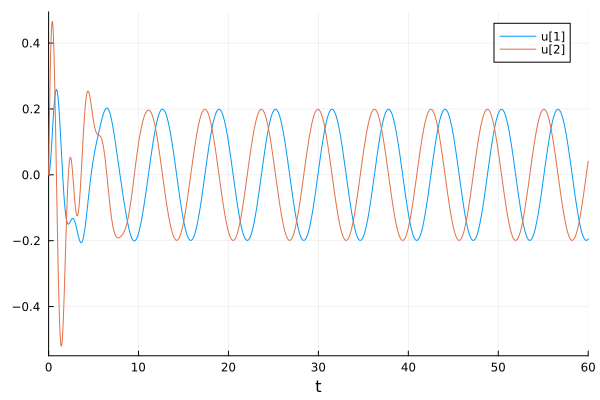

---
## Front matter
title: "Лабораторная работа №4"
subtitle: "Модель гармонических колебаний"
author: "Парфенова Елизавета Евгеньевна"

## Generic otions
lang: ru-RU
toc-title: "Содержание"

## Bibliography
bibliography: bib/cite.bib
csl: pandoc/csl/gost-r-7-0-5-2008-numeric.csl

## Pdf output format
toc: true # Table of contents
toc-depth: 2
lof: true # List of figures
lot: true # List of tables
fontsize: 12pt
linestretch: 1.5
papersize: a4
documentclass: scrreprt
## I18n polyglossia
polyglossia-lang:
  name: russian
  options:
	- spelling=modern
	- babelshorthands=true
polyglossia-otherlangs:
  name: english
## I18n babel
babel-lang: russian
babel-otherlangs: english
## Fonts
mainfont: PT Serif
romanfont: PT Serif
sansfont: PT Sans
monofont: PT Mono
mainfontoptions: Ligatures=TeX
romanfontoptions: Ligatures=TeX
sansfontoptions: Ligatures=TeX,Scale=MatchLowercase
monofontoptions: Scale=MatchLowercase,Scale=0.9
## Biblatex
biblatex: true
biblio-style: "gost-numeric"
biblatexoptions:
  - parentracker=true
  - backend=biber
  - hyperref=auto
  - language=auto
  - autolang=other*
  - citestyle=gost-numeric
## Pandoc-crossref LaTeX customization
figureTitle: "Рис."
tableTitle: "Таблица"
listingTitle: "Листинг"
lofTitle: "Список иллюстраций"
lotTitle: "Список таблиц"
lolTitle: "Листинги"
## Misc options
indent: true
header-includes:
  - \usepackage{indentfirst}
  - \usepackage{float} # keep figures where there are in the text
  - \floatplacement{figure}{H} # keep figures where there are in the text
---

# Цель работы

- Изучить понятие гармонических колебаний и гармонического осциллятора
- Изучить математичсекую модель колебаний гармонического осциллятора 
- Найти решение уравнений и построить фазовый портерт для различных случаев в Julia и OpenModelica

# Задание

Мой вариант - вариант №8 

Постройте фазовый портрет гармонического осциллятора и решение уравнения
гармонического осциллятора для следующих случаев: 

1. Колебания гармонического осциллятора без затуханий и без действий внешней
силы 

   $$\ddot{x}+1.5x=0$$

2. Колебания гармонического осциллятора c затуханием и без действий внешней
силы 

   $$\ddot{x}+\dot{x}+10x=0$$

3. Колебания гармонического осциллятора c затуханием и под действием внешней
силы 

   $$\ddot{x}+\dot{x}+11x=2\cos(t)$$

На интервале $t\in [0;60]$ (шаг 0.05) с начальными условиями $x_0 = 0, y_0 = 0$

# Теоретическое введение

*Гармонические колебания* — колебания, при которых физическая величина изменяется с течением времени по гармоническому (синусоидальному, косинусоидальному) закону. [@wiki:bash]

*Гармониический осциллятор* (в классической механике) — система, которая при выведении её из положения равновесия испытывает действие возвращающей силы $F$, пропорциональной смещению $x$: 

$F = kx$, где $k$ - постоянный коэффициент.


Если $F$ — единственная сила, действующая на систему, то систему называют простым или консервативным гармоническим осциллятором. 

Если имеется ещё и сила трения (затухание), пропорциональная скорости движения, то такую систему называют затухающим или диссипативным осциллятором[@wiki_1:bash].

По второму закону Ньютона дифференциальное уравнение, описывающее затухающий осциллятор выглядит так [@wiki_1:bash]:

$$\ddot{x}+2\gamma\dot{x}+\omega_0^2=0$$ 

где $x$ – переменная, описывающая состояние системы (смещение грузика, заряд
конденсатора и т.д.), $\gamma$ – параметр, характеризующий потери энергии (трение в
механической системе, сопротивление в контуре), $\omega_0$
– собственная частота колебаний, $t$ – время.

*Фазовый портрет* - это геометрическое представление орбит динамической системы в фазовой плоскости. Каждый набор начальных условий представлен отдельной точкой или кривой [@wiki_2:bash].

# Выполнение лабораторной работы

**Математичсекая модель** 

Как уже было обозначено в теоретическом введении, уравнение свободных колебаний гармонического осциллятора имеет следующий вид:

$$\ddot{x}+2\gamma\dot{x}+\omega_0^2=0$$ 

где $x$ – переменная, описывающая состояние системы (смещение грузика, заряд
конденсатора и т.д.), $\gamma$ – параметр, характеризующий потери энергии (трение в
механической системе, сопротивление в контуре), $\omega_0$ – собственная частота колебаний, $t$ – время.

Уравнение, написанное выше, - это линейное однородное дифференциальное уравнение
второго порядка и оно является примером линейной динамической системы.
При отсутствии потерь в системе ( $\gamma = 0$) получаем
уравнение консервативного осциллятора энергия колебания которого сохраняется
во времени:

$$\ddot{x}+\omega_0^2=0$$ 

Данное уранение второго порядка можно представить в виде системы дифференциальных уравнений первого порядка: 

$$
 \begin{cases}
	\dot{x}=y
	\\   
	\dot{y}=-\omega_0^2 x
 \end{cases}
$$

с начальными условиями: 

$$
 \begin{cases}
	x(t_0)=x_0
	\\   
	y(t_0)=y_0
 \end{cases}
$$

Независимые переменные $x$, $y$ определяют пространство, в котором
«движется» решение. Это фазовое пространство системы, поскольку оно двумерно
будем называть его *фазовой плоскостью*. 

Решению уравнения движения как функции времени отвечает гладкая кривая в фазовой плоскости. Она называется *фазовой траекторией*. 

Если множество различных решений (соответствующих различным 
начальным условиям) изобразить на одной фазовой плоскости, возникает общая
картина поведения системы. Такую картину, образованную набором фазовых
траекторий, называют *фазовым портретом*.

**Колебания гармонического осциллятора без затуханий и без действий внешней силы**

*Julia*

Уравнение для этого случая представлено в таком виде: $\ddot{x}+1.5x=0$. Здесь $\omega^2 = 1.5$.

Код программы на Julia для этого случая выглядит так: 

```
# 1 случай
# Eq: x'' + 1.5x = 0

using DifferentialEquations
using Plots

w = 1.5

function without_intervention(du, u, p, t)
    du[1] = u[2]
    du[2] = -w*u[1]
end

#Начальные условия и временной промежуток
u0 = [0.0, 0.0]
timee = (0.0, 60.0)

prob = ODEProblem(without_intervention, u0, timee)
sol = solve(prob, dtmax = 0.05)

# Построение решения уранвения
plot(sol)
savefig("lab4_1_jl.png")

# Построение фазового потрета
plot(sol, vars=(2,1))
savefig("lab4_1_jl_pp.png")
```
В результате работы кода получились вот такие изображения: 

1. Решение уравнения колебаний гармонического осциллятора для случая без затуханий и без воздествия внешей силы  (рис. [-@fig:001]).

{#fig:001 width=70%}

2. Фазовый портрет колебаний гармонического осциилятора для случая без затуханий и без воздествия внешей силы (рис. [-@fig:002]).

{#fig:002 width=70%}

*OpenModelica*

Модель, написанная для этого случая, выглядит так: 

```
model without_intervention

parameter Real w = 1.5;  

parameter Real x0 = 0.0;
parameter Real y0 = 0.0;

Real x(start=x0); 
Real y(start=y0); 

equation 
der(x) = y; 
der(y) = -w*x; 

end without_intervention;
```

В результате моделирования получились такие же график решения и фазовый портрет, как и для Julia: 

1. Решение уравнения колебаний гармонического осциллятора для случая без затуханий и без воздествия внешей силы  (рис. [-@fig:003]).

{#fig:003 width=70%}

2. Фазовый портрет колебаний гармонического осциилятора для случая без затуханий и без воздествия внешей силы (рис. [-@fig:004]).

{#fig:004 width=70%}

Так как начальные условия равны нулю ($x_0 = 0, y_0 = 0$), то в итоге без затуханий и воздествия каких-либо внещних сил решением уранвения колебаний становятся две совпадающие друг с другом прямые, проходящие через центр координат. А фазовый портрет приобретает вид точки, которая находится в центре координат. Что мы, собственно, и видим на представленных графиках. 

**Колебания гармонического осциллятора с затуханиями и без действий внешней силы** 

*Julia*

Уравнение для этого случая представлено в таком виде: $\ddot{x}+\dot{x}+10x=0$. Здесь $\omega^2 = 10$, a $g = 1$. 

Код программы на Julia для этого случая выглядит так: 

```
# 2 случай
# Eq: x'' + x' + 10x = 0

using DifferentialEquations
using Plots

w = 10
g = 1

function with_one_intervention(du, u, p, t)
    du[1] = u[2]
    du[2] = -g*du[1]- w*u[1]
end

#Начальные условия и временной промежуток
u0 = [0.0, 0.0]
timee = (0.0, 60.0)

prob = ODEProblem(with_one_intervention, u0, timee)
sol = solve(prob, dtmax = 0.05)

# Построение решения уранвения
plot(sol)
savefig("lab4_2_jl.png")

# Построение фазового потрета
plot(sol, vars=(2,1))
savefig("lab4_2_jl_pp.png")
```

В результате работы кода сгенерировались такие изображения: 

1. Решение уравнения колебаний гармонического осциллятора для случая с затуханиями и воздествия внешей силы  (рис. [-@fig:005]).

{#fig:005 width=70%}

2. Фазовый портрет колебаний гармонического осциилятора для случая с затуханиями и без воздествия внешей силы (рис. [-@fig:006]).

{#fig:006 width=70%}


*OpenModelica*

Модель для построения необходимых графика решений и фазового портрета: 

```
model with_one_intervention

parameter Real w = 10;  
parameter Real g = 1;
 
parameter Real x0 = 0.0;
parameter Real y0 = 0.0;

Real x(start=x0); 
Real y(start=y0); 

equation 
der(x) = y; 
der(y) = -g*der(x) - w*x; 

end with_one_intervention;
```

Результаты работы кода: 

1. Решение уравнения колебаний гармонического осциллятора для случая с затуханиями и без воздествия внешей силы  (рис. [-@fig:007]).

{#fig:007 width=70%}

2. Фазовый портрет колебаний гармонического осциилятора для случая с затуханием и без воздествия внешей силы (рис. [-@fig:008]).

{#fig:008 width=70%}

Данные графики повторяют графики предыдущего случая, так как начальные условия остаются неизменны и превращают график решения уранвения в две совпадающие прямые, а фазовый портрет схлопывают в точку. Затухания никак не влияют на поведение графика и фазового портерата, однако внещняя сила все изменит. 

**Колебания гармонического осциллятора с затуханиями и с действием внешней силы** 

*Julia*

Уравнение для этого случая представлено в таком виде: $\ddot{x}+\dot{x}+11x=2cos(t)$. Здесь $\omega^2 = 11$, a $g = 1$. 

Код программы на Julia для этого случая выглядит так: 

```
# 3 случай
# Eq: x'' + x' + 11x = 2cos(t)

using DifferentialEquations
using Plots

w = 11
g = 1

function with_intervention(du, u, p, t)
    du[1] = u[2]
    du[2] = -g*du[1]- w*u[1] + 2*cos(t)
end

#Начальные условия и временной промежуток
u0 = [0.0, 0.0]
timee = (0.0, 60.0)

prob = ODEProblem(with_intervention, u0, timee)
sol = solve(prob, dtmax = 0.05)

# Построение решения уранвения
plot(sol)
savefig("lab4_3_jl.png")
 # Построение фазового потрета
plot(sol, vars=(2,1))
savefig("lab4_3_jl_pp.png")
```

Вот какие результаты получились: 

1. Решение уравнения колебаний гармонического осциллятора для случая с затуханиями и с воздествием внешей силы  (рис. [-@fig:009]).

{#fig:009 width=70%}

2. Фазовый портрет колебаний гармонического осциилятора для случая с затуханиями и с воздествием внешей силы (рис. [-@fig:010]).

{#fig:010 width=70%}

*OpenModelica*

Модель для построения грфаика решений и фазового портрета для случая с затуханиями и воздейтсивем внешних сил:

```
model with_interventiion

parameter Real w = 11.0;  
parameter Real g = 1.0;  

parameter Real x0 = 0.0; 
parameter Real y0 = 0.0; 

Real x(start=x0); 
Real y(start=y0); 
Real t = time;
 
equation 
der(x) = y; 
der(y) = -w*x - g*der(x) + 2*cos(t); 

end with_interventiion;
```

Результаты моделирования: 

1. Решение уравнения колебаний гармонического осциллятора для случая с затуханиями и с воздествием внешей силы  (рис. [-@fig:011]).

{#fig:011 width=70%}

2. Фазовый портрет колебаний гармонического осциилятора для случая с затуханиями и с воздествием внешей силы (рис. [-@fig:012]).

{#fig:012 width=70%}

В результате вмешательства внешней силы график решения и фазовый портерт уже выглядят не так, как в предыдущих двух случаях. Графики на Julia и OpenModelica совпадают, немного отличаются лишь масштабом (фазовый портрет в OpemModelica получился более растянутым) 

# Выводы

Были изучены понятия гармоничсекого осциллятора и гармонических колебаний, изучена модель колебаний гармонического осциллятора и с помощью нее построены график решения уравнения и фазовый протрет для нескольких случаев в Julia и OpenModelica. 

# Список литературы{.unnumbered}

::: {#refs}
:::
