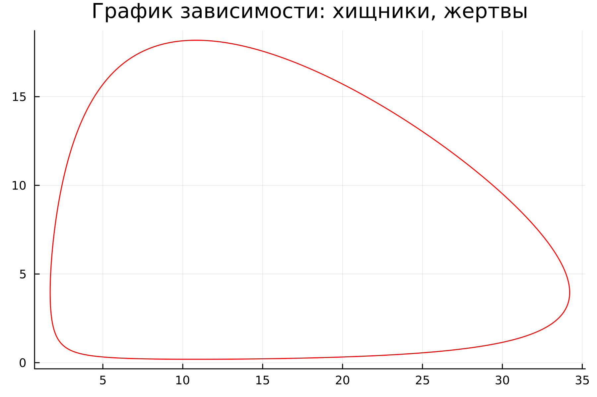
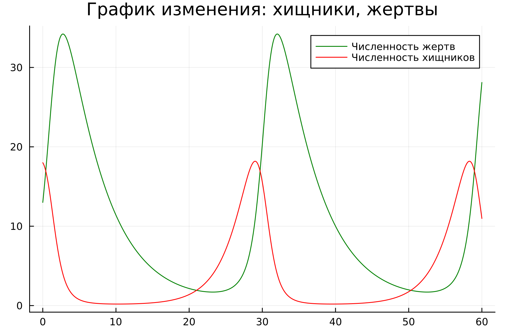
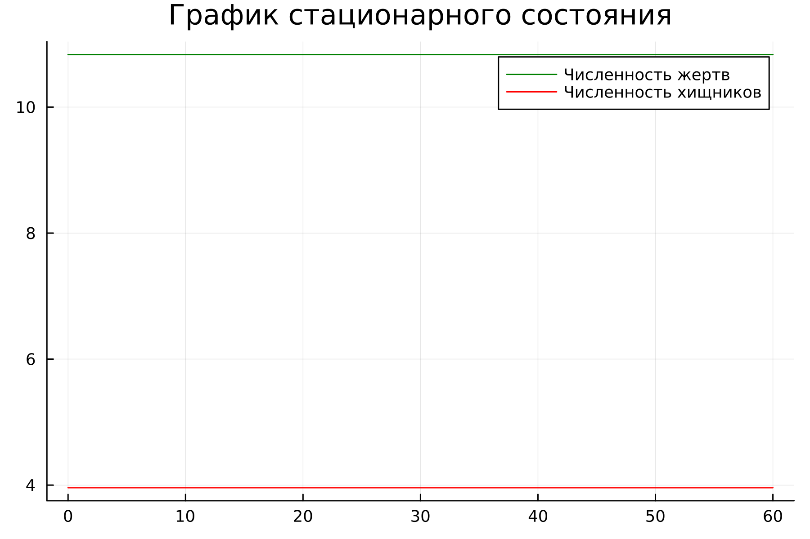
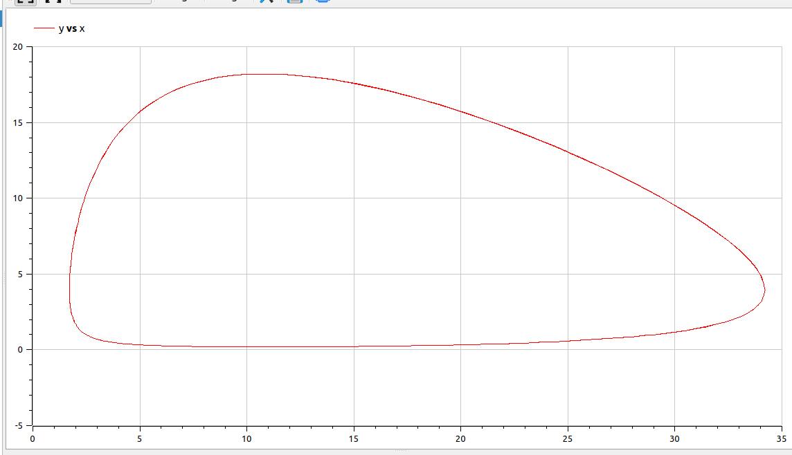
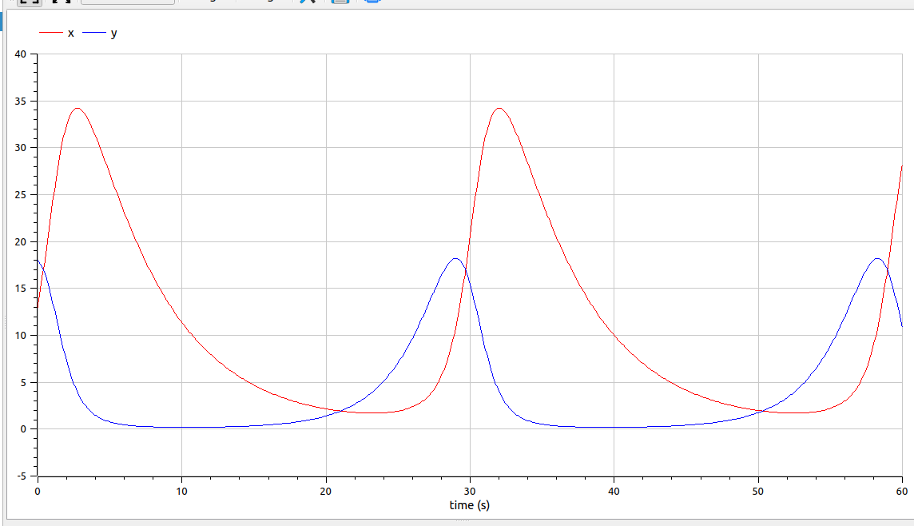
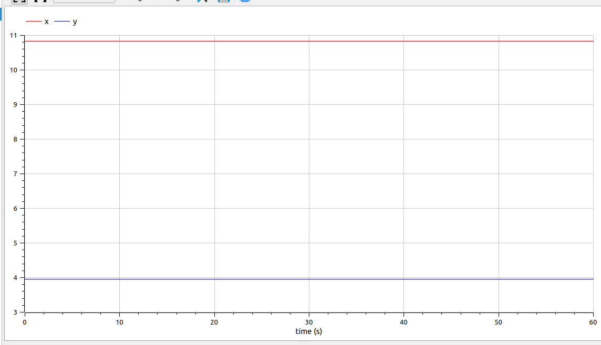

---
## Front matter
lang: ru-RU
title: Лаборторная работа №5
subtitle: Модель "хищник-жертва"
author:
  - Парфенова Е. Е.
teacher:
  - Кулябов Д. С.
  - д.ф.-м.н., профессор
  - профессор кафедры прикладной информатики и теории вероятностей
institute:
  - Российский университет дружбы народов, Москва, Россия
date: 5 марта 2024

## i18n babel
babel-lang: russian
babel-otherlangs: english

## Formatting pdf
toc: false
toc-title: Содержание
slide_level: 2
aspectratio: 169
section-titles: true
theme: metropolis
header-includes:
 - \metroset{progressbar=frametitle,sectionpage=progressbar,numbering=fraction}
 - '\makeatletter'
 - '\beamer@ignorenonframefalse'
 - '\makeatother'
---

# Информация

## Докладчик

:::::::::::::: {.columns align=center}
::: {.column width="70%"}

  * Парфенова Елизавета Евгеньвена
  * студент
  * Российский университет дружбы народов
  * [1032216437@pfur.ru](mailto:1032216437@pfur.ru)
  * <https://github.com/parfenovaee>

:::
::: {.column width="30%"}

:::
::::::::::::::

# Вводная часть

## Актуальность

- Важность изучения модели "хищник - жертва", распространенной в биологии и применяющейся даже в экономике
- Необходимость умения строить различные математичсекие модели и их визуальное представление

## Цели и задачи

- Изучить жесткую модель "хищник-жертва"
- Построить графики зависимости и изменения численностей хищников и жертв
- Найти стационарное состояние системы

# Теоретическое введение 

## Модель Лотки — Вольтерры

*Модель Лотки — Вольтерры* (модель Лотки — Вольтерра) — модель взаимодействия двух видов типа «хищник — жертва», названная в честь своих авторов, которые предложили модельные уравнения независимо друг от друга.

Такие уравнения можно использовать для моделирования систем «хищник — жертва», «паразит — хозяин», конкуренции и других видов взаимодействия между двумя видами.

## Модель Лотки — Вольтерры. Система уравнений

В математической форме предложенная система имеет следующий вид:

$$
\left\{
\begin{array}{cc}
\dfrac{dx}{dt} = (\alpha - \beta y)x  \\\\
\dfrac{dy}{dt} = (-\gamma - \delta x)y
\end{array}
\right.
$$

где где $x$  — количество жертв, $y$ — количество хищников, $t$ — время, $\alpha, \beta, \gamma, \delta$ — коэффициенты, отражающие взаимодействия между видами. 

## Модель Лотки — Вольтерры. Основания

Математическая модель наиболее простой, то есть двух видовой системы «хищник – жертва» основывается на следующих предположениях:

1) численности популяций жертв N и хищников M зависят только от времени;

2) в отсутствие взаимодействия численность видов изменяется по модели Мальтуса; 

3) естественная смертность жертвы и естественная рождаемость хищника считаются несущественными;

4) эффект насыщения численности обеих популяций не учитывается;

5) скорость роста численности жертвы уменьшается пропорционально численности хищников;

## Модель Лотки — Вольтерры. Стационарное состояние

Для положения равновесия $\overline{x}> 0, \overline{y}> 0$ изменение численностей популяции равно нулю. Следовательно:
$$
\begin{array}{cc}
\alpha \overline{x} - \beta \overline{y} \overline{x}= 0 \\
-\gamma \overline{y} - \delta x \overline{x} \overline{y} = 0 
\end{array}
$$

Отсюда следует, что $\overline{x} = {\gamma\over{\delta}}, \overline{y} = {\alpha\over{\beta}}$ 

# Задание лабораторной работы

## Задача. Вариант № 8

Для модели «хищник-жертва»:

$$
\left\{
\begin{array}{cc}
\dfrac{dx}{dt} = - 0.19 x(t) + 0.048 x(t) y(t) \\\\
\dfrac{dy}{dt} = 0.39 y(t) - 0.036 x(t) y(t) 
\end{array}
\right.
$$

Постройте график зависимости численности хищников от численности жертв, а также графики изменения численности хищников и численности жертв при
следующих начальных условиях: $x_0 = 13, y_0 = 19$. Найдите стационарное
состояние системы.

# Выполнение лабораторной работы

## Математичсекая модель

Простейшая модель взаимодействия двух видов типа «хищник — жертва» -
модель Лотки-Вольтерры.

Сама модель в нашем случае выглядит так: 

$$
\left\{
\begin{array}{cc}
\dfrac{dx}{dt} = a x(t) - b x(t) y(t) \\\\
\dfrac{dy}{dt} = - c y(t) + d x(t) y(t) 
\end{array}
\right.
$$

## Математичсекая модель

В этой модели $x$ – число жертв, $y$ - число хищников. Коэффициент $a$
описывает скорость естественного прироста числа жертв в отсутствие хищников, $с$ - естественное вымирание хищников, лишенных пищи в виде жертв. Каждый акт взаимодействия уменьшает популяцию жертв, но способствует увеличению популяции хищников, чему соотвествуют члены $-bxy$ и $dxy$ в правой части уравнения. 

## Математичсекая модель

Математический анализ этой модели, которая является жесткой, показывает, что имеется
стационарное состояние, всякое же другое начальное состояние B приводит к периодическому колебанию численности как жертв, так и хищников, так что по прошествии некоторого времени система возвращается в состояние B.

## Математичсекая модель

Стационарное состояние системы, описанной выше, (положение равновесия, не зависящее
от времени решение) будет в точке: $x = {c\over{d}}$, $y = {a\over{b}}$. 

Если начальные значения задать в стационарном состоянии $x(0) = x_0, y(0) = y_0$, то в любой момент времени численность популяций изменяться не будет. 

## Построение математичсекой модели. Julia

Для моделировния графиков был написан код на Julia, в результате работы которого сгенерировались изображения трех графиков: 

1. График зависимости численности хищников от численности жертв.

{#fig:001 width=40%}

## Построение математичсекой модели. Julia

2. График изменения численности хищников и численности жертв при начальных условиях $x_0 = 13, y_0 = 19$.

{#fig:002 width=50%}

## Построение математичсекой модели. Julia

3. График стационарного состояния.

{#fig:003 width=50%}

## Построение математичсекой модели. OpenModelica

Для моделирования были написаны две модели. В результате работы первой получились такие графики: 

1. График зависимости численности хищников от численности жертв.

{#fig:004 width=40%}

## Построение математичсекой модели. OpenModelica

2. График изменения численности хищников и численности жертв при начальных условиях $x_0 = 13, y_0 = 19$.

{#fig:005 width=50%}

## Построение математичсекой модели. OpenModelica

Результатом работы второй модели стал: 

График стационарного состояния.

{#fig:006 width=40%}

## Анализ результатов 

Графики, построенные на Julia и OpenModelica, совпали друг с другом, однако, можно отметить, что код, получившийся на OpenModelica, значительно меньше, чем на Julia. 

# Вывод

## Вывод 

В результате выполнения лабораторной работы мы изучили жесткую модель "хищник-жертва" и построили график зависимости численности хищников от численности жертв, графики изменения численности жертв и численности хищников, а также нашли стационарное состояние, используя Julia и OpemModelica. 