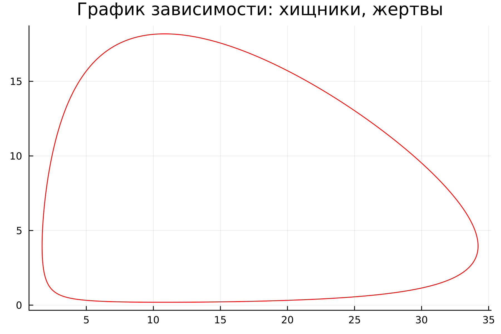
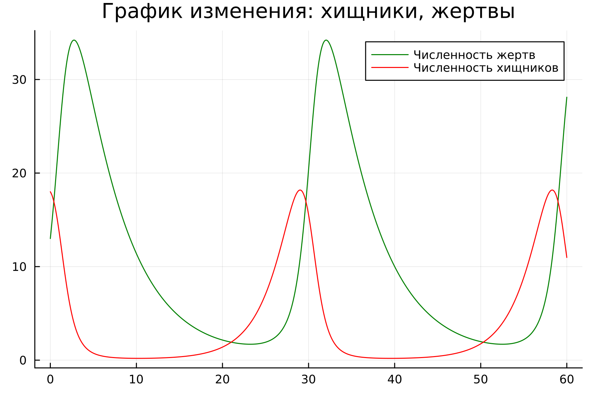
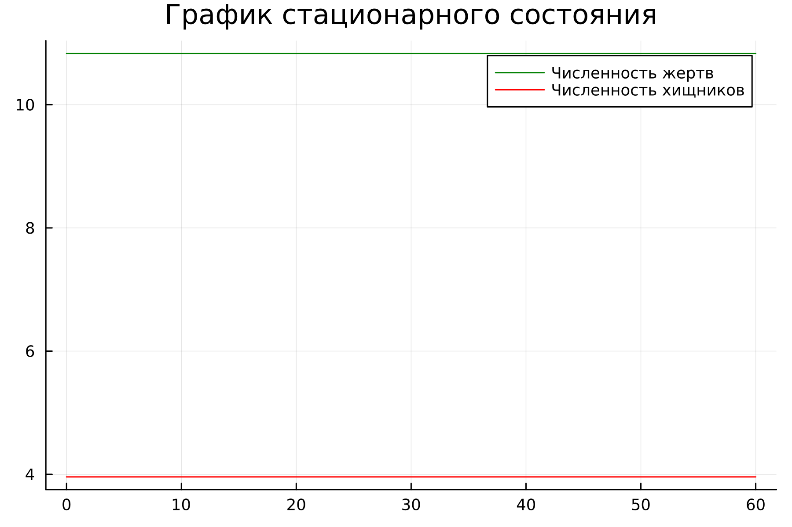
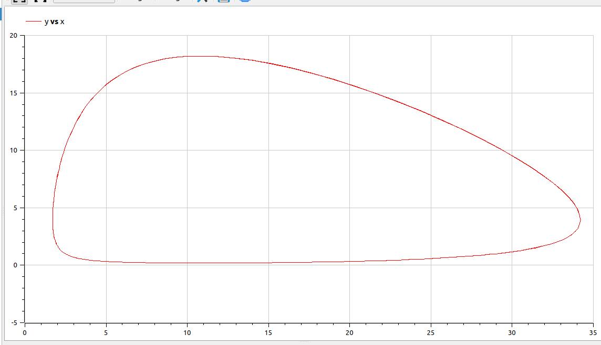
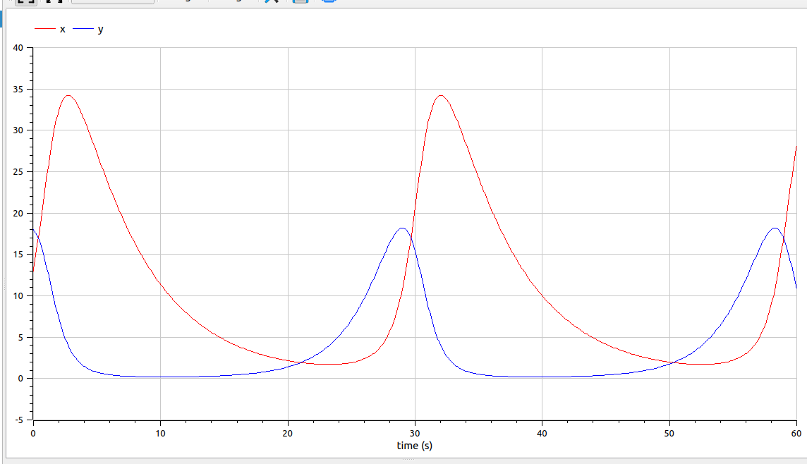
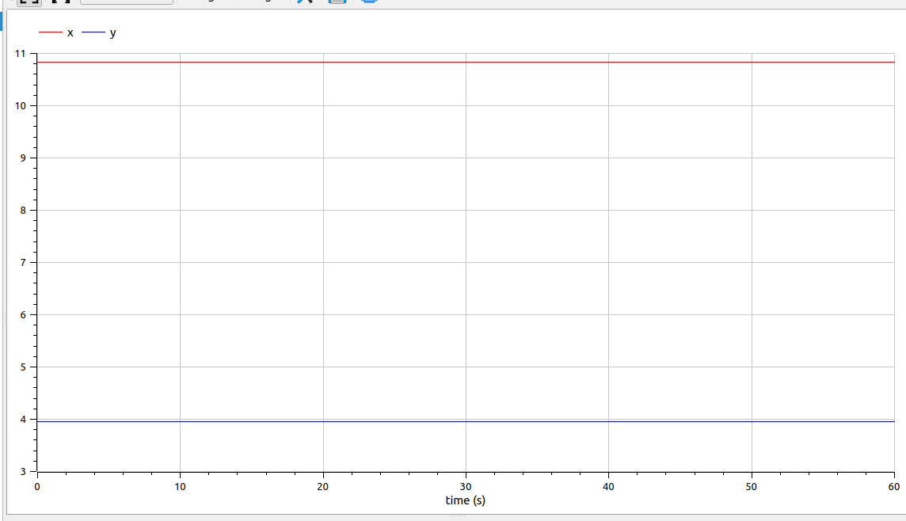

---
## Front matter
title: 'Лабораторная работа №5'
subtitle: 'Модеь "хищник-жертва"'
author: 'Парфенова Елизавета Евгеньевна'

## Generic otions
lang: ru-RU
toc-title: "Содержание"

## Bibliography
bibliography: bib/cite.bib
csl: pandoc/csl/gost-r-7-0-5-2008-numeric.csl

## Pdf output format
toc: true # Table of contents
toc-depth: 2
lof: true # List of figures
lot: true # List of tables
fontsize: 12pt
linestretch: 1.5
papersize: a4
documentclass: scrreprt
## I18n polyglossia
polyglossia-lang:
  name: russian
  options:
	- spelling=modern
	- babelshorthands=true
polyglossia-otherlangs:
  name: english
## I18n babel
babel-lang: russian
babel-otherlangs: english
## Fonts
mainfont: PT Serif
romanfont: PT Serif
sansfont: PT Sans
monofont: PT Mono
mainfontoptions: Ligatures=TeX
romanfontoptions: Ligatures=TeX
sansfontoptions: Ligatures=TeX,Scale=MatchLowercase
monofontoptions: Scale=MatchLowercase,Scale=0.9
## Biblatex
biblatex: true
biblio-style: "gost-numeric"
biblatexoptions:
  - parentracker=true
  - backend=biber
  - hyperref=auto
  - language=auto
  - autolang=other*
  - citestyle=gost-numeric
## Pandoc-crossref LaTeX customization
figureTitle: "Рис."
tableTitle: "Таблица"
listingTitle: "Листинг"
lofTitle: "Список иллюстраций"
lotTitle: "Список таблиц"
lolTitle: "Листинги"
## Misc options
indent: true
header-includes:
  - \usepackage{indentfirst}
  - \usepackage{float} # keep figures where there are in the text
  - \floatplacement{figure}{H} # keep figures where there are in the text
---

# Цель работы

Изучить распространенную модель "хищник-жертва" (жесткую) и построить графики зависимости и изменения численностей хищников и жертв, а также найти стационарное состояние.

# Задание

Мой вариант - вариант №8 

*Задача. Вариант №8*

Для модели «хищник-жертва»:

$$
\left\{
\begin{array}{cc}
\dfrac{dx}{dt} = - 0.19 x(t) + 0.048 x(t) y(t) \\\\
\dfrac{dy}{dt} = 0.39 y(t) - 0.036 x(t) y(t) 
\end{array}
\right.
$$

Постройте график зависимости численности хищников от численности жертв, а также графики изменения численности хищников и численности жертв при
следующих начальных условиях: $x_0 = 13, y_0 = 19$. Найдите стационарное
состояние системы.


# Теоретическое введение

*Модель Лотки — Вольтерры* (модель Лотки — Вольтерра) — модель взаимодействия двух видов типа «хищник — жертва», названная в честь своих авторов, которые предложили модельные уравнения независимо друг от друга.

Такие уравнения можно использовать для моделирования систем «хищник — жертва», «паразит — хозяин», конкуренции и других видов взаимодействия между двумя видами.

В математической форме предложенная система имеет следующий вид:

$$
\left\{
\begin{array}{cc}
\dfrac{dx}{dt} = (\alpha - \beta y)x  \\\\
\dfrac{dy}{dt} = (-\gamma - \delta x)y
\end{array}
\right.
$$

где где $x$  — количество жертв, $y$ — количество хищников, $t$ — время, $\alpha, \beta, \gamma, \delta$ — коэффициенты, отражающие взаимодействия между видами. [@wiki:bash]

Математическая модель наиболее простой, то есть двух видовой системы «хищник – жертва» основывается на следующих предположениях [@st:bash]:

1) численности популяций жертв N и хищников M зависят только от времени (модель не учитывающая пространственное распределение популяции на занимаемой территории);

2) в отсутствие взаимодействия численность видов изменяется по модели Мальтуса; при этом число жертв увеличивается, а число хищников падает, так как им в этом случае нечем питаться;

3) естественная смертность жертвы и естественная рождаемость хищника считаются несущественными;

4) эффект насыщения численности обеих популяций не учитывается;

5) скорость роста численности жертвы уменьшается пропорционально численности хищников;

*Нахождение положения равновесия системой* [@wiki:bash]

Для положения равновесия $\overline{x}> 0, \overline{y}> 0$ изменение численностей популяции равно нулю. Следовательно:
$$
\alpha \overline{x} - \beta \overline{y} \overline{x}= 0 \\
-\gamma \overline{y} - \delta x \overline{x} \overline{y} = 0 
$$

Отсюда следует, что $\overline{x} = {\gamma\over{\delta}}, \overline{y} = {\alpha\over{\beta}}$ 

# Выполнение лабораторной работы

**Математическая модель**

Простейшая модель взаимодействия двух видов типа «хищник — жертва» -
модель Лотки-Вольтерры. В теоретическом введении уже описано на каких преположениях основывается данная двувидовая модель. 

Сама модель в нашем случае выглядит так: 

$$
\left\{
\begin{array}{cc}
\dfrac{dx}{dt} = a x(t) - b x(t) y(t) \\\\
\dfrac{dy}{dt} = - c y(t) + d x(t) y(t) 
\end{array}
\right.
$$

В этой модели $x$ – число жертв, $y$ - число хищников. Коэффициент $a$
описывает скорость естественного прироста числа жертв в отсутствие хищников, $с$ - естественное вымирание хищников, лишенных пищи в виде жертв. Вероятность
взаимодействия жертвы и хищника считается пропорциональной как количеству
жертв, так и числу самих хищников ($xy$). Каждый акт взаимодействия уменьшает
популяцию жертв, но способствует увеличению популяции хищников (члены $-bxy$
и $dxy$ в правой части уравнения). 

Математический анализ этой модели, которая является жесткой, показывает, что имеется
стационарное состояние, всякое же другое начальное состояние B приводит к периодическому колебанию численности как жертв, так и хищников, так что по прошествии некоторого времени система возвращается в состояние B.

Стационарное состояние системы, описанной выше, (положение равновесия, не зависящее
от времени решение) будет в точке: $x = {с\over{d}}$, $y = {a\over{b}}$. 

Если начальные значения задать в стационарном состоянии $x(0) = x_0, y(0) = y_0$, то в любой момент времени численность популяций изменяться не будет. При малом отклонении от положения равновесия численности как хищника, так и жертвы с течением времени не возвращаются к равновесным значениям, а совершают периодические колебания
вокруг стационарной точки. Амплитуда колебаний и их период определяется
начальными значениями численностей $x(0), y(0)$. Колебания совершаются в
противофазе.

**Построение математичсекой модели. Julia**

Для построения графиков зависимости, изменения и нахождения стационарного состояния я напислаа следующий код: 

```
using Plots
using DifferentialEquations

# Коэффициенты в системе дифф.уранвений
a = 0.19 
b = 0.048
c = 0.39
d = 0.036

#Начальные условия
x0 = 13.0
y0 = 18.0

start = [x0, y0]

#Начальные условия для стационарного состояния
x0_1 = c / d
y0_1 = a / b

startt = [x0_1, y0_1]

#Временной промежуток
timee = [0.0, 60.0]

#Функция, содеражащая систему дифф.уравнений (мат.модель)
function predator_prey(du, u, p, t)
    du[1] = -a*u[1] + b*u[1]*u[2]
    du[2] = c*u[2] - d*u[1]*u[2] 
end

#Постановка проблемы и решения для графиков зависимости и изменения
equat1 = ODEProblem(predator_prey, start, timee)
solv1 = solve(equat1, dtmax=0.01)  

U1_1 = [u[1] for u in solv1.u]
U2_1 = [u[2] for u in solv1.u]

#Постановка проблемы и решения для стационарного состояния
equat2 = ODEProblem(predator_prey, startt, timee)
solv2 = solve(equat2, dtmax=0.01)

U1_2 = [u[1] for u in solv2.u]
U2_2 = [u[2] for u in solv2.u]

#Построение графика зависимости и его сохранение
plot1 = plot(dpi = 300, legend = false, bg =:white, title="График зависимости: хищники, жертвы")
plot!(plot1, U1_1, U2_1, color=:red)

savefig(plot1, "lab05_1.png")

#Построение графиков изменения и их сохранение
plot2 = plot(dpi = 300, legend= true, bg =:white, title="График изменения: хищники, жертвы")
plot!(plot2, solv1.t, U1_1, label="Численность жертв", color =:green)
plot!(plot2, solv1.t, U2_1, label="Численность хищников", color =:red)

savefig(plot2, "lab05_2.png")

#Построение графика стационарного сосотояния и его сохранение
plot3 = plot(dpi = 300, legend= true, bg =:white, title="График стационарного состояния")
plot!(plot3, solv2.t, U1_2, label="Численность жертв", color =:green)
plot!(plot3, solv2.t, U2_2, label="Численность хищников", color =:red)

savefig(plot3, "lab05_3.png")
```
В результате работы кода генерируются изображения трех графиков: 

1. График зависимости численности хищников от численности жертв (рис. [-@fig:001]).

{#fig:001 width=70%}

2. График изменения численности хищников и численности жертв при начальных условиях $x_0 = 13, y_0 = 19$ (рис. [-@fig:002]).

{#fig:002 width=70%}

3. График стационарного состояния (рис. [-@fig:003]).

{#fig:003 width=70%}

**Построение математичсекой модели. OpenModelica**

Для OpenModelica я написала две модели, разделив построение графиков изменения и зависимости и графика стационарного состояние. 

Модель для построения графиков зависимости и изменения:

```
model predator_prey

parameter Real a = 0.19;
parameter Real b = 0.048;
parameter Real c = 0.39;
parameter Real d = 0.036;

parameter Real x0 = 13.0; 
parameter Real y0 = 18.0;

Real x(start=x0); 
Real y(start=y0); 

equation

der(x) = -a*x + b*x*y;
der(y) = c*y - d*x*y;

end predator_prey;
```
В результате моделирования получились такие графики: 

1. График зависимости численности хищников от численности жертв (рис. [-@fig:004]).

{#fig:004 width=70%}

2. График изменения численности хищников и численности жертв при начальных условиях $x_0 = 13, y_0 = 19$ (рис. [-@fig:005]).

{#fig:005 width=70%}

Модель, написанная мною для построения графиков стационарного состояния, отличается только начальными условиями: 

```
model predator_prey_ss

parameter Real a = 0.19;
parameter Real b = 0.048;
parameter Real c = 0.39;
parameter Real d = 0.036;

parameter Real x0 = c / d; 
parameter Real y0 = a / b;

Real x(start=x0); 
Real y(start=y0); 

equation

der(x) = -a*x + b*x*y;
der(y) = c*y - d*x*y;

end predator_prey_ss;
```

В результате работы кода получилась такая модель: 

График стационарного состояния (рис. [-@fig:006]).

{#fig:006 width=70%}

**Анализ результатов**

Графики, построенные на Julia и OpenModelica, совпали друг с другом, однако, можно отметить, что код, получившийся на OpenModelica, значительно меньше, чем на Julia. 

# Выводы

В результате выполнения лабораторной работы мы изучили жесткую модель "хищник-жертва" и построили график зависимости численности хищников от численности жертв, графики изменения численности жертв и численности хищников, а также нашли стационарное состояние, используя Julia и OpemModelica. 

# Список литературы{.unnumbered}

::: {#refs}
:::
