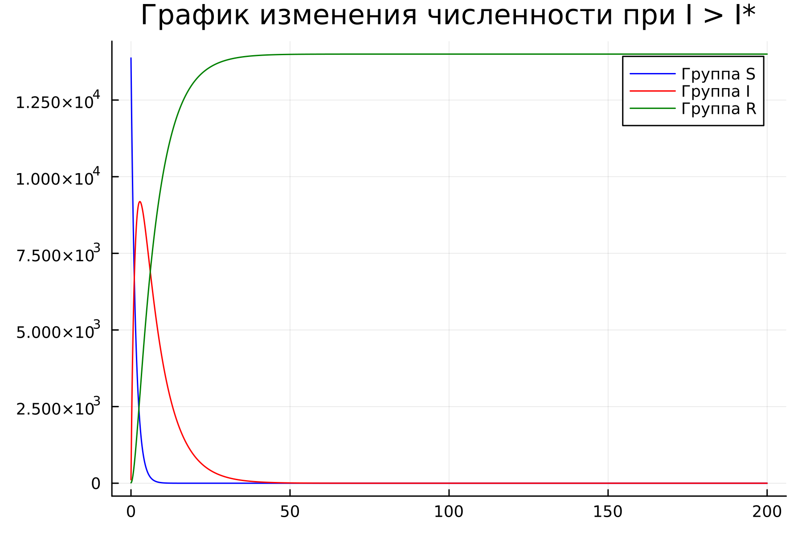

---
## Front matter
lang: ru-RU
title: Лабораторная работа №6
subtitle: Модель эпидемии "SIR"
author:
  - Парфенова Е. Е.
teacher:
  - Кулябов Д. С.
  - д.ф.-м.н., профессор
  - профессор кафедры прикладной информатики и теории вероятностей
institute:
  - Российский университет дружбы народов, Москва, Россия
date: 6 марта 2024

## i18n babel
babel-lang: russian
babel-otherlangs: english

## Formatting pdf
toc: false
toc-title: Содержание
slide_level: 2
aspectratio: 169
section-titles: true
theme: metropolis
header-includes:
 - \metroset{progressbar=frametitle,sectionpage=progressbar,numbering=fraction}
 - '\makeatletter'
 - '\beamer@ignorenonframefalse'
 - '\makeatother'
---

# Информация

## Докладчик

:::::::::::::: {.columns align=center}
::: {.column width="70%"}

  * Парфенова Елизавета Евгеньвена
  * студент
  * Российский университет дружбы народов
  * [1032216437@pfur.ru](mailto:1032216437@pfur.ru)
  * <https://github.com/parfenovaee>

:::
::: {.column width="30%"}

:::
::::::::::::::

# Вводная часть

## Актуальность

- Важность изучения достаточно распространенной и используемой модели эпидемии
- Необходимость умения строить различные математичсекие модели и их визуальное представление

## Цели и задачи

- Изучить модель эпидемии SIR 
- Пострпоить графики изменения особей в группах в различных случаях на Julia и OpenModelica

# Теоретическое введение

## Модель эпидемии SIR 

*Модель SIR (модель эпидемии)* является одной из простейших компартментарных моделей, и многие модели являются производными от этой базовой формы. Модель состоит из трех отсеков:

- $S$: количество $s$ незаметных особей. Когда восприимчивый и заразный индивидуум вступают в "инфекционный контакт", восприимчивый индивидуум заражается болезнью и переходит в инфекционный компартмент.
- $I$: количество $i$ неинфекционных особей. Это лица, которые были инфицированы и способны заразить восприимчивых лиц.
- $R$ для количества $r$ инфицированных (и невосприимчивых) или умерших людей. Это люди, которые были инфицированы и либо выздоровели от болезни и попали в удаленный компартмент, либо умерли. 

## Модель эпидемии SIR 

Эта модель является достаточно прогностической для инфекционных заболеваний, которые передаются от человека к человеку и при выздоровлении которых возникает стойкая резистентность, таких как корь, свинка и краснуха.

Чтобы показать, что количество восприимчивых, инфекционных и удаленных лиц может меняться с течением времени, мы делаем точные цифры функцией от $t$ (времени): $S(t), I(t), R(t)$. Для конкретного заболевания в конкретной популяции эти функции могут быть разработаны для прогнозирования возможных вспышек и взятия их под контроль. 

## Модель эпидемии SIR 

Модель SIR в таком случае представляет собой нелинейную систему дифференциальных уравнений, описывающих динамику распространения заболевания в популяции:

$$
\left\{
\begin{array}{cc}
\dfrac{dS}{dt} = {-\beta I S\over{N}} \\\\
\dfrac{dI}{dt} = - {\beta I S\over{N}} - \gamma I \\\\
\dfrac{dR}{dt} = \gamma I
\end{array}
\right.
$$

# Задание

## Задача. Вариант №8

На одном острове вспыхнула эпидемия. Известно, что из всех проживающих
на острове ($N = 14 000$) в момент начала эпидемии ($t=0$) число заболевших людей
(являющихся распространителями инфекции) $I(0)=114$, а число здоровых людей с
иммунитетом к болезни $R(0)=14$. Таким образом, число людей восприимчивых к
болезни, но пока здоровых, в начальный момент времени $S(0)=N-I(0)- R(0)$.
Постройте графики изменения числа особей в каждой из трех групп.
Рассмотрите, как будет протекать эпидемия в случае:

1) $I(t) \leq I^*$
2) $I(t) > I^*$

# Выполнение работы

## Математическая модель 

Предположим, что некая популяция, состоящая из N особей, (считаем, что популяция изолирована) подразделяется на три группы, о которых уже было сказано в теоретическом введении. Первая группа - это восприимчивые к болезни, но
пока здоровые особи, обозначим их через $S(t)$. Вторая группа – это число
инфицированных особей, которые также при этом являются распространителями
инфекции, обозначим их $I(t)$. А третья группа, обозначающаяся через $R(t)$ – это здоровые особи с иммунитетом к болезни. 

## Математическая модель 

До того, как число заболевших не превышает критического значения $I^*$, считаем, что все больные изолированы и не заражают здоровых. Когда $I(t) > I^*$,
тогда инфицирование способны заражать восприимчивых к болезни особей.

## Математическая модель 

Таким образом, скорость изменения числа *S(t)* меняется по следующему
закону:

$$
\dfrac{dS}{dt}=
 \begin{cases}
	-\alpha S &\text{,если $I(t) > I^*$}
	\\   
	0 &\text{,если $I(t) \leq I^*$}
 \end{cases}
$$

## Математическая модель 

Поскольку каждая восприимчивая к болезни особь, которая, в конце концов,
заболевает, сама становится инфекционной, то скорость изменения числа
инфекционных особей представляет разность за единицу времени между
заразившимися и теми, кто уже болеет и лечится, т.е.:

$$
\dfrac{dI}{dt}=
 \begin{cases}
	\alpha S -\beta I &\text{, если $I(t) > I^*$}
	\\   
	-\beta I &\text{, если $I(t) \leq I^*$}
 \end{cases}
$$

## Математическая модель 

А скорость изменения выздоравливающих особей (при этом приобретающие
иммунитет к болезни):

$$\dfrac{dR}{dt} = \beta I$$

Постоянные пропорциональности $\alpha, \beta$, - это коэффициенты заболеваемости
и выздоровления соответственно.

Для того, чтобы решения соответствующих уравнений определялось
однозначно, необходимо задать начальные условия. 

## Построение графиков при $I(t) \leq I^*$

В первом случае мы используем такую систему дифференциальных уравнений: 

$$
\left\{
\begin{array}{cc}
\dfrac{dS}{dt} = {0} \\\\
\dfrac{dI}{dt} = -\beta I \\\\
\dfrac{dR}{dt} = \beta I
\end{array}
\right.
$$

## Построение графиков при $I(t) \leq I^*$

Так как изначально S0, которое мы используем в дальнейших вычислениях, не дано конкретно, я вычислила его по приведенной в задаче формуле $S(0)=N-I(0)- R(0)$. В итоге $S(0) = 13872$

## Построение графиков при $I(t) \leq I^*$

В результате работы кода было сгенерировано такое изображение.

{#fig:001 width=50%}

## Построение графиков при $I(t) \leq I^*$

При построении графиков в том же случае на OpenModelica получилось такое изображение:

{#fig:002 width=50%}

## Построение графиков при $I(t) > I^*$

Далее рассмотрим второй случай. Здесь немного меняется меняется система дифференциальных уравнений: 

$$
\left\{
\begin{array}{cc}
\dfrac{dS}{dt} = {-\alpha S} \\\\
\dfrac{dI}{dt} = \alpha S -\beta I \\\\
\dfrac{dR}{dt} = \beta I
\end{array}
\right.
$$

## Построение графиков при $I(t) > I^*$

В результате работы кода на Julia получились такие графики: 

{#fig:003 width=50%}

## Построение графиков при $I(t) > I^*$

При моделировании этого случая в OpenModelica вышел вот такой результат: 

{#fig:004 width=70%}

# Вывод

## Вывод 

Мы изучили модель эпидемии SIR и построили графики изменения числа особей в трех группах в двух разных случаях на Julia и OpenModelica. При этом графики при моедлировании на обоих языках совпали. 