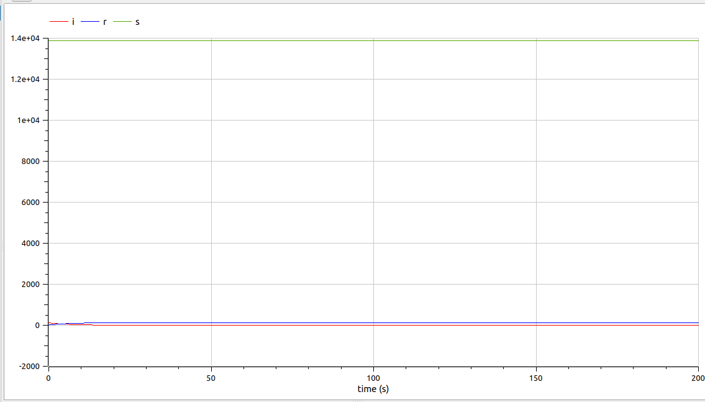
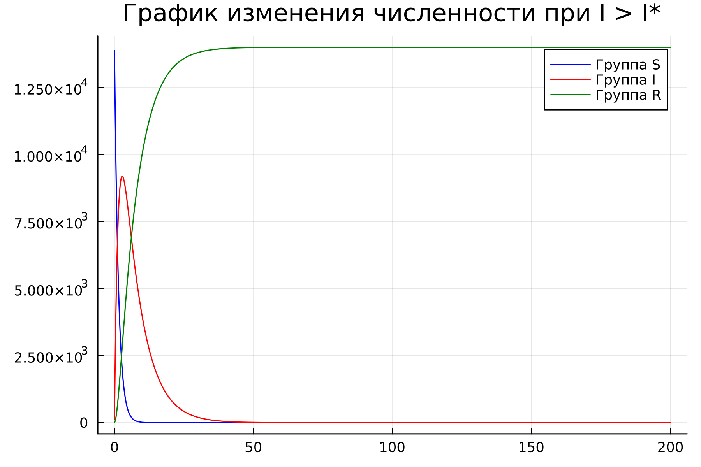
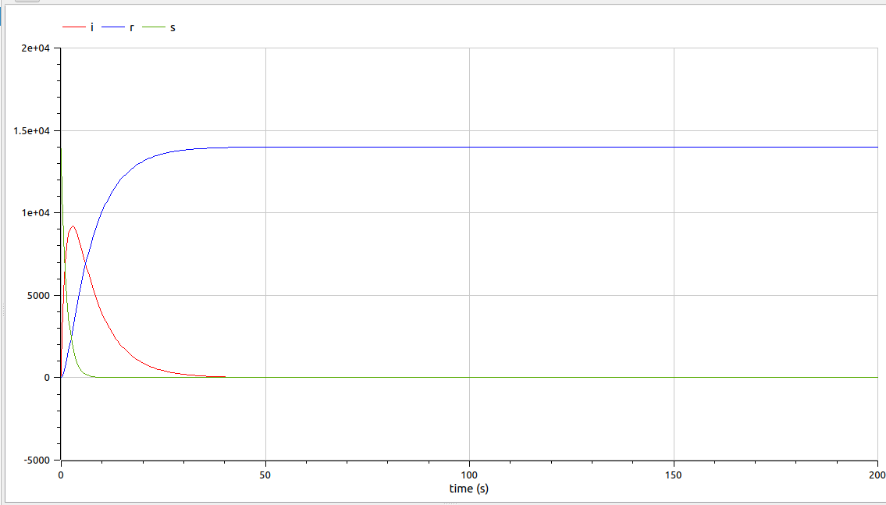

---
## Front matter
title: "Лабораторная работа №6"
subtitle: "Модель эпидемии 'SIR'"
author: "Парфенова Елизавета Евгеньевна"
## Generic otions
lang: ru-RU
toc-title: "Содержание"

## Bibliography
bibliography: bib/cite.bib
csl: pandoc/csl/gost-r-7-0-5-2008-numeric.csl

## Pdf output format
toc: true # Table of contents
toc-depth: 2
lof: true # List of figures
lot: true # List of tables
fontsize: 12pt
linestretch: 1.5
papersize: a4
documentclass: scrreprt
## I18n polyglossia
polyglossia-lang:
  name: russian
  options:
	- spelling=modern
	- babelshorthands=true
polyglossia-otherlangs:
  name: english
## I18n babel
babel-lang: russian
babel-otherlangs: english
## Fonts
mainfont: PT Serif
romanfont: PT Serif
sansfont: PT Sans
monofont: PT Mono
mainfontoptions: Ligatures=TeX
romanfontoptions: Ligatures=TeX
sansfontoptions: Ligatures=TeX,Scale=MatchLowercase
monofontoptions: Scale=MatchLowercase,Scale=0.9
## Biblatex
biblatex: true
biblio-style: "gost-numeric"
biblatexoptions:
  - parentracker=true
  - backend=biber
  - hyperref=auto
  - language=auto
  - autolang=other*
  - citestyle=gost-numeric
## Pandoc-crossref LaTeX customization
figureTitle: "Рис."
tableTitle: "Таблица"
listingTitle: "Листинг"
lofTitle: "Список иллюстраций"
lotTitle: "Список таблиц"
lolTitle: "Листинги"
## Misc options
indent: true
header-includes:
  - \usepackage{indentfirst}
  - \usepackage{float} # keep figures where there are in the text
  - \floatplacement{figure}{H} # keep figures where there are in the text
---

# Цель работы

Изучить модель эпидемии SIR и пострпоить графики изменения особей в группах в различных случаях на Julia и OpenModelica


# Задание

Мой вариант - вариант №8.

*Задача. Вариант №8*

На одном острове вспыхнула эпидемия. Известно, что из всех проживающих
на острове ($N = 14 000$) в момент начала эпидемии ($t=0$) число заболевших людей
(являющихся распространителями инфекции) $I(0)=114$, а число здоровых людей с
иммунитетом к болезни $R(0)=14$. Таким образом, число людей восприимчивых к
болезни, но пока здоровых, в начальный момент времени $S(0)=N-I(0)- R(0)$.
Постройте графики изменения числа особей в каждой из трех групп.
Рассмотрите, как будет протекать эпидемия в случае:

1) $I(t) \leq I^*$
2) $I(t) > I^*$

# Теоретическое введение

*Модель SIR (модель эпидемии)* является одной из простейших компартментарных моделей, и многие модели являются производными от этой базовой формы. Модель состоит из трех отсеков:

- $S$: количество $s$ незаметных особей. Когда восприимчивый и заразный индивидуум вступают в "инфекционный контакт", восприимчивый индивидуум заражается болезнью и переходит в инфекционный компартмент.
- $I$: количество $i$ неинфекционных особей. Это лица, которые были инфицированы и способны заразить восприимчивых лиц.
- $R$ для количества $r$ инфицированных (и невосприимчивых) или умерших людей. Это люди, которые были инфицированы и либо выздоровели от болезни и попали в удаленный компартмент, либо умерли. Предполагается, что число смертей незначительно по отношению к общей численности населения. Этот компартмент также может называться "$r$ защищенный" или "$r$ устойчивый".

Эта модель является достаточно прогностической для инфекционных заболеваний, которые передаются от человека к человеку и при выздоровлении которых возникает стойкая резистентность, таких как корь, свинка и краснуха.

Моделирование пространственной модели SIR. Каждая клетка может заразить своих восьми ближайших соседей. Эти переменные ($S$, $I$ и $R$) представляют количество людей в каждом компартменте в определенный момент времени. Чтобы показать, что количество восприимчивых, инфекционных и удаленных лиц может меняться с течением времени (даже если общая численность популяции остается постоянной), мы делаем точные цифры функцией от $t$ (времени): $S(t), I(t), R(t)$. Для конкретного заболевания в конкретной популяции эти функции могут быть разработаны для прогнозирования возможных вспышек и взятия их под контроль. [@wiki:bash]

Модель SIR в таком случае представляет собой нелинейную систему дифференциальных уравнений, описывающих динамику распространения заболевания в популяции:

$$
\left\{
\begin{array}{cc}
\dfrac{dS}{dt} = {-\beta I S\over{N}} \\\\
\dfrac{dI}{dt} = - {\beta I S\over{N}} - \gamma I \\\\
\dfrac{dR}{dt} = \gamma I
\end{array}
\right.
$$

Здесь $S(t)$ — численность восприимчивых индивидов в момент времени $t$; 
$I(t)$ — численность инфицированных индивидов в момент времени $t$; $R(t)$  — численность переболевших индивидов в момент времени $t$; $N$ — численность популяции; $\beta$ — коэффициент интенсивности контактов индивидов с последующим инфицированием; $\gamma$ — коэффициент интенсивности перехода инфицированных индивидов в группу переболевших [@gt:bash].

# Выполнение лабораторной работы

**Математическая модель** 

Как уже было сказано, мы будем рассматривать простейшую модель эпидемии. Предположим, что некая популяция, состоящая из N особей, (считаем, что популяция изолирована) подразделяется на три группы, о которых уже было сказано в теоретическом введении. Первая группа - это восприимчивые к болезни, но
пока здоровые особи, обозначим их через $S(t)$. Вторая группа – это число
инфицированных особей, которые также при этом являются распространителями
инфекции, обозначим их $I(t)$. А третья группа, обозначающаяся через $R(t)$ – это здоровые особи с иммунитетом к болезни. 

До того, как число заболевших не превышает критического значения $I^*$, считаем, что все больные изолированы и не заражают здоровых. Когда $I(t) > I^*$,
тогда инфицирование способны заражать восприимчивых к болезни особей.
Таким образом, скорость изменения числа *S(t)* меняется по следующему
закону:

$$
\dfrac{dS}{dt}=
 \begin{cases}
	-\alpha S &\text{,если $I(t) > I^*$}
	\\   
	0 &\text{,если $I(t) \leq I^*$}
 \end{cases}
$$

Поскольку каждая восприимчивая к болезни особь, которая, в конце концов,
заболевает, сама становится инфекционной, то скорость изменения числа
инфекционных особей представляет разность за единицу времени между
заразившимися и теми, кто уже болеет и лечится, т.е.:


$$
\dfrac{dI}{dt}=
 \begin{cases}
	\alpha S -\beta I &\text{, если $I(t) > I^*$}
	\\   
	-\beta I &\text{, если $I(t) \leq I^*$}
 \end{cases}
$$

А скорость изменения выздоравливающих особей (при этом приобретающие
иммунитет к болезни):

$$\dfrac{dR}{dt} = \beta I$$

Постоянные пропорциональности $\alpha, \beta$, - это коэффициенты заболеваемости
и выздоровления соответственно.

Для того, чтобы решения соответствующих уравнений определялось
однозначно, необходимо задать начальные условия. 


**Построение графиков при $I(t) \leq I^*$**

Первым рассмотрим случай $I(t) \leq I^*$. В этом случае мы используем такую систему дифференциальных уравнений: 

$$
\left\{
\begin{array}{cc}
\dfrac{dS}{dt} = {0} \\\\
\dfrac{dI}{dt} = -\beta I \\\\
\dfrac{dR}{dt} = \beta I
\end{array}
\right.
$$

Так как изначально S0, которое мы используем в дальнейших вычислениях, не дано конкретно, я вычислила его по приведенной в задаче формуле $S(0)=N-I(0)- R(0)$. В итоге $S(0) = 13872$

Код на Julia: 

```
using Plots
using DifferentialEquations

#Начальные значения для каждой из групп
#N = 14000
I0 = 114.0
R0 = 14.0
S0 = 13872.0

#Коэффициенты заболеваемости и выздоровления
a = 0.7
b = 0.15

#Функция, определяющая систему дифф.уравнений
function one_ep(du, u, p, t)
    du[1] = 0
    du[2] = -b*u[2]
    du[3] = b*u[2]
end

#Промежуток времени и начальные условия
time = (0.0, 200.0)
start = [S0,I0,R0]

#Постановка проблемы и решение уранвения
equat = ODEProblem(one_ep, start, time)
solv = solve(equat, dtmax=0.01)  

S = [u[1] for u in solv.u]
I = [u[2] for u in solv.u]
R = [u[3] for u in solv.u]

#Построение графиков и сохранение изображения
plot1 = plot(dpi = 300, legend = :topright, bg =:white, title = "График изменения численности при I <= I*")
plot!(plot1, solv.t, S, label="Группа S", color =:blue)
plot!(plot1, solv.t, I, label="Группа I", color =:red)
plot!(plot1, solv.t, R, label="Группа R", color =:green)

savefig(plot1, "lab06_1.png")
```
В результате работы кода, было сгенерировано такое изображение, которое отображает графики изменения числа особей трех групп в нашем случае (рис. [-@fig:001]).

{#fig:001 width=70%}

Далее я написала модель на OpenModelica для этого же случая. Получившийся код: 

```
model one_ep

parameter Real I0 = 114.0;
parameter Real R0 = 14.0;
parameter Real S0 = 13872.0;

parameter Real a = 0.7;
parameter Real b = 0.15;

Real s (start=S0);
Real i (start=I0);
Real r (start=R0);

equation

der(s) = 0;
der(i) = -b*i;
der(r) = b*i;

end one_ep;
```

В результате были смоделированы графики, отображенные на рисунке (рис. [-@fig:002]):

{#fig:002 width=70%}

**Построение графиков при $I(t) > I^*$**

Далее рассмотрим случай $I(t) > I^*$. Здесь все параметры остаются прежними, меняется только математическая модель, то есть система дифференциальных уравнений выглядит немного по-другому: 

$$
\left\{
\begin{array}{cc}
\dfrac{dS}{dt} = {-\alpha S} \\\\
\dfrac{dI}{dt} = \alpha S -\beta I \\\\
\dfrac{dR}{dt} = \beta I
\end{array}
\right.
$$

Код для данной модели на Julia: 

```
using Plots
using DifferentialEquations

#Начальные значения для каждой из групп
#N = 14000
I0 = 114.0
R0 = 14.0
S0 = 13872.0

#Коэффициенты заболеваемости и выздоровления
a = 0.7
b = 0.15

#Функция, определяющая систему дифф.уравнений
function two_ep(du, u, p, t)
    du[1] = -a*u[1]
    du[2] = a*u[1]-b*u[2]
    du[3] = b*u[2]
end

#Промежуток времени и начальные условия
time = (0.0, 200.0)
start = [S0,I0,R0]

#Постановка проблемы и решение уранвения
equat = ODEProblem(two_ep, start, time)
solv = solve(equat, dtmax=0.01)  

S = [u[1] for u in solv.u]
I = [u[2] for u in solv.u]
R = [u[3] for u in solv.u]

#Построение графиков и сохранение изображения
plot1 = plot(dpi = 300, legend = :topright, bg =:white, title = "График изменения численности при I > I*")
plot!(plot1, solv.t, S, label="Группа S", color =:blue)
plot!(plot1, solv.t, I, label="Группа I", color =:red)
plot!(plot1, solv.t, R, label="Группа R", color =:green)

savefig(plot1, "lab06_2.png")

```

В результате работы кода было сгененрировано такое изображение (рис. [-@fig:003])

{#fig:003 width=70%}

Модель для этого же случая на OpenModelica: 

```
model two_ep

parameter Real I0 = 114.0;
parameter Real R0 = 14.0;
parameter Real S0 = 13872.0;

parameter Real a = 0.7;
parameter Real b = 0.15;

Real s (start=S0);
Real i (start=I0);
Real r (start=R0);

equation

der(s) = -a*s;
der(i) = a*s-b*i;
der(r) = b*i;

end two_ep;
```
в результате моделирования получились такие графики (рис. [-@fig:004]):

{#fig:004 width=70%}

# Выводы

Мы изучили модель эпидемии SIR и построили графики изменения числа особей в трех группах в двух разных случаях на Julia и OpenModelica. При этом графики при моедлировании на обоих языках совпали. 

# Список литературы{.unnumbered}

::: {#refs}
:::
