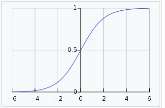
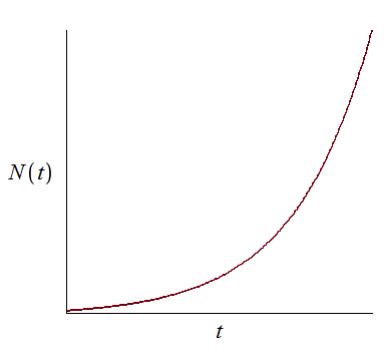
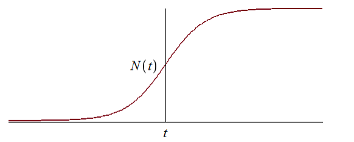
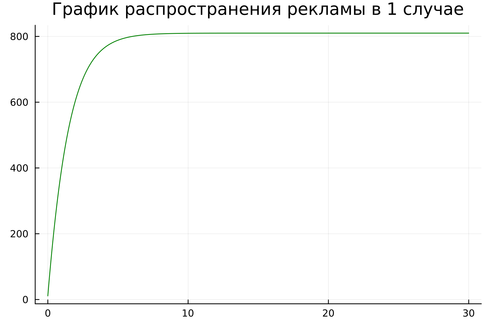
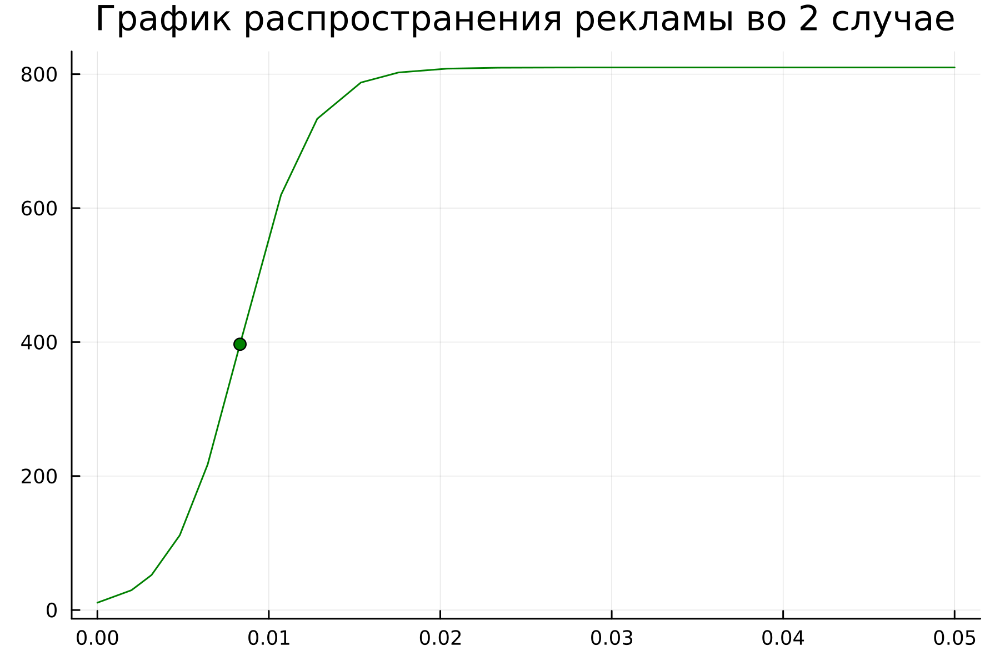
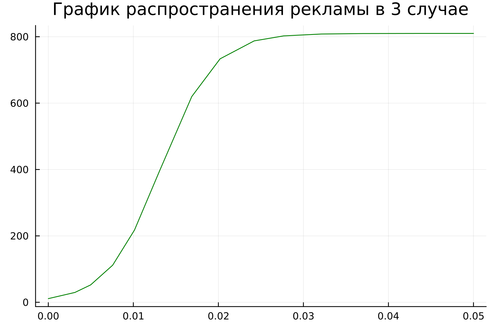
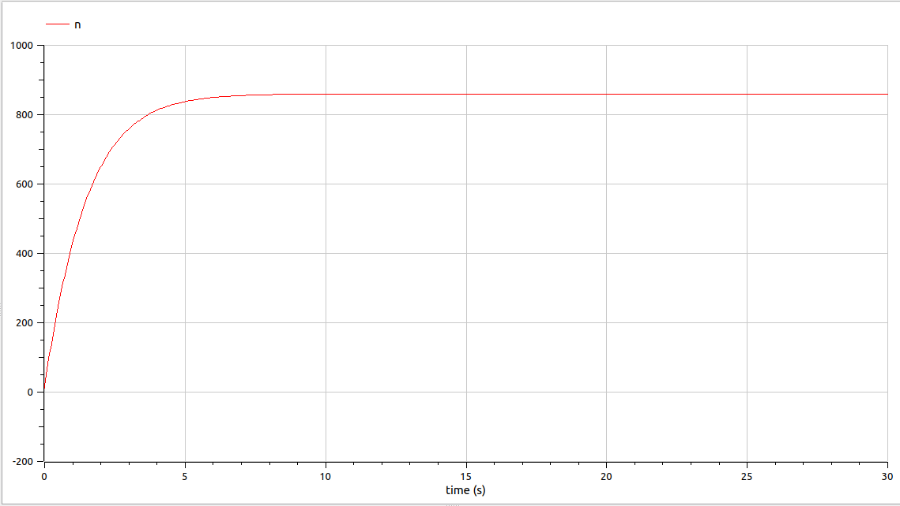
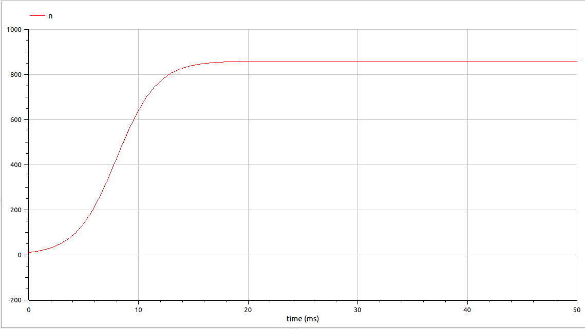
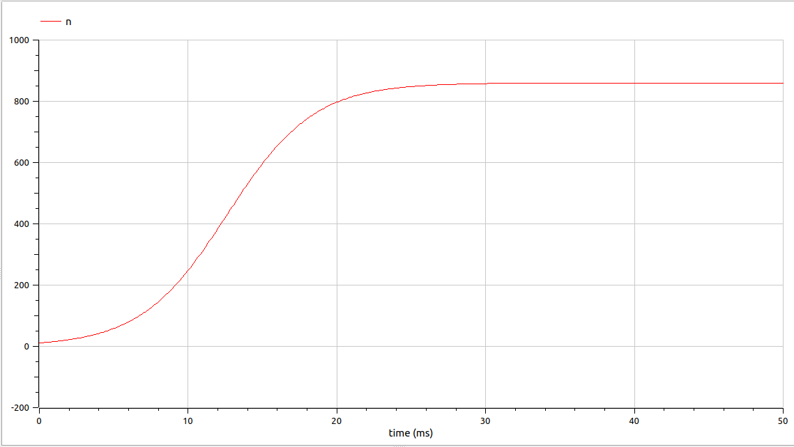

---
## Front matter
lang: ru-RU
title: Лабораторная работа №7
subtitle: Эффективность рекламы
author:
  - Парфенова Е. Е.
teacher:
  - Кулябов Д. С.
  - д.ф.-м.н., профессор
  - профессор кафедры прикладной информатики и теории вероятностей
institute:
  - Российский университет дружбы народов, Москва, Россия
date: 19 марта 2024

## i18n babel
babel-lang: russian
babel-otherlangs: english

## Formatting pdf
toc: false
toc-title: Содержание
slide_level: 2
aspectratio: 169
section-titles: true
theme: metropolis
header-includes:
 - \metroset{progressbar=frametitle,sectionpage=progressbar,numbering=fraction}
 - '\makeatletter'
 - '\beamer@ignorenonframefalse'
 - '\makeatother'
---

# Информация

## Докладчик

:::::::::::::: {.columns align=center}
::: {.column width="70%"}

  * Парфенова Елизавета Евгеньвена
  * студент
  * Российский университет дружбы народов
  * [1032216437@pfur.ru](mailto:1032216437@pfur.ru)
  * <https://github.com/parfenovaee>

:::
::: {.column width="30%"}

:::
::::::::::::::

# Вводная часть

## Актуальность

- Маркетинг и реклама в современном мире являются важной частью бизнеса, которую для успеха необходимо уметь прогнозировать
- Необходимость умения строить различные математичсекие модели и их визуальное представление

## Цели и задачи

- Изучить модель рекламной кампании 
- Построить графики для различных моделей в Julia и OpenModelica

# Теоретическое введение 

## Модель Мальтуса

***Мальтузианская модель роста***, также называемая ***моделью Мальтуса*** — это экспоненциальный рост с постоянным темпом. Модель названа в честь английского демографа и экономиста Томаса Мальтуса.

Мальтузианские модели выглядят следующим образом: $$P(t) = P_0e^rt$$

Здесь: 

- $P_0$ - исходная численность чего-либо (населения, например)
- $r$ - темп прироста
- $t$ - время

## Логистическая кривая

:::::::::::::: {.columns align=center}
::: {.column width="70%"}

***Логистическая функция или логистическая кривая*** представляет собой обычную S-образную кривую (сигмовидная кривая) с уравнением

$$f(x) = {{L} \over {1+ e^{-k(x-x_0)} }} $$

Стандартную логистическую функцию, где $L = 1$, $k = 1$, $x_0 = 0$, иногда называют просто сигмовидной. 

:::
::: {.column width="30%"}

{#fig:001 width=60%}

:::
::::::::::::::

# Задание

## Задача. Вариант №8

Постройте график распространения рекламы, математическая модель которой описывается
следующим уравнением:

1. $\frac{dn}{dt} = (0.64 + 0.00014n(t))(N-n(t))$
2. $\frac{dn}{dt} = (0.000014 + 0.63n(t))(N-n(t))$
3. $\frac{dn}{dt} = (0.7t + 0.4cos(t)n(t))(N-n(t))$
 
При этом объем аудитории $N= 810$, в начальный момент о товаре знает 11 человек. Для
случая 2 определите в какой момент времени скорость распространения рекламы будет
иметь максимальное значение.

# Выполнение работы

## Математическая модель

Предположим, что торговыми учреждениями реализуется некоторая
продукция, о которой в момент времени $t$ из числа потенциальных покупателей $N$
знает лишь $n$ покупателей. Для ускорения сбыта продукции запускается реклама
по радио, телевидению и других средств массовой информации. После запуска
рекламной кампании информация о продукции начнет распространяться среди
потенциальных покупателей путем общения друг с другом. Таким образом, после
запуска рекламных объявлений скорость изменения числа знающих о продукции
людей пропорциональна как числу знающих о товаре покупателей, так и числу
покупателей о нем не знающих.

## Математическая модель

Считаем, что ${dn}\over{dt}$ - скорость изменения со временем числа потребителей,
узнавших о товаре и готовых его купить, $t$ - время, прошедшее с начала рекламной
кампании, $n(t)$ - число уже информированных клиентов. Эта величина
пропорциональна числу покупателей, еще не знающих о нем, это описывается
следующим образом: $\alpha_1(t) (N - n(t))$, где $N$ - общее число потенциальных
платежеспособных покупателей, $\alpha_1(t) > 0$ - характеризует интенсивность
рекламной кампании (зависит от затрат на рекламу в данный момент времени).

## Математическая модель

Помимо этого, узнавшие о товаре потребители также распространяют полученную
информацию среди потенциальных покупателей, не знающих о нем (в этом случае
работает т.н. сарафанное радио). Этот вклад в рекламу описывается величиной
$\alpha_2(t) (N - n(t))$, эта величина увеличивается с увеличением потребителей
узнавших о товаре. 

Математическая модель распространения рекламы описывается
уравнением:

$$\frac{dn}{dt} = (\alpha _1(t) + \alpha _2(t)n(t))(N-n(t))$$

## Математическая модель

При $\alpha_1(t) >> \alpha_2(t)$ получается модель типа модели Мальтуса, решение которой имеет вид:

{#fig:002 width=40%}

## Математическая модель

В обратном случае, при $\alpha_1(t) << \alpha_2(t)$ получаем уравнение логистической
кривой:

{#fig:003 width=40%}

## Построение графиков. Julia

В результате работы кода были сгенерированы следующие изображения: 

1. График рапространение рекламы для первой математической модели, когда $\alpha_1(t) >> \alpha_2(t)$.

{#fig:004 width=40%} 

## Построение графиков. Julia

2. График рапространение рекламы для второй математической модели, когда $\alpha_1(t) << \alpha_2(t)$. 

{#fig:005 width=40%}

## Построение графиков. Julia

3. График рапространение рекламы для третей математической модели, где появляется функция от времени.

{#fig:006 width=40%}

## Построение графиков. OpenModelica

В результате моделирования получились такие графики:

1. График рапространение рекламы для первой математической модели, когда $\alpha_1(t) >> \alpha_2(t)$.

{#fig:007 width=40%} 

## Построение графиков. OpenModelica

2. График рапространение рекламы для второй математической модели, когда $\alpha_1(t) << \alpha_2(t)$.

{#fig:008 width=40%}

## Построение графиков. OpenModelica

3. График рапространение рекламы для третей математической модели, где появляется функция от времени.

{#fig:009 width=40%}

# Вывод

## Вывод

Мы изучили модель рекламной кампании в разных ее случаях и построили необходимые графики на Julia и OpenModelica. Также для второго случая определили максимальную скорость распросторанения рекламы и наглядно отобразили ее на графике при построении на Julia. 