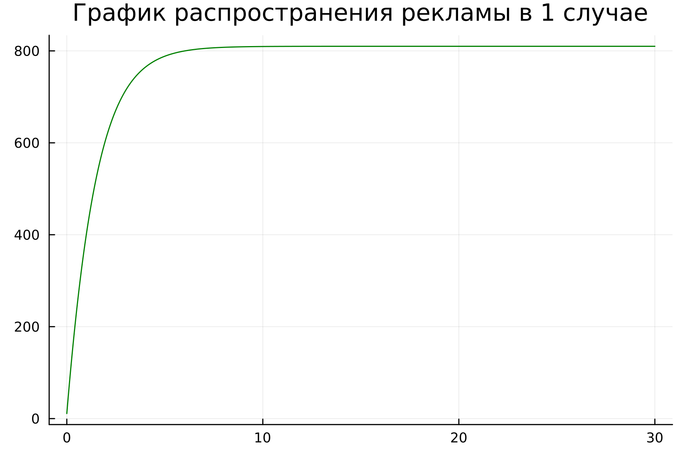
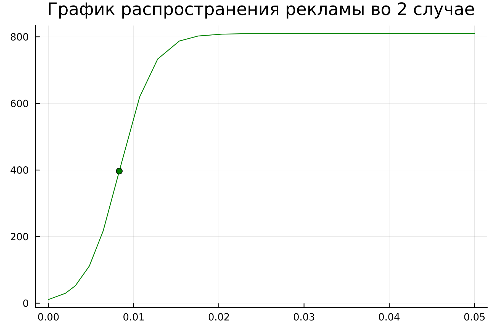
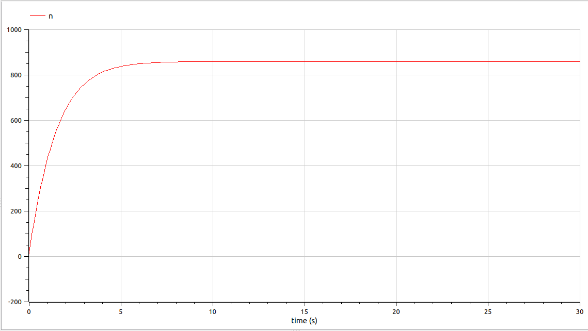
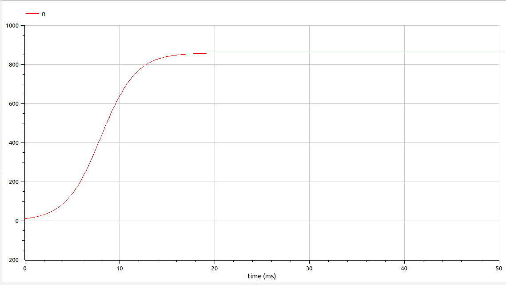
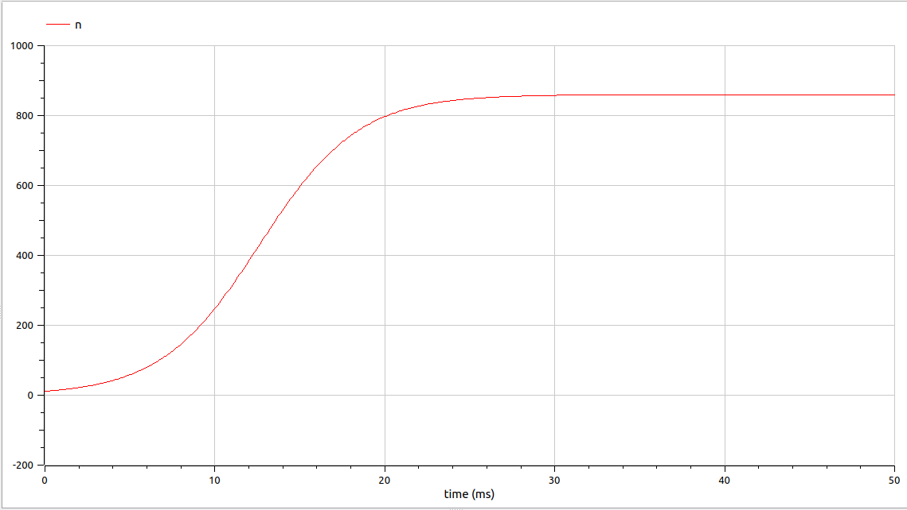

---
## Front matter
title: "Лабораторная работа №7"
subtitle: "Эффективность рекламы"
author: "Парфенова Елизавета Евгеньевна"

## Generic otions
lang: ru-RU
toc-title: "Содержание"

## Bibliography
bibliography: bib/cite.bib
csl: pandoc/csl/gost-r-7-0-5-2008-numeric.csl

## Pdf output format
toc: true # Table of contents
toc-depth: 2
lof: true # List of figures
lot: true # List of tables
fontsize: 12pt
linestretch: 1.5
papersize: a4
documentclass: scrreprt
## I18n polyglossia
polyglossia-lang:
  name: russian
  options:
	- spelling=modern
	- babelshorthands=true
polyglossia-otherlangs:
  name: english
## I18n babel
babel-lang: russian
babel-otherlangs: english
## Fonts
mainfont: PT Serif
romanfont: PT Serif
sansfont: PT Sans
monofont: PT Mono
mainfontoptions: Ligatures=TeX
romanfontoptions: Ligatures=TeX
sansfontoptions: Ligatures=TeX,Scale=MatchLowercase
monofontoptions: Scale=MatchLowercase,Scale=0.9
## Biblatex
biblatex: true
biblio-style: "gost-numeric"
biblatexoptions:
  - parentracker=true
  - backend=biber
  - hyperref=auto
  - language=auto
  - autolang=other*
  - citestyle=gost-numeric
## Pandoc-crossref LaTeX customization
figureTitle: "Рис."
tableTitle: "Таблица"
listingTitle: "Листинг"
lofTitle: "Список иллюстраций"
lotTitle: "Список таблиц"
lolTitle: "Листинги"
## Misc options
indent: true
header-includes:
  - \usepackage{indentfirst}
  - \usepackage{float} # keep figures where there are in the text
  - \floatplacement{figure}{H} # keep figures where there are in the text
---

# Цель работы

Изучить модель рекламной кампании и построить графики для различных моделей в Julia и OpenModelica

# Задание
Мой вариант - вариант №8

*Задача. Вариант №8*

Постройте график распространения рекламы, математическая модель которой описывается
следующим уравнением:

1. $\frac{dn}{dt} = (0.64 + 0.00014n(t))(N-n(t))$
2. $\frac{dn}{dt} = (0.000014 + 0.63n(t))(N-n(t))$
3. $\frac{dn}{dt} = (0.7t + 0.4cos(t)n(t))(N-n(t))$
 
При этом объем аудитории $N= 810$, в начальный момент о товаре знает 11 человек. Для
случая 2 определите в какой момент времени скорость распространения рекламы будет
иметь максимальное значение.

# Теоретическое введение

***Мальтузианская модель роста (Malthusian growth model)***, также называемая ***моделью Мальтуса*** — это экспоненциальный рост с постоянным темпом. Модель названа в честь английского демографа и экономиста Томаса Мальтуса. [@wiki:bash]

Мальтузианские модели выглядят следующим образом: $$P(t) = P_0e^rt$$

Здесь: 

- $P_0$ - исходная численность чего-либо (населения, например)
- $r$ - темп прироста
- $t$ - время

***Логистическая функция или логистическая кривая*** представляет собой обычную S-образную кривую (сигмовидная кривая) с уравнением

$$f(x) = {{L} \over {1+ e^{-k(x-x_0)} }} $$

Стандартную логистическую функцию, где $L = 1$, $k = 1$, $x_0 = 0$, иногда называют просто сигмовидной. Ее также иногда называют $expit$, поскольку она является обратной к $logit$. [@wiki_1:bash]

Вот как она выглядит в таком случае (рис. [-@fig:001]):

{#fig:001 width=70%}


# Выполнение лабораторной работы

**Математичсекая модель**

Организуется рекламная кампания нового товара или услуги. Необходимо,
чтобы прибыль будущих продаж с избытком покрывала издержки на рекламу.
Вначале расходы могут превышать прибыль, поскольку лишь малая часть
потенциальных покупателей будет информирована о новинке. Затем, при
увеличении числа продаж, возрастает и прибыль, и, наконец, наступит момент,
когда рынок насытиться, и рекламировать товар станет бесполезным.

Предположим, что торговыми учреждениями реализуется некоторая
продукция, о которой в момент времени $t$ из числа потенциальных покупателей $N$
знает лишь $n$ покупателей. Для ускорения сбыта продукции запускается реклама
по радио, телевидению и других средств массовой информации. После запуска
рекламной кампании информация о продукции начнет распространяться среди
потенциальных покупателей путем общения друг с другом. Таким образом, после
запуска рекламных объявлений скорость изменения числа знающих о продукции
людей пропорциональна как числу знающих о товаре покупателей, так и числу
покупателей о нем не знающих.

Модель рекламной кампании описывается следующими величинами.
Считаем, что ${dn}\over{dt}$ - скорость изменения со временем числа потребителей,
узнавших о товаре и готовых его купить, $t$ - время, прошедшее с начала рекламной
кампании, $n(t)$ - число уже информированных клиентов. Эта величина
пропорциональна числу покупателей, еще не знающих о нем, это описывается
следующим образом: $\alpha_1(t) (N - n(t))$, где $N$ - общее число потенциальных
платежеспособных покупателей, $\alpha_1(t) > 0$ - характеризует интенсивность
рекламной кампании (зависит от затрат на рекламу в данный момент времени).
Помимо этого, узнавшие о товаре потребители также распространяют полученную
информацию среди потенциальных покупателей, не знающих о нем (в этом случае
работает т.н. сарафанное радио). Этот вклад в рекламу описывается величиной
$\alpha_2(t) (N - n(t))$, эта величина увеличивается с увеличением потребителей
узнавших о товаре. Математическая модель распространения рекламы описывается
уравнением:

$$\frac{dn}{dt} = (\alpha _1(t) + \alpha _2(t)n(t))(N-n(t))$$

При $\alpha_1(t) >> \alpha_2(t)$ получается модель типа модели Мальтуса, решение которой имеет вид (рис. [-@fig:002]):

{#fig:002 width=70%}

В обратном случае, при $\alpha_1(t) << \alpha_2(t)$ получаем уравнение логистической
кривой(рис. [-@fig:003]):

{#fig:003 width=70%}

Оба понятия были обозначены в теореичсеком введении. 

**Построение графиков. Julia**

Код программы на Julia содержит решение сразу для трех математических моделей, при этом там также происходит определение максимального значения скорости распространения рекламы для второго случая, которое отображается на графике точкой. 

Код программы на Julia: 

```
using Plots
using DifferentialEquations

#Константы и начальные параметры
N = 810.0
n_0 = 11.0

#Функции диф.уравнений для кадого из трех случаев
function one(du, u, p, t)
   du[1] = (0.64 + 0.00014*u[1])*(N - u[1])
end

function two(du, u, p, t)
   du[1] = (0.000014 + 0.63*u[1])*(N - u[1])
end

function three(du, u, p, t)
   du[1] = (0.7*t + 0.4*cos(t)*u[1])*(N - u[1])
end

#Промежутки времени и начальные условия
time = (0.0, 30.0)
timee = (0.0, 0.05)
start = [n_0]

#Проблема и ее решение для каждого из трех случаев
equat1 = ODEProblem(one, start, time)
solv1 = solve(equat1, dtmax=0.01)  

equat2 = ODEProblem(two, start, timee)
solv2 = solve(equat2, dtmax=0.01)  

equat3 = ODEProblem(three, start, timee)
solv3 = solve(equat3, dtmax=0.01)  

n_1 = [u[1] for u in solv1.u]
n_2 = [u[1] for u in solv2.u]
n_3 = [u[1] for u in solv3.u]

#Определение максимального значения для второго случая
max = 0;
max_t = 0;
max_n = 0;
for (i, t) in enumerate(solv2.t)
    if solv2(t, Val{1})[1] > max
        global max = solv2(t, Val{1})[1]
        global max_t = t
        global max_n = n_2[i]
    end
end

#Создание графиков и сохранение каждого из них в отдельное изображение
plot1 = plot(dpi = 300, legend= false, bg =:white, title="График распространения рекламы в 1 случае")
plot!(plot1, solv1.t, n_1, color =:green)

savefig(plot1, "lab07_1.png")

plot2 = plot(dpi = 300, legend= false, bg =:white, title="График распространения рекламы во 2 случае")
plot!(plot2, solv2.t, n_2, color =:green)
plot!(plot2, [max_t], [max_n], seriestype = :scatter, color = :green) #Отображение точки, значащей максимальное значение

savefig(plot2, "lab07_2.png")

plot3 = plot(dpi = 300, legend= false, bg =:white, title="График распространения рекламы в 3 случае")
plot!(plot3, solv3.t, n_3, color =:green)

savefig(plot3, "lab07_3.png")
```

Результаты получились следующие: 

1. График рапространение рекламы для первой математической модели, когда $\alpha_1(t) >> \alpha_2(t)$.(рис. [-@fig:004])

{#fig:004 width=70%} 

2. График рапространение рекламы для второй математической модели, когда $\alpha_1(t) << \alpha_2(t)$. (рис. [-@fig:005])

{#fig:005 width=70%}

3. График рапространение рекламы для третей математической модели, где появляется функция от времени.(рис. [-@fig:006])

{#fig:006 width=70%}

В первом случае, как и полагается, мы наблюдаем модель Мальтуса, а во втором и третьем - логистическую кривую. На втором графике точкой отмечено максимальное значение скорости распространения рекламы для, как раз, второго случая.

**Построение графиков. OpenModelica**

Для OpenModelica я написала уже три различные модели, которые представлены ниже. 

1. Модель для 1 случая: 

```
model one_model

parameter Real N = 860.0;
parameter Real n_0 = 11.0;

Real n(start = n_0);

equation
der(n) = (0.64 + 0.00014*n)*(N-n);

end one_model;
```

2. Модель для 2 случая: 

```
model second_model

parameter Real N = 860.0;
parameter Real n_0 = 11.0;

Real n(start = n_0);

equation
der(n) = (0.000014 + 0.63*n)*(N-n);

end second_model;
```

3. Модель для 3 случая:

```
model third_model

parameter Real N = 860.0;
parameter Real n_0 = 11.0;

Real n(start = n_0);
Real t = time;

equation
der(n) = (0.7*t + 0.4*cos(t)*n)*(N-n);

end third_model;
```

Результаты получились следующими:

1. График рапространение рекламы для первой математической модели, когда $\alpha_1(t) >> \alpha_2(t)$.(рис. [-@fig:007])

{#fig:007 width=70%} 

2. График рапространение рекламы для второй математической модели, когда $\alpha_1(t) << \alpha_2(t)$. (рис. [-@fig:008])

{#fig:008 width=70%}

3. График рапространение рекламы для третей математической модели, где появляется функция от времени.(рис. [-@fig:009])

{#fig:009 width=70%}

При сравнении графиков на Julia и OpenModelica, можно увидеть, что они получились вполне похожи, и единтсвенной различие - в OpenModelica графики более растянуты в ширину. 

# Выводы

Мы изучили модель рекламной кампании в разных ее случаях и построили необходимые графики на Julia и OpenModelica. Также для второго случая определили максимальную скорость распросторанения рекламы и наглядно отобразили ее на графике при построении на Julia. 

# Список литературы{.unnumbered}

::: {#refs}
:::
