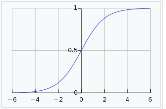
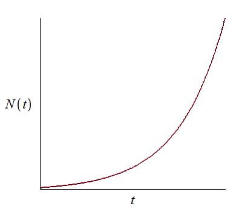
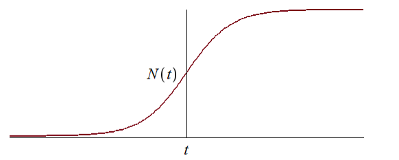

---
## Front matter
title: "Лабораторная работа №7"
subtitle: "Эффективность рекламы"
author: "Парфенова Елизавета Евгеньевна"

## Generic otions
lang: ru-RU
toc-title: "Содержание"

## Bibliography
bibliography: bib/cite.bib
csl: pandoc/csl/gost-r-7-0-5-2008-numeric.csl

## Pdf output format
toc: true # Table of contents
toc-depth: 2
lof: true # List of figures
lot: true # List of tables
fontsize: 12pt
linestretch: 1.5
papersize: a4
documentclass: scrreprt
## I18n polyglossia
polyglossia-lang:
  name: russian
  options:
	- spelling=modern
	- babelshorthands=true
polyglossia-otherlangs:
  name: english
## I18n babel
babel-lang: russian
babel-otherlangs: english
## Fonts
mainfont: PT Serif
romanfont: PT Serif
sansfont: PT Sans
monofont: PT Mono
mainfontoptions: Ligatures=TeX
romanfontoptions: Ligatures=TeX
sansfontoptions: Ligatures=TeX,Scale=MatchLowercase
monofontoptions: Scale=MatchLowercase,Scale=0.9
## Biblatex
biblatex: true
biblio-style: "gost-numeric"
biblatexoptions:
  - parentracker=true
  - backend=biber
  - hyperref=auto
  - language=auto
  - autolang=other*
  - citestyle=gost-numeric
## Pandoc-crossref LaTeX customization
figureTitle: "Рис."
tableTitle: "Таблица"
listingTitle: "Листинг"
lofTitle: "Список иллюстраций"
lotTitle: "Список таблиц"
lolTitle: "Листинги"
## Misc options
indent: true
header-includes:
  - \usepackage{indentfirst}
  - \usepackage{float} # keep figures where there are in the text
  - \floatplacement{figure}{H} # keep figures where there are in the text
---

# Цель работы

# Задание

# Теоретическое введение

***Мальтузианская модель роста (Malthusian growth model)***, также называемая ***моделью Мальтуса*** — это экспоненциальный рост с постоянным темпом. Модель названа в честь английского демографа и экономиста Томаса Мальтуса. [@wiki:bash]

Мальтузианские модели выглядят следующим образом: $$P(t) = P_0e^rt$$

Здесь: 

- $P_0$ - исходная численность чего-либо (населения, например)
- $r$ - темп прироста
- $t$ - время

***Логистическая функция или логистическая кривая*** представляет собой обычную S-образную кривую (сигмовидная кривая) с уравнением

$$f(x) = {{L} \over {1+ e^{-k(x-x_0)} }} $$

Стандартную логистическую функцию, где $L = 1$, $k = 1$, $x_0 = 0$, иногда называют просто сигмовидной. Ее также иногда называют $expit$, поскольку она является обратной к $logit$. [@wiki_1:bash]

Вот как она выглядит в таком случае (рис. [-@fig:001]):

{#fig:001 width=70%}

# Выполнение лабораторной работы

**Математичсекая модель**

Организуется рекламная кампания нового товара или услуги. Необходимо,
чтобы прибыль будущих продаж с избытком покрывала издержки на рекламу.
Вначале расходы могут превышать прибыль, поскольку лишь малая часть
потенциальных покупателей будет информирована о новинке. Затем, при
увеличении числа продаж, возрастает и прибыль, и, наконец, наступит момент,
когда рынок насытиться, и рекламировать товар станет бесполезным.

Предположим, что торговыми учреждениями реализуется некоторая
продукция, о которой в момент времени $t$ из числа потенциальных покупателей $N$
знает лишь $n$ покупателей. Для ускорения сбыта продукции запускается реклама
по радио, телевидению и других средств массовой информации. После запуска
рекламной кампании информация о продукции начнет распространяться среди
потенциальных покупателей путем общения друг с другом. Таким образом, после
запуска рекламных объявлений скорость изменения числа знающих о продукции
людей пропорциональна как числу знающих о товаре покупателей, так и числу
покупателей о нем не знающих.

Модель рекламной кампании описывается следующими величинами.
Считаем, что ${dn}\over{dt}$ - скорость изменения со временем числа потребителей,
узнавших о товаре и готовых его купить, $t$ - время, прошедшее с начала рекламной
кампании, $n(t)$ - число уже информированных клиентов. Эта величина
пропорциональна числу покупателей, еще не знающих о нем, это описывается
следующим образом: $\alpha_1(t) (N - n(t))$, где $N$ - общее число потенциальных
платежеспособных покупателей, $\alpha_1(t) > 0$ - характеризует интенсивность
рекламной кампании (зависит от затрат на рекламу в данный момент времени).
Помимо этого, узнавшие о товаре потребители также распространяют полученную
информацию среди потенциальных покупателей, не знающих о нем (в этом случае
работает т.н. сарафанное радио). Этот вклад в рекламу описывается величиной
$\alpha_2(t) (N - n(t))$, эта величина увеличивается с увеличением потребителей
узнавших о товаре. Математическая модель распространения рекламы описывается
уравнением:

$$\frac{dn}{dt} = (\alpha _1(t) + \alpha _2(t)n(t))(N-n(t))$$

При $\alpha_1(t) >> \alpha_2(t)$ получается модель типа модели Мальтуса, решение которой имеет вид (рис. [-@fig:002]):

{#fig:002 width=70%}

В обратном случае, при $\alpha_1(t) << \alpha_2(t)$ получаем уравнение логистической
кривой(рис. [-@fig:003]):

{#fig:003 width=70%}

Оба понятия были обозначены в теореичсеком введении. 

# Выводы

# Список литературы{.unnumbered}

::: {#refs}
:::
