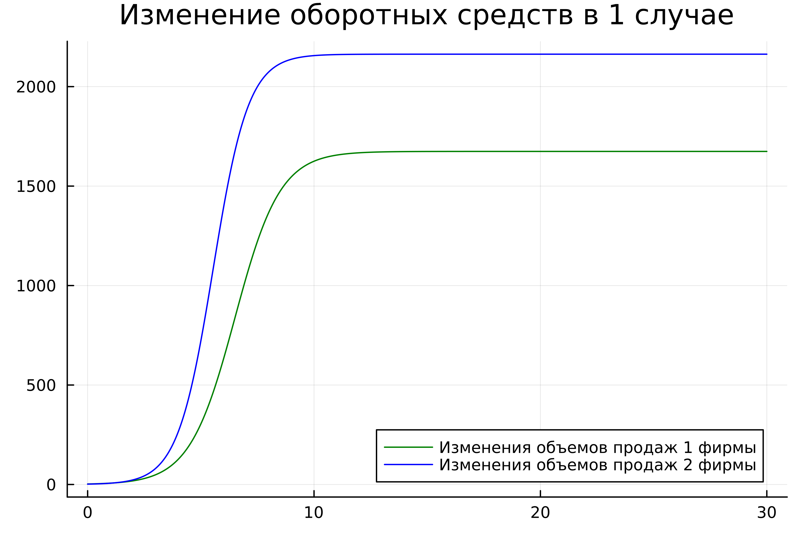
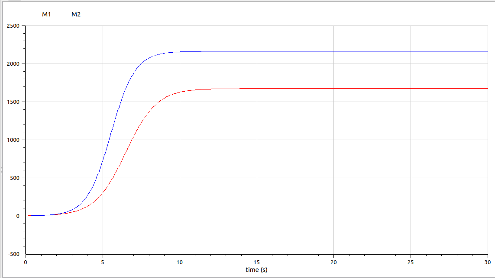
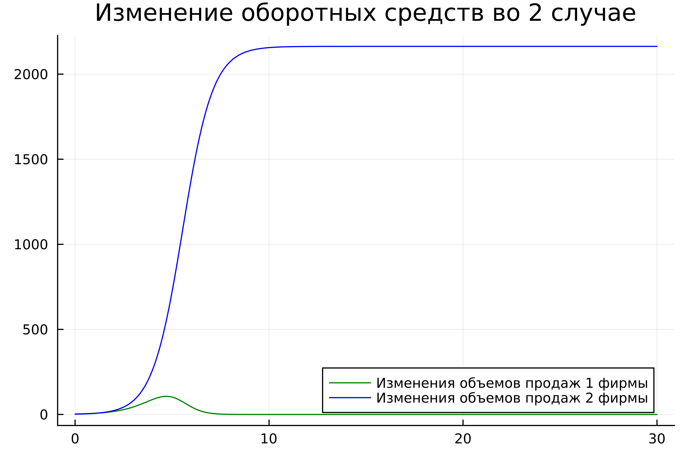
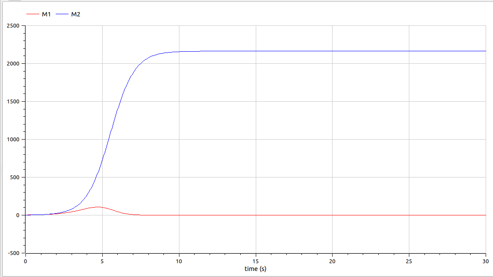

---
## Front matter
lang: ru-RU
title: Лабораторная работа №8
subtitle: Модель конкуренции двух фирм
author:
  - Парфенова Е. Е.
teacher:
  - Кулябов Д. С.
  - д.ф.-м.н., профессор
  - профессор кафедры прикладной информатики и теории вероятностей
institute:
  - Российский университет дружбы народов, Москва, Россия
date: 28 марта 2024

## i18n babel
babel-lang: russian
babel-otherlangs: english

## Formatting pdf
toc: false
toc-title: Содержание
slide_level: 2
aspectratio: 169
section-titles: true
theme: metropolis
header-includes:
 - \metroset{progressbar=frametitle,sectionpage=progressbar,numbering=fraction}
 - '\makeatletter'
 - '\beamer@ignorenonframefalse'
 - '\makeatother'
---

# Информация

## Докладчик

:::::::::::::: {.columns align=center}
::: {.column width="70%"}

  * Парфенова Елизавета Евгеньвена
  * студент
  * Российский университет дружбы народов
  * [1032216437@pfur.ru](mailto:1032216437@pfur.ru)
  * <https://github.com/parfenovaee>

:::
::: {.column width="30%"}

:::
::::::::::::::

# Вводная часть

## Актуальность

- Конкуренция является одним из основополагающих аспектов бизнеса. Изучение влияния других фирм на выручку является важным для успеха бизнеса.
- Необходимость умения строить различные математичсекие модели и их визуальное представление

## Цели и задачи

- Изучить разные случаи модели конкуренции двух фирм 
- Построить соотвествующие этим случаям графики изменения обортных средств в Julia и OpenModelica

# Теоретическое введение

## Теоретическое введение(1)

Рассмотрим модель одной фирмы. Обозначим: 

$N$ - число потребителей производимого продукта. 

$S$ – доходы потребителей данного продукта. Считаем, что доходы всех потребителей одинаковы. 

$M$ – оборотные средства предприятия 

$\tau$ - длительность производственного цикла

$p$ - рыночная цена товара 

## Теоретическое введение(2)

$\widetilde{p}$ - себестоимость продукта, то есть переменные издержки на производство единицы продукции

$\delta$ - доля оборотных средств, идущая на покрытие переменных издержек

$k$ - постоянные издержки, которые не зависят от количества выпускаемой продукции

$Q(S/p)$ – функция спроса, зависящая от отношения дохода $S$ к цене $p$. Она равна количеству продукта, потребляемого одним потребителем в единицу времени.

## Теоретическое введение(3)

Функцию спроса товаров долговременного использования часто представляют в простейшей форме: 

$$Q = q - k\frac{p}{S} = q(1 - \frac{p}{p_{cr}})$$

где $q$ – максимальная потребность одного человека в продукте в единицу времени.
Эта функция падает с ростом цены и при $p = p_{cr}$ (критическая стоимость продукта) потребители отказываются от приобретения товара. Величина $p_{cr} = Sq/k$. Параметр $k$ – мера эластичности функции спроса по цене. 

## Теоретическое введение(4)

Уравнения динамики оборотных средств можно записать в виде:

$$\frac{dM}{dt} = -\frac{M \delta}{\tau} + NQp - k = -\frac{M\delta}{\tau} + Nq(1 - \frac{p}{p_{cr}})p - k$$

## Теоретическое введение(5)

Уравнение для рыночной цены $p$ представим в виде:

$$\frac{dp}{dt} = \gamma (-\frac{M\delta}{\tau \widetilde{p}} + Nq(1-\frac{p}{p_{cr}}) )$$

Первый член соответствует количеству поставляемого на рынок товара (то есть, предложению), а второй член – спросу. 

## Теоретическое введение(5)

Параметр $\gamma$ зависит от скорости оборота товаров на рынке. Как правило, время торгового оборота существенно меньше времени производственного цикла $\tau$. При заданном M уравнение описывает быстрое стремление цены к равновесному значению цены, которое устойчиво.

# Задание

## Задача. Вариант №8. Случай 1

Рассмотрим две фирмы, производящие взаимозаменяемые товары
одинакового качества и находящиеся в одной рыночной нише. Считаем, что в рамках
нашей модели конкурентная борьба ведётся только рыночными методами. То есть,
конкуренты могут влиять на противника путем изменения параметров своего
производства: себестоимость, время цикла, но не могут прямо вмешиваться в ситуацию на рынке («назначать» цену или влиять на потребителей каким-либо иным
способом.) Будем считать, что постоянные издержки пренебрежимо малы, и в
модели учитывать не будем.

## Задача. Вариант №8. Случай 1

В этом случае динамика изменения объемов продаж
фирмы 1 и фирмы 2 описывается следующей системой уравнений:

$$\frac{dM}{d\theta} = M_1 -\frac{b}{c_1}M_1M_2 - \frac{a_1}{c_1}M_1^2$$
$$\frac{dM}{d\theta} = \frac{c_2}{c_1}M_2 -\frac{b}{c_1}M_1M_2 - \frac{a_2}{c_1}M_2^2$$

## Задача. Вариант №8. Случай 1

где 

$$ a_1 = \frac{p_{cr}}{\tau_1^2 \widetilde{p}_1^2 Nq } $$
$$ a_2 = \frac{p_{cr}}{\tau_2^2 \widetilde{p}_2^2 Nq } $$
$$ b = \frac{p_{cr}}{\tau_1^2 \widetilde{p}_1^2 \tau_2^2 \widetilde{p}_2^2 Nq} $$
$$ c_1 = \frac{p_{cr} - \widetilde{p}_1}{\tau_1 \widetilde{p}_1} $$
$$ c_2 = \frac{p_{cr} - \widetilde{p}_2}{\tau_2 \widetilde{p}_2} $$

## Задача. Вариант №8. Случай 2

Рассмотрим модель, когда, помимо экономического фактора
влияния (изменение себестоимости, производственного цикла, использование
кредита и т.п.), используются еще и социально-психологические факторы –
формирование общественного предпочтения одного товара другому, не зависимо от
их качества и цены. В этом случае взаимодействие двух фирм будет зависеть друг
от друга, соответственно коэффициент перед
$M_1 M_2$будет отличаться. 

## Задача. Вариант №8. Случай 2

Пусть в
рамках рассматриваемой модели динамика изменения объемов продаж фирмы 1 и
фирмы 2 описывается следующей системой уравнений:

$$\frac{dM}{d\theta} = M_1 -(\frac{b}{c_1} + 0.0017)M_1M_2 - \frac{a_1}{c_1}M_1^2$$
$$\frac{dM}{d\theta} = \frac{c_2}{c_1}M_2 -\frac{b}{c_1}M_1M_2 - \frac{a_2}{c_1}M_2^2$$

## Задача. Вариант №8. Случай 2

Для обоих случаев рассмотрим задачу со следующими начальными условиями и
параметрами: 

$$M_0^1 = 2.5, M_0^2 = 1.8$$
$$p_{cr} = 20, N = 23, q = 1$$ 
$${\tau_1} = 16, {\tau_2} = 19$$ 
$$\widetilde{p_1} = 13, \widetilde{p_2} = 11$$ 

## Задача. Вариант №8. Задания

1. Постройте графики изменения оборотных средств фирмы 1 и фирмы 2 без
учета постоянных издержек и с веденной нормировкой для случая 1.

2. Постройте графики изменения оборотных средств фирмы 1 и фирмы 2 без
учета постоянных издержек и с веденной нормировкой для случая 2.

# Выполнение лабораторной работы

## Построение графиков. Случай 1

Для первого случая характерна следующая математичсекая модель: 

$$\frac{dM}{d\theta} = M_1 -\frac{b}{c_1}M_1M_2 - \frac{a_1}{c_1}M_1^2$$
$$\frac{dM}{d\theta} = \frac{c_2}{c_1}M_2 -\frac{b}{c_1}M_1M_2 - \frac{a_2}{c_1}M_2^2$$

## Построение графиков. Случай 1

В результате работы кода на Julia получился такой график:

{#fig:001 width=60%}

## Построение графиков. Случай 1

В результате моделирования в OpenModelica получился такой график:

{#fig:002 width=60%}

## Построение графиков. Случай 2

Для второго случая характерна уже другая математичсекая модель: 

$$\frac{dM}{d\theta} = M_1 -(\frac{b}{c_1} + 0.0017)M_1M_2 - \frac{a_1}{c_1}M_1^2$$
$$\frac{dM}{d\theta} = \frac{c_2}{c_1}M_2 -\frac{b}{c_1}M_1M_2 - \frac{a_2}{c_1}M_2^2$$

## Построение графиков. Случай 2

В результате работы кода на Julia для второго получился такой график:

{#fig:003 width=60%}

## Построение графиков. Случай 2

В результате моделирования в OpenModelica для второго случая получился такой график:

{#fig:004 width=60%}

# Вывод

## Вывод

Мы изучили модель конкуренции двух фирм и построили графики обортных средств этих фирм в 2 разных случаях на Julia и OpenModelica