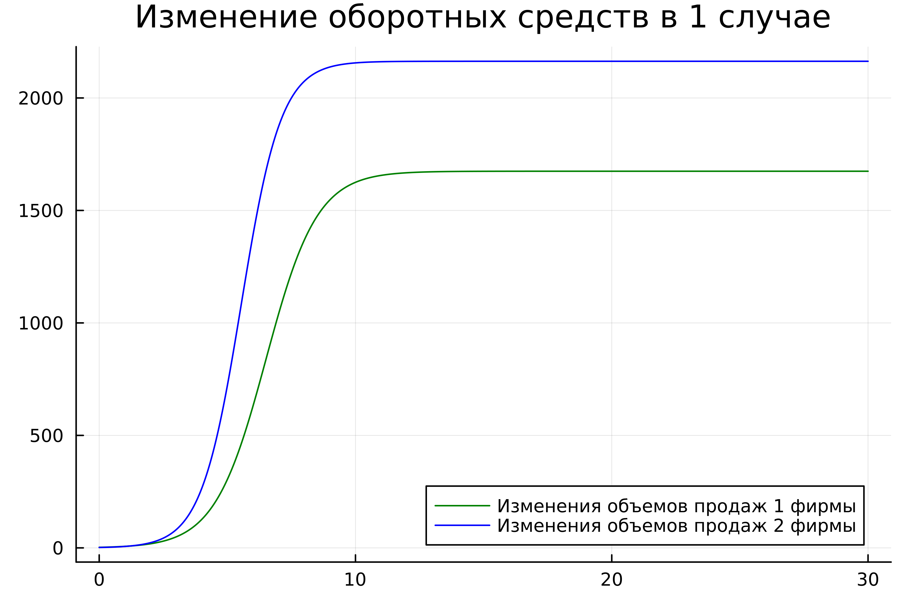
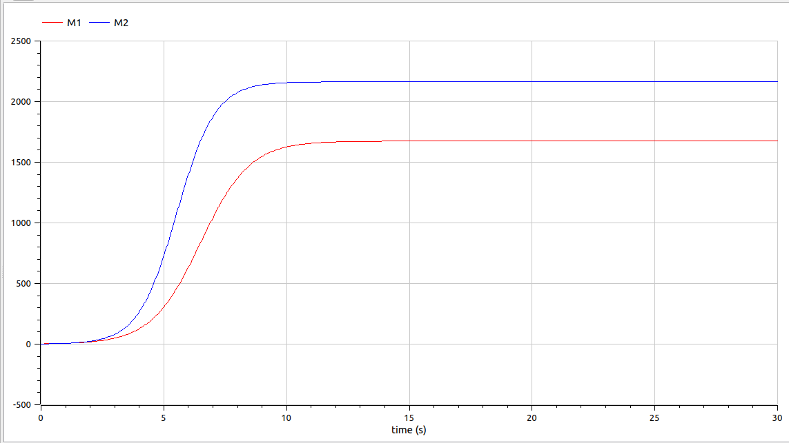
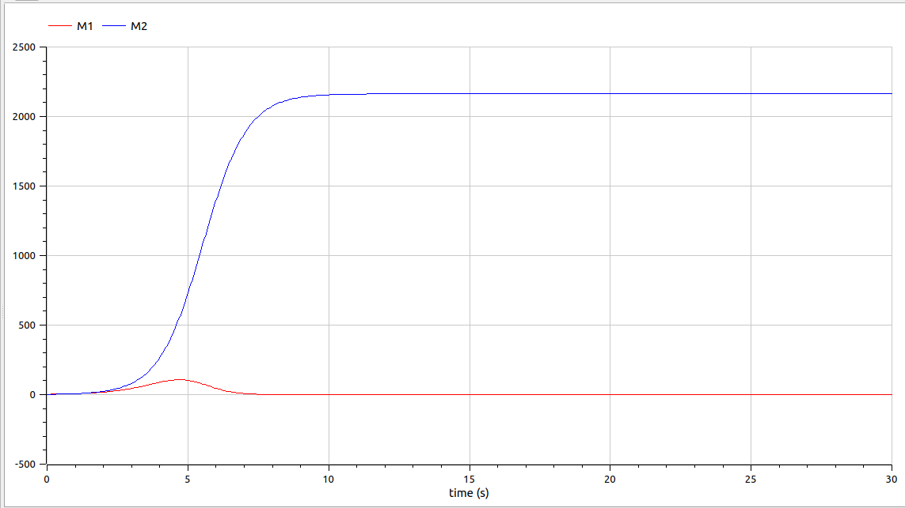

---
## Front matter
title: "Лабораторная работа №8"
subtitle: "Модель конкуренции двух фирм"
author: "Парфенова Елизавета Евгеньевна"

## Generic otions
lang: ru-RU
toc-title: "Содержание"

## Bibliography
bibliography: bib/cite.bib
csl: pandoc/csl/gost-r-7-0-5-2008-numeric.csl

## Pdf output format
toc: true # Table of contents
toc-depth: 2
lof: true # List of figures
lot: true # List of tables
fontsize: 12pt
linestretch: 1.5
papersize: a4
documentclass: scrreprt
## I18n polyglossia
polyglossia-lang:
  name: russian
  options:
	- spelling=modern
	- babelshorthands=true
polyglossia-otherlangs:
  name: english
## I18n babel
babel-lang: russian
babel-otherlangs: english
## Fonts
mainfont: PT Serif
romanfont: PT Serif
sansfont: PT Sans
monofont: PT Mono
mainfontoptions: Ligatures=TeX
romanfontoptions: Ligatures=TeX
sansfontoptions: Ligatures=TeX,Scale=MatchLowercase
monofontoptions: Scale=MatchLowercase,Scale=0.9
## Biblatex
biblatex: true
biblio-style: "gost-numeric"
biblatexoptions:
  - parentracker=true
  - backend=biber
  - hyperref=auto
  - language=auto
  - autolang=other*
  - citestyle=gost-numeric
## Pandoc-crossref LaTeX customization
figureTitle: "Рис."
tableTitle: "Таблица"
listingTitle: "Листинг"
lofTitle: "Список иллюстраций"
lotTitle: "Список таблиц"
lolTitle: "Листинги"
## Misc options
indent: true
header-includes:
  - \usepackage{indentfirst}
  - \usepackage{float} # keep figures where there are in the text
  - \floatplacement{figure}{H} # keep figures where there are in the text
---

# Цель работы

Изучить разные случаи модели конкуренции двух фирм и построить соотвествующие этим случаям графики изменения обортных средств в Julia и OpenModelica

# Задание

Мой вариант - вариант №8.

*Задача. Вариант №8*

**Случай 1.** Рассмотрим две фирмы, производящие взаимозаменяемые товары
одинакового качества и находящиеся в одной рыночной нише. Считаем, что в рамках
нашей модели конкурентная борьба ведётся только рыночными методами. То есть,
конкуренты могут влиять на противника путем изменения параметров своего
производства: себестоимость, время цикла, но не могут прямо вмешиваться в ситуацию на рынке («назначать» цену или влиять на потребителей каким-либо иным
способом.) Будем считать, что постоянные издержки пренебрежимо малы, и в
модели учитывать не будем. В этом случае динамика изменения объемов продаж
фирмы 1 и фирмы 2 описывается следующей системой уравнений:

$$\frac{dM}{d\theta} = M_1 -\frac{b}{c_1}M_1M_2 - \frac{a_1}{c_1}M_1^2$$
$$\frac{dM}{d\theta} = \frac{c_2}{c_1}M_2 -\frac{b}{c_1}M_1M_2 - \frac{a_2}{c_1}M_2^2$$

где 

$$ a_1 = \frac{p_{cr}}{\tau_1^2 \widetilde{p}_1^2 Nq } $$
$$ a_2 = \frac{p_{cr}}{\tau_2^2 \widetilde{p}_2^2 Nq } $$
$$ b = \frac{p_{cr}}{\tau_1^2 \widetilde{p}_1^2 \tau_2^2 \widetilde{p}_2^2 Nq} $$
$$ c_1 = \frac{p_{cr} - \widetilde{p}_1}{\tau_1 \widetilde{p}_1} $$
$$ c_2 = \frac{p_{cr} - \widetilde{p}_2}{\tau_2 \widetilde{p}_2} $$

Также введена нормировка $t = c_1 \theta$

**Случай 2.** Рассмотрим модель, когда, помимо экономического фактора
влияния (изменение себестоимости, производственного цикла, использование
кредита и т.п.), используются еще и социально-психологические факторы –
формирование общественного предпочтения одного товара другому, не зависимо от
их качества и цены. В этом случае взаимодействие двух фирм будет зависеть друг
от друга, соответственно коэффициент перед
$M_1 M_2$будет отличаться. Пусть в
рамках рассматриваемой модели динамика изменения объемов продаж фирмы 1 и
фирмы 2 описывается следующей системой уравнений:

$$\frac{dM}{d\theta} = M_1 -(\frac{b}{c_1} + 0.0017)M_1M_2 - \frac{a_1}{c_1}M_1^2$$
$$\frac{dM}{d\theta} = \frac{c_2}{c_1}M_2 -\frac{b}{c_1}M_1M_2 - \frac{a_2}{c_1}M_2^2$$

Для обоих случаев рассмотрим задачу со следующими начальными условиями и
параметрами: 

$$M_0^1 = 2.5, M_0^2 = 1.8$$
$$p_{cr} = 20, N = 23, q = 1$$ 
$${\tau_1} = 16, {\tau_2} = 19$$ 
$$\widetilde{p_1} = 13, \widetilde{p_2} = 11$$ 

*Задание*
1. Постройте графики изменения оборотных средств фирмы 1 и фирмы 2 без
учета постоянных издержек и с веденной нормировкой для случая 1.

2. Постройте графики изменения оборотных средств фирмы 1 и фирмы 2 без
учета постоянных издержек и с веденной нормировкой для случая 2.


# Теоретическое введение

Для построения модели конкуренции хотя бы двух фирм необходимо рассмотреть модель одной фирмы. Вначале рассмотрим модель фирмы, производящей продукт долговременного пользования, когда цена его определяется балансом спроса и предложения. Примем, что этот продукт занимает определенную нишу рынка и конкуренты в ней отсутствуют. 
Обозначим:

$N$ - число потребителей производимого продукта. 

$S$ – доходы потребителей данного продукта. Считаем, что доходы всех потребителей одинаковы. Это предположение справедливо, если речь идет об одной рыночной нише, т.е. производимый продукт ориентирован на определенный слой населения. 

$M$ – оборотные средства предприятия 

$\tau$ - длительность производственного цикла

$p$ - рыночная цена товара 

$\widetilde{p}$ - себестоимость продукта, то есть переменные издержки на производство единицы продукции

$\delta$ - доля оборотных средств, идущая на покрытие переменных издержек

$k$ - постоянные издержки, которые не зависят от количества выпускаемой продукции

$Q(S/p)$ – функция спроса, зависящая от отношения дохода $S$ к цене $p$. Она равна количеству продукта, потребляемого одним потребителем в единицу времени.

Функцию спроса товаров долговременного использования часто представляют в простейшей форме: 

$$Q = q - k\frac{p}{S} = q(1 - \frac{p}{p_{cr}})$$

где $q$ – максимальная потребность одного человека в продукте в единицу времени.
Эта функция падает с ростом цены и при $p = p_{cr}$ (критическая стоимость продукта) потребители отказываются от приобретения товара. Величина $p_{cr} = Sq/k$. Параметр $k$ – мера эластичности функции спроса по цене. Таким образом, функция спроса является пороговой (то есть, $Q(S/p) = 0$ при $p \geq p_{cr}$) и обладает свойствами насыщения.

Уравнения динамики оборотных средств можно записать в виде:

$$\frac{dM}{dt} = -\frac{M \delta}{\tau} + NQp - k = -\frac{M\delta}{\tau} + Nq(1 - \frac{p}{p_{cr}})p - k$$

Уравнение для рыночной цены $p$ представим в виде:

$$\frac{dp}{dt} = \gamma (-\frac{M\delta}{\tau \widetilde{p}} + Nq(1-\frac{p}{p_{cr}}) )$$

Первый член соответствует количеству поставляемого на рынок товара (то есть, предложению), а второй член – спросу.
Параметр $\gamma$ зависит от скорости оборота товаров на рынке. Как правило, время торгового оборота существенно меньше времени производственного цикла $\tau$. При заданном M уравнение описывает быстрое стремление цены к равновесному значению цены, которое устойчиво.

В этом случае уравнение можно заменить алгебраическим соотношением

$$ -\frac{M\delta}{\tau \widetilde{p}} + Nq(1-\frac{p}{p_{cr}}) = 0$$

равновесное значение цены $p$ равно

$$ p = p_{cr}(1 - \frac{M\delta}{\tau \widetilde{p} Nq})$$

Тогда уравнения динамики оборотных средств приобретает вид

$$\frac{dM}{dt} = -\frac{M \delta}{\tau}(\frac{p}{p_{cr}}-1) - M^2 ( \frac{\delta}{\tau \widetilde{p} })^2 \frac{p_{cr}}{Nq} - k$$

Это уравнение имеет два стационарных решения, соответствующих условию $dM/dt=0$

$$ \widetilde{M_{1,2}} = \frac{1}{2} a \pm \sqrt{\frac{a^2}{4} - b}$$

где

$$ a = Nq(1 - \frac{\widetilde{p}}{p_{cr}} \widetilde{p} \frac{\tau}{\delta}), b = kNq \frac{(\tau \widetilde{p})^2}{p_{cr}\delta ^2} $$

Получается, что при больших постоянных издержках (в случае $a^2 < 4b$) стационарных состояний нет. Это означает, что в этих условиях фирма не может функционировать стабильно, то есть, терпит банкротство. Однако, как правило, постоянные затраты малы по сравнению с переменными (то есть, $b << a^2$) и играют роль, только в случае, когда оборотные средства малы. 

При $b << a$ стационарные значения $M$ равны

$$ \widetilde{M_{+}} = Nq \frac{\tau}{\delta}(1 - \frac{\widetilde{p}}{p_{cr}})\widetilde{p}, \widetilde{M_{-}} = k\widetilde{p} \frac{\tau}{\delta(p_{cr} - \widetilde{p})} $$

Первое состояние $\widetilde{M_{+}}$ устойчиво и соответствует стабильному функционированию предприятия. Второе состояние \widetilde{M_{-} неустойчиво, так, что при $M < \widetilde{M_{-}}$ оборотные средства падают ($dM/dt < 0$), то есть, фирма идет к банкротству. По смыслу $\widetilde{M_{-}}$ соответствует начальному капиталу, необходимому для входа в рынок.

В обсуждаемой модели параметр $\delta$ всюду входит в сочетании с $\tau$. Это значит, что уменьшение доли оборотных средств, вкладываемых в производство, эквивалентно удлинению производственного цикла. Поэтому мы в дальнейшем положим: $\delta = 1$, а параметр $\tau$ будем считать временем цикла. [@book:bash]

# Выполнение лабораторной работы

**Построение графиков. Случай 1**

Для первого случая характерна следующая математичсекая модель: 

$$\frac{dM}{d\theta} = M_1 -\frac{b}{c_1}M_1M_2 - \frac{a_1}{c_1}M_1^2$$
$$\frac{dM}{d\theta} = \frac{c_2}{c_1}M_2 -\frac{b}{c_1}M_1M_2 - \frac{a_2}{c_1}M_2^2$$

Для построения графика на основе этой математичсекой модели был написан следующий код на Julia:

```
# Использованные библиотеки

using Plots
using DifferentialEquations

#Необходимые константы

M0_1 = 2.5
M0_2 = 1.8
p_c = 20.0
N = 23.0
q = 1.0
tau_1 = 16.0
tau_2 = 19.0
p_1 = 13.0
p_2 = 11.0

#Вычисление параметров

a_1 = p_c/(tau_1*tau_1*p_1*p_1*N*q)
a_2 = p_c/(tau_2*tau_2*p_2*p_2*N*q)
b = p_c/(tau_1*tau_1*p_1*p_1*tau_2*tau_2*p_2*p_2*N*q)
c_1 = (p_c-p_1)/(tau_1*p_1)
c_2 = (p_c-p_2)/(tau_2*p_2)

# Начальные условия

start = [M0_1, M0_2]
timee = (0.0, 30.0)

# Функция мат.модели

function one_fun(du, u, p, t)
   du[1] = u[1] - b/c_1*u[1]*u[2]-a_1/c_1*u[1]*u[1]
   du[2] = c_2/c_1*u[2] - b/c_1*u[1]*u[2]-a_2/c_1*u[2]*u[2]
end

# Задание проблемы и ее решение

equat = ODEProblem(one_fun, start, timee)
solv = solve(equat, dtmax=0.01)

M_1 = [u[1] for u in solv.u]
M_2 = [u[2] for u in solv.u]

# Построение графиков и сохранение изображения

plot1 = plot(dpi = 600, legend =:bottomright, bg =:white, title="Изменение оборотных средств в 1 случае")
plot!(plot1, solv.t, M_1, label="Изменения объемов продаж 1 фирмы", color =:green)
plot!(plot1, solv.t, M_2, label="Изменения объемов продаж 2 фирмы", color =:blue)

savefig(plot1, "lab08_1.png")
```
В результате работы кода получился такой график (рис. [-@fig:001]):

{#fig:001 width=70%}

Для построения графика в этом же случае в OpenModelica получилась такая модель: 

```
model one_fun

parameter Real M0_1 = 2.5;
parameter  Real M0_2 = 1.8;

Real p_c = 20.0;
Real N = 23.0;
Real q = 1.0;
Real tau_1 = 16.0;
Real tau_2 = 19.0;
Real p_1 = 13.0;
Real p_2 = 11.0;

Real a_1 = p_c/(tau_1*tau_1*p_1*p_1*N*q);
Real a_2 = p_c/(tau_2*tau_2*p_2*p_2*N*q);
Real b = p_c/(tau_1*tau_1*p_1*p_1*tau_2*tau_2*p_2*p_2*N*q);
Real c_1 = (p_c-p_1)/(tau_1*p_1);
Real c_2 = (p_c-p_2)/(tau_2*p_2);

Real M1(start = M0_1);
Real M2(start = M0_2);

equation

der(M1) = M1 - b/c_1 * M1 * M2 - a_1/c_1 * M1 * M1;
der(M2) = c_2/c_1 * M2 - b/c_1 * M1 * M2 - a_2/c_1*M2*M2;
   
end one_fun;
```

В результате моделирования получился такой график(рис. [-@fig:002]):

{#fig:002 width=70%}

Графики, построенные на Julia и OpenModelica, совпали. 

**Построение графиков. Случай 2**

Для второго случая характерна уже другая математичсекая модель: 

$$\frac{dM}{d\theta} = M_1 -(\frac{b}{c_1} + 0.0017)M_1M_2 - \frac{a_1}{c_1}M_1^2$$
$$\frac{dM}{d\theta} = \frac{c_2}{c_1}M_2 -\frac{b}{c_1}M_1M_2 - \frac{a_2}{c_1}M_2^2$$

Код на Julia для данной мат.модели выглядит так: 

```
# Использованные библиотеки

using Plots
using DifferentialEquations


#Необходимые константы

M0_1 = 2.5
M0_2 = 1.8
p_c = 20.0
N = 23.0
q = 1.0
tau_1 = 16.0
tau_2 = 19.0
p_1 = 13.0
p_2 = 11.0

#Вычисление параметров

a_1 = p_c/(tau_1*tau_1*p_1*p_1*N*q)
a_2 = p_c/(tau_2*tau_2*p_2*p_2*N*q)
b = p_c/(tau_1*tau_1*p_1*p_1*tau_2*tau_2*p_2*p_2*N*q)
c_1 = (p_c-p_1)/(tau_1*p_1)
c_2 = (p_c-p_2)/(tau_2*p_2)

# Начальные условия

start = [M0_1, M0_2]
timee = (0.0, 30.0)

# Функция мат.модели

function two_fun(du, u, p, t)
   du[1] = u[1] - (b/c_1 + 0.0017)*u[1]*u[2] - a_1/c_1*u[1]*u[1]
   du[2] = c_2/c_1*u[2] - b/c_1*u[1]*u[2]-a_2/c_1*u[2]*u[2]
end

# Задание проблемы и ее решение

equat = ODEProblem(two_fun, start, timee)
solv = solve(equat, dtmax=0.01)

M_1 = [u[1] for u in solv.u]
M_2 = [u[2] for u in solv.u]

# Построение графиков и сохранение изображения

plot1 = plot(dpi = 600, legend =:bottomright, bg =:white, title="Изменение оборотных средств во 2 случае")
plot!(plot1, solv.t, M_1, label="Изменения объемов продаж 1 фирмы", color =:green)
plot!(plot1, solv.t, M_2, label="Изменения объемов продаж 2 фирмы", color =:blue)

savefig(plot1, "lab08_2.png")

```

В результате получился следующий график (рис. [-@fig:003]):

{#fig:003 width=70%}

Модель в OpenModelica для того же случая: 

```
model two_fun

parameter Real M0_1 = 2.5;
parameter Real M0_2 = 1.8;

Real p_c = 20.0;
Real N = 23.0;
Real q = 1.0;
Real tau_1 = 16.0;
Real tau_2 = 19.0;
Real p_1 = 13.0;
Real p_2 = 11.0;

Real a_1 = p_c/(tau_1*tau_1*p_1*p_1*N*q);
Real a_2 = p_c/(tau_2*tau_2*p_2*p_2*N*q);
Real b = p_c/(tau_1*tau_1*p_1*p_1*tau_2*tau_2*p_2*p_2*N*q);
Real c_1 = (p_c-p_1)/(tau_1*p_1);
Real c_2 = (p_c-p_2)/(tau_2*p_2);

Real M1(start = M0_1);
Real M2(start = M0_2);

equation

der(M1) = M1 - (b/c_1 + 0.0017) * M1 * M2 - a_1/c_1 * M1 * M1;
der(M2) = c_2/c_1 * M2 - b/c_1 * M1 * M2 - a_2/c_1*M2*M2;

end two_fun;
```
В результате моделирования получился такой график(рис. [-@fig:004]):

{#fig:004 width=70%}

Графики на двух языках программирования также совпали

# Выводы

Мы изучили модель конкуренции двух фирм и построили графики обортных средств этих фирм в 2 разных случаях на Julia и OpenModelica

# Список литературы{.unnumbered}

::: {#refs}
:::
